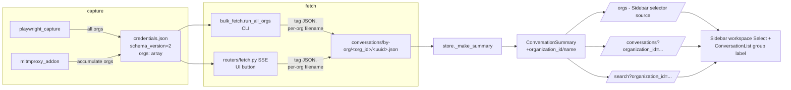

# Multi-Org Fetching (Cowork Support)

## Status (2026-05-01) — SHIPPED

Implemented in commit `506335c` on `main`. All six commits (C1-C6) landed; 89 net new pytest cases pass (174 total); 5 Playwright e2e cases for the workspace selector pass; tsc clean.

**Live verification:**
- v2 credentials at `~/.claude-exporter/credentials.json` (mode `0o600`, both orgs captured: `ae24ae66-…` "raymondpeckiii@gmail.com's Organization" + `0c0c170b-…` "Raymond's Individual Org").
- Migration ran on startup: 102 v1 conversations relocated to `~/.claude-exporter/conversations/by-org/ae24ae66-.../`. `.migrated_v2` sentinel present. Pre-migration backup at `~/.claude-exporter.pre-cowork-multi-org-backup/`.
- `/api/orgs` returns three-state response correctly with `authenticated: true` and both orgs in payload.
- Multi-org fetch loop (`run_all_orgs`) iterates both workspaces; gracefully handles the 403 from the API-only second org (capabilities `[api, api_individual]` — no `chat`).
- `_index.json` v2 schema with per-org status, `last_successful_fetched_count`, `last_successful_fetched_at`.
- Sidebar workspace selector live with "All workspaces" option + per-workspace filter.

**Real-world finding:** the user's "Raymond's Individual Org" turned out to be an API-only workspace with no chat conversations, so cross-workspace sync surfaced no new data for this user. The plan still landed correctly — for any user with two chat-capable orgs (the canonical Personal + Cowork case), conversations from both will now flow through.

**Spec items deferred** (flagged in code with `cowork-multi-org` references; non-blocking for the canonical use case):
- SSE `heartbeat` frames during 429 sleeps (the `on_event` callback in `run_all_orgs` is plumbed; the SSE wrapper just doesn't yet emit them).
- `claude-explorer list-orgs` / `set-primary-org` / `wipe-creds` / `unlock-fetch` CLI subcommands (`migrate` shipped).
- `_index.json` `.fetch.lock` wrapping the SSE handler (migration path locks correctly; SSE fetch alone could theoretically race).
- FetchDialog UI surfacing for `org_start` / `org_done` / `primary_demoted` SSE events (backend emits them; UI shows aggregate via `complete`).

---

## Context

Claude.ai accounts with a personal org plus a "Cowork" workspace have more than one organization. The fetcher currently captures only the *first* org it sees and never queries the others, so Cowork conversations silently never reach the exporter.

Evidence:
- `fetcher/playwright_capture.py:91-92` takes `data[0].uuid` from `/api/organizations` and discards the rest.
- `fetcher/mitmproxy_addon.py:32,73` latches onto the first `org_id` matching a regex and stops.
- `fetcher/bulk_fetch.py:84` scopes every call to that single org_id.

Stored conversations carry no organization metadata, so even after a re-fetch there's no way to distinguish Personal vs Cowork at display time.

This document was reviewed by an adversarial LLM Council (Gemini-3-Pro + GPT-5.2). Council findings (P0-1 through P1-7) are folded into the relevant sections below; a summary mapping appears at the end.

## High-Level Shape



Both fetch paths must learn multi-org. The CLI (`bulk_fetch.py`) and the UI's "Fetch" button (`backend/routers/fetch.py` SSE endpoint) construct `ClaudeFetcher` independently — fixing only the CLI leaves the in-app fetch on the single-org bug.

## Phase 0 — Verify org topology + chat-visibility scoping (read-only probe)

Council P0-6: a "≥2 orgs vs =1 org" gate is too coarse. We must confirm what *actually scopes chat visibility*. An org may be listed but `/chat_conversations` denied, or Cowork may be partitioned by some header/cookie/account-context that the URL path doesn't capture.

Required artifacts before any code is written:

1. **Full `/api/organizations` response** — `uuid`, `name`, `capabilities` for every org.
2. **One `/chat_conversations` request per org context** — confirm the org `uuid` is the actual scoping dimension, with full URL + every request header + cookies recorded. Diff the two requests; the *only* differences should be the path-segment `org_id` and possibly per-org cookies.
3. **An empirical answer to: "When the user clicks the Cowork tab in Claude Desktop, what changes in outbound requests?"** Capture this via mitmproxy. If anything beyond the path segment changes (a workspace header, a context cookie, a different host), the multi-org loop must replicate that switch — not just the path.

```bash
SESSION=$(jq -r .session_key ~/.claude-exporter/credentials.json)
CF_BM=$(jq -r .cf_bm ~/.claude-exporter/credentials.json)
CF_CLEARANCE=$(jq -r .cf_clearance ~/.claude-exporter/credentials.json)

# Step 1: list orgs
curl -s -H "Cookie: sessionKey=${SESSION}; __cf_bm=${CF_BM}; cf_clearance=${CF_CLEARANCE}" \
  -H "User-Agent: Mozilla/5.0 (Macintosh; Intel Mac OS X 10_15_7) AppleWebKit/537.36" \
  https://claude.ai/api/organizations \
  | jq '[.[] | {uuid, name, capabilities}]'

# Step 2: probe each org's chat list (replace ORG_UUID per org). Record status code.
for ORG in $(curl -s ... /api/organizations | jq -r '.[].uuid'); do
  echo "=== $ORG ==="
  curl -i -s -H "Cookie: sessionKey=${SESSION}" \
    "https://claude.ai/api/organizations/${ORG}/chat_conversations?limit=1" | head -20
done
```

Decision gate:

| Probe outcome | Action |
|---|---|
| ≥ 2 orgs, all return 200 on `/chat_conversations` | Proceed with the plan as written. |
| ≥ 2 orgs, secondary returns 403/404 | Cowork uses some other scoping dimension. Capture Claude Desktop's actual Cowork-tab requests via mitmproxy and amend before coding. |
| Any org responds with a header/cookie change beyond `org_id` | Plan Phase 2 must include header/cookie passthrough; do not proceed without that captured. |
| = 1 org | Cowork is a project inside the personal org. Stop and re-plan around `project_uuid`. |

Fallback if Cloudflare blocks the curl probe (401/403): add `print(json.dumps(data, indent=2))` after `data = await response.json()` at `fetcher/playwright_capture.py:90`, re-run `uv run claude-explorer capture`, read the printed list, then revert.

## Design decisions

### Migration timing and startup invisibility (NEW2-P0-α, NEW3-P0-A, NEW3-P0-B)

A naive split — `migrate_to_v2()` only runs inside the Fetch button's SSE handler, while `store.py` globs only `by-org/*/*.json` — produces a fatal first-launch experience: after upgrade, the user opens the app, sees **zero conversations**, panics, files a bug. The fix is multi-layered:

1. **`store.py` falls back to legacy globbing while the migration sentinel is absent**, with **load-path dedup** (NEW3-P0-A). When `by-org/.migrated_v2` does not exist, `_get_conversation_files()` returns:
   ```python
   by_org = list(data_dir.glob("by-org/*/*.json"))
   legacy = [p for p in data_dir.glob("*.json")
             if re.fullmatch(r'[0-9a-f-]{36}\.json', p.name)]
   # Dedup by UUID: prefer by-org copy when both exist
   seen_uuids = {p.stem for p in by_org}
   return by_org + [p for p in legacy if p.stem not in seen_uuids]
   ```
   Without this dedup, a window opens between Commits 3 and 4: bulk_fetch writes new conversation `X` to `by-org/<org>/X.json`, but the legacy `data_dir/X.json` still exists pre-migration → UI renders X twice. Dedup at the load layer eliminates the duplicate. The legacy set empties entirely the moment the sentinel appears (migration moved everything).

2. **Migration runs at server startup, not just on Fetch — but non-fatally** (NEW3-P0-B + NEW4-P1-A + NEW4-P1-C). `backend/main.py` lifespan handler calls `migrate_to_v2(timeout_seconds=10)`. The signature is **canonical** as `migrate_to_v2(on_progress: Callable[[int, int], None] | None = None, timeout_seconds: float = 10.0)`; if `timeout_seconds` elapses with the lock held, raises `LockContentionError`. The lifespan handler catches this, logs `"Migration deferred: .fetch.lock held by <metadata>"`, and **starts the server anyway**. **Retry mechanism (single canonical implementation):** an `asyncio.create_task` wraps a loop `while not sentinel.exists(): try migrate_to_v2(); except LockContentionError: await asyncio.sleep(60)`. Each iteration first checks for the sentinel and exits early if present. After 5 consecutive failed retries (~5 min), the task surfaces a warning via `/api/health` (`migration_stuck: true, holder: <metadata>`) and the FetchDialog shows a banner suggesting `claude-explorer unlock-fetch` if the holder process is gone. The task is registered with the lifespan teardown so server shutdown cancels it cleanly. While migration is deferred, `store.py`'s legacy fallback continues to surface all data, so the user never sees zero conversations. Skip the entire mechanism with `CLAUDE_EXPORTER_SKIP_MIGRATION=1`.

3. **Migration runs explicitly via `claude-explorer migrate`** for users who prefer offline migration on huge data dirs.

All three conditions ship in the same commit (Commit 4 in the implementation sequence at the bottom of this doc). Any one alone leaves a window where data appears lost or duplicated.

### Capture-path preserves user state (NEW2-P0-β, NEW2-P0-θ)

`fetcher/playwright_capture.py::capture_credentials()` must **load the existing creds before constructing the new v2 record** (tolerating absent file). Two fields are inherited from the prior record if compatible:

- `primary_org_id` — only inherited if the referenced UUID is still in the new `creds["orgs"]`. Prevents a recapture from silently resetting a `set-primary-org` choice.
- `legacy_migration_target` — first capture writes this to whatever the v1 `creds["org_id"]` was (definitionally Personal — the only org we knew about pre-multi-org). Subsequent captures preserve it. Migration uses this field, **not** `primary_org_id`, to route legacy untagged files. Without this, a fresh recapture's heuristic primary-org selection could pick Cowork → 10k Personal files land under `by-org/<cowork>/` and become unrecoverable without `--full-refresh`.

If no v1 file existed (fresh install) and no v2 record yet exists, `legacy_migration_target` is `None` and `migrate_to_v2.py` routes to `_unknown_source/` rather than guessing.

### Storage layout: per-org subdirectory

**Council P0-2 / P1-5.** Today both fetch paths write `<output_dir>/<uuid>.json` and dedup by filename stem. Two orgs returning the same conversation UUID (which happens when conversations are shared between orgs, and is statistically possible regardless) cause **silent data loss**: incremental mode skips the second org's copy, full-refresh mode silently overwrites the first. Confirmed by reading `fetcher/bulk_fetch.py:330-341`, `backend/routers/fetch.py:109-136`, and `backend/store.py:214-218,372-375`.

Fix: write per org. New layout:

```
~/.claude-explorer/conversations/
├── _index.json                  # global index (schema_version=2)
└── by-org/
    ├── <org_id_personal>/
    │   ├── <uuid_a>.json
    │   └── <uuid_b>.json
    └── <org_id_cowork>/
        └── <uuid_c>.json
```

This requires changes in three places:

1. `fetcher/bulk_fetch.py:save_conversation`: build `path = self.output_dir / "by-org" / self.current_org["uuid"] / f"{uuid}.json"` and `mkdir(parents=True, exist_ok=True)`.
2. `fetcher/local_claude_code.py:264-267`: parallel save path; same change. (Claude Code locally-imported sessions go under a synthetic `local` org id, e.g. `by-org/_claude_code/<uuid>.json`, so the loader treats them uniformly.)
3. `backend/store.py:_get_conversation_files` (line 214) + `routers/fetch.py:109-114`: glob becomes `data_dir.rglob("*.json")` (or explicitly `data_dir.glob("by-org/*/*.json")` to keep `_index.json` and any future top-level files out of the load set). The dedup set in `routers/fetch.py:113` becomes `set[tuple[str, str]]` keyed by `(org_id, uuid)`, populated by walking `by-org/<org_id>/`. Read `org_id` from the parent directory name.

**Migration of existing single-org data.** On the first multi-org run: walk `data_dir/*.json` (top-level), read each JSON's `organization_id` (None for legacy), and `os.rename` into `by-org/<org_id_or_PRIMARY>/`. `PRIMARY` resolves to the legacy `creds["org_id"]` (the only org we knew about pre-migration). Migration is one-shot and idempotent — guarded by a sentinel file `by-org/.migrated_v2`. **Migration is read-only of file contents** (only filesystem moves), so a partial failure leaves data recoverable: a separate `by-org/.migration_log.json` records every move.

### Credentials schema and the *real* "single normalization point"

**Council P0-1.** The original plan claimed `bulk_fetch.load_credentials()` was the single normalization point. It isn't — `backend/routers/fetch.py` reads `credentials.json` independently. Hand-wave fix.

Real fix: extract a shared module.

- New module: **`fetcher/credentials.py`** containing `load_credentials(path) -> CredentialsV2` and `save_credentials(creds, path)`. Imported by `bulk_fetch.py`, `routers/fetch.py`, `playwright_capture.py`, `mitmproxy_addon.py`, and tests. *No other module reads or writes `credentials.json` directly.* The plan must include a final-step grep audit to enforce this.
- New typed model `CredentialsV2`:

  ```python
  class CredentialsV2(TypedDict):
      schema_version: Literal[2]
      session_key: str
      cf_bm: str | None
      cf_clearance: str | None
      captured_at: str          # ISO8601
      orgs: list[OrgRef]        # always non-empty
      primary_org_id: str       # see P1-4 below
      org_id: str               # legacy mirror = primary_org_id, kept for one minor version
  ```

- `load_credentials()` accepts both schemas. If `schema_version` is missing (or 1), it synthesizes:
  ```python
  creds["schema_version"] = 2
  creds["orgs"] = [{"uuid": creds["org_id"], "name": None, "capabilities": []}]
  creds["primary_org_id"] = creds["org_id"]
  creds["legacy_migration_target"] = creds["org_id"]   # NEW3-P0-C
  ```
  The `legacy_migration_target` synthesis is critical: if a user upgrades their binary and starts `claude-explorer serve` *before* recapturing, the lifespan migration must still route legacy untagged files to the v1 `org_id` (definitionally Personal pre-multi-org) rather than dumping them all into `_unknown_source/`. The function **returns the upgraded dict in memory only** — no automatic disk rewrite. The next legitimate write (next capture, next `save_credentials` call) persists the v2 shape.
- `save_credentials()` writes atomically (see Atomic writes below) and always emits `schema_version: 2`.

### Primary org selection (P1-4, NEW-P0-B)

`/api/organizations` doesn't document a stable order. Picking `orgs[0]` makes `primary_org_id` random across captures.

Resolution order:
1. If `creds["primary_org_id"]` already exists **and the referenced org is still in `creds["orgs"]`**, keep it (sticky once chosen).
2. Else, prefer the org whose `capabilities` includes `"chat"` (or whatever flag the Phase 0 probe reveals; record the actual flag name in this section before coding).
3. Else, prefer the org with the **most conversations on disk** (a tiebreaker that survives mitm captures with no `/api/organizations` response).
4. Else, the first by UUID lexicographic order (deterministic fallback, never index-based).

**Auto-demote on access loss (NEW-P0-B).** The original "primary 403/404 → hard abort" rule, combined with the sticky primary, creates a permanent brick if the user loses access to their primary org (left a Cowork tenant, capability revoked, etc.). Replacement rule: on the **primary** org, only `401 Unauthorized` is a hard abort (genuine session expiration). `403` and `404` instead trigger an auto-demote: clear `primary_org_id`, run resolution steps 2-4 against the remaining orgs (excluding the demoted one), **persist via `save_credentials` regardless of which entrypoint hit the failure** (NEW2-P0-δ — both CLI and SSE paths must write; otherwise every fetch re-detects 403, demotes again, banner spams), log a strong warning to `_index.json` (`primary_demoted_from: <uuid>, reason: HTTP_403`), and continue with the new primary.

**Single-org account guardrail (NEW2-P1-γ).** If `_demote_primary()` is called and zero remaining orgs exist after exclusion, do **not** raise inside the resolution algorithm. Set a sentinel `status: NO_ACCESSIBLE_ORGS` on the run, persist `_index.json`, and surface to the UI/CLI as: "Lost access to your only workspace. Run `claude-explorer capture` to re-authenticate, or `claude-explorer list-orgs` to inspect what's stored." This is the only legitimate exit path for single-org-403; it must not crash with `IndexError` or fail `_validate(creds)`.

The user sees demotions in the FetchDialog summary as a banner. They can override at any time via `claude-explorer set-primary-org <uuid>` (new CLI subcommand) or discover the available list via `claude-explorer list-orgs` (NEW-P1-F).

### Atomic credentials writes (P0-5)

All `credentials.json` writes go through `fetcher/credentials.py::save_credentials()` (precise pseudocode that matches the prose below — NEW3-P2-A):

```python
def save_credentials(creds: CredentialsV2, path: Path) -> None:
    _validate(creds)                       # raise if shape is wrong
    tmp = path.with_suffix(".json.tmp")
    bak = path.with_suffix(".json.bak")
    prev_bak = path.with_suffix(".json.bak.prev")
    lock_path = path.with_suffix(".json.lock")
    with portalocker.Lock(lock_path, timeout=10):
        # Step 1: preserve the prior .bak under .bak.prev so we can
        # delete it cleanly after the new write succeeds.
        if bak.exists():
            os.replace(bak, prev_bak)
        # Step 2: write tmp + fsync, restrict perms (best-effort on Windows).
        with open(tmp, "w") as f:
            json.dump(creds, f, indent=2)
            f.flush()
            os.fsync(f.fileno())
        try:
            os.chmod(tmp, 0o600)           # NEW2-P2-α: best-effort on POSIX
        except OSError as e:
            log.warning("chmod 0o600 failed (likely Windows): %s", e)
        # Step 3: rotate current → .bak (last-known-good for crash recovery).
        if path.exists():
            os.replace(path, bak)
        # Step 4: install new file.
        os.replace(tmp, path)              # atomic on POSIX + Windows
        # Step 5: atomicity is now guaranteed — drop the now-redundant .bak.prev
        # to prevent stale session keys from leaking past the next rotation.
        if prev_bak.exists():
            prev_bak.unlink()
```

`os.replace` guarantees *file-level* atomicity on both POSIX and Windows, but **not state-level atomicity** under read-modify-write. Pass-2 dropped `fcntl.flock` for Windows compat; Pass-3 must address the lost-update race that re-emerged (NEW-P0-A): if `playwright_capture` (terminal A) and `mitmproxy_addon` (terminal B) both load creds, each merges a different subset of orgs, last writer wins and the org list is silently truncated. Mitm's "save on every new org" pattern (line 172) makes this more frequent.

Two-part fix:

1. **Cross-platform advisory lock.** Use `portalocker` (works on POSIX *and* Windows, unlike `fcntl`). Add to `pyproject.toml`. The lock wraps the whole read-modify-write block in `save_credentials` AND the merge-aware variant used by mitm.
2. **Merge-on-write semantics for org accumulation.** Mitm's `save_credentials` path becomes `merge_orgs_and_save(new_orgs, path)`: acquire lock, re-read current creds inside the locked block, union `creds["orgs"]` with `new_orgs` keyed by UUID (preferring entries with `seen_in_response: true` so URL-only fallbacks don't overwrite real names), write atomically, release lock. This eliminates lost updates even if the lock acquisition somehow fails (defense in depth).

**(The canonical pseudocode for `save_credentials` is at the top of this section. The duplicate block that previously appeared here, which omitted the Step-1 `.bak → .bak.prev` rename, has been removed — NEW4-P0-A. All readers should refer to the canonical block.)**

`.bak` retention (NEW-P1-H, NEW3-P2-A): the prior implementation kept `.bak` indefinitely, leaking stale session keys after re-capture. New rule (precisely matching the canonical pseudocode): at the start of each save, rename any existing `.bak` to `.bak.prev`; rotate the current creds to a fresh `.bak` (the new last-known-good); install the new tmp as the live file; finally delete `.bak.prev`. After every successful save, exactly **one** backup copy exists (`.bak`, holding the *immediately prior* version, never anything older). A crash mid-rotation leaves either `.bak` or `.bak.prev` present — both are valid recovery sources. Add a `claude-explorer wipe-creds` subcommand for explicit teardown that removes `credentials.json`, `.bak`, `.bak.prev`, `.lock`, and any tmp residue.

`_validate` rejects partial/malformed inputs before the tmp file is opened.

### Per-org error handling (P0-3, P0-7, NEW-P0-B, NEW-P0-J, NEW-P1-K)

Replace blanket `try/except: log + continue` with explicit per-org status:

| HTTP code on `/chat_conversations` | Behavior |
|---|---|
| 200 | `status: ok`, write conversations. |
| 401 (any org) | **Hard abort.** Surface "session expired — re-run `claude-explorer capture`" to the UI/CLI. Do not write a partial `_index.json`. |
| 403 / 404 (**primary** org) | **Auto-demote** (NEW-P0-B): clear `primary_org_id`, re-resolve via the deterministic algorithm, persist creds, log `primary_demoted_from` to `_index.json`. Continue with new primary. **Do not hard-abort** — that would brick the user permanently. |
| 403 / 404 (**secondary** org) | Skip that org, mark `status: skipped`, persist `error_code` and `error_message` to `_index.json`. UI surfaces "Cowork: skipped (403)". |
| 429 | See "Rate-limit handling" below. |
| Other 5xx | Same retry policy as 429. After exhaustion: `status: failed`, persist error. |
| Network/timeout | Same retry policy. After exhaustion: `status: failed`. |

**Rate-limit handling (NEW-P0-J, NEW-P1-K).** Anthropic 429s scope by **session-key/IP**, not by org — exhausting Cowork's "budget" then immediately fetching Personal would instant-429 there too and risk a session ban. Therefore:

- Backoff state is **global to the `ClaudeFetcher` instance**, not per-org. A 429 sets `self._cooldown_until = now + retry_after`; *every* subsequent request across all orgs honors that timestamp before issuing.
- Honor `Retry-After` header literally. If absent, use exponential backoff (3 attempts, base 30s, capped 5min).
- **Sleep policy (precise to make tests deterministic):** retry sleep = backoff value only (or `Retry-After`); the per-conversation `--delay` applies only between *successful* requests, never inside the retry chain. Inter-org `--delay` is a separate sleep applied between two successful org transitions.
- Inject a `sleep_fn: Callable[[float], None] = time.sleep` parameter on the retry helper so tests can replace it with a recorder for timing assertions.

**Crucially, a `failed` status does not overwrite previously-successful org data on disk.** Per-org subdirectories make this trivial: a failed Cowork run never touches `by-org/<personal_id>/`.

**`_index.json` write-atomicity (NEW-P1-L).** The global `_index.json` is also written via tmp+`os.replace`. An org is recorded with `status: ok` **only after every conversation in that org has been persisted** — never speculatively. If a crash occurs mid-org, the index either reflects the last fully-completed org or, if no orgs completed, isn't written at all (the prior `_index.json` survives untouched). Partial state never makes it to disk.

**Concurrent fetch lock (NEW-P2-N).** A `data_dir/.fetch.lock` file (created via `portalocker`) prevents simultaneous CLI + UI fetches from racing on `_index.json`. Second attempt fails with `FetchInProgress` ("Another fetch is running. Wait or check `data_dir/.fetch.lock` if you believe this is stale.").

### `_index.json` schema across the rollout (P1-3, NEW3-P1-A, NEW3-P1-C)

**Single shape from Commit 3 onward.** Every commit that writes `_index.json` writes the v2 schema below. The legacy single-org code path (`bulk_fetch.run()` shim) writes a v2 record with exactly one entry in `orgs`. `store.py`'s reader uses `schema_version` dispatch and tolerates both shapes for read-only consumers, but writers always emit v2 — no mid-rollout shape drift.

**Failure does not erase prior counts (NEW3-P1-C, NEW4-P1-B).** When an org's run ends with `status: failed` or `status: skipped`, the writer **preserves** `last_successful_fetched_count: int | null` and `last_successful_fetched_at: str | null` from the prior `_index.json` (read just before writing). On the **first-ever** fetch where this org has never previously succeeded (no prior `_index.json` entry, or org wasn't in it), both fields are emitted as `null` — *not* `0` (which would render as a misleading "0 conversations from last successful fetch"). UI rule: when both are `null`, render `"never fetched successfully"` instead of a count. UI surfaces "Cowork: 800 conversations (last fetch failed at 2026-04-26 — retry?)" once a successful fetch has occurred. Filesystem remains the authoritative source for actual conversation counts (NEW2-P1-ζ); `_index.json` is the status ledger only.


```json
{
  "schema_version": 2,
  "fetched_at": "2026-04-26T...Z",
  "orgs": [
    {
      "org_id": "...",
      "name": "Personal",
      "status": "ok",
      "fetched_count": 87,
      "last_successful_fetched_count": 87,
      "last_successful_fetched_at": "2026-04-26T...Z",
      "skipped_count": 0,
      "error_code": null,
      "error_message": null,
      "conversations": [{"uuid": "...", ...}]
    },
    {
      "org_id": "...",
      "name": "Cowork",
      "status": "skipped",
      "fetched_count": 0,
      "last_successful_fetched_count": 800,
      "last_successful_fetched_at": "2026-04-25T...Z",
      "skipped_count": 0,
      "error_code": "HTTP_403",
      "error_message": "Forbidden"
    }
  ]
}
```

`schema_version` lets external scripts and future commits detect the shape. We retain a top-level `org_id` mirror for one minor version (= primary org) for any external readers; remove in the version after.

### `'Claude Desktop'` legacy fallback (P1-1)

Council: bucketing untagged exports under `'Claude Desktop'` conflates **source** ("captured from the desktop app / web export") with **tenant** (Personal vs Cowork). After Phase 5's re-fetch, conversations migrate visibly between groups, breaking user trust.

Resolution:

- Storage: `organization_id` and `organization_name` stay `null` for un-retagged JSONs (do not synthesize `'Claude Desktop'` as a fake organization).
- UI: untagged Claude.ai conversations group under a distinct label `"Untagged (re-fetch to assign workspace)"`. Both source-icon and copy clearly tell the user a re-fetch is needed. The literal `'Claude Desktop'` string disappears from the group-key code path entirely.
- Source vs tenant remain orthogonal: `source` continues to drive the icon picker (P1-1 fallout into ConversationList.tsx — see Edits table).

### Sidebar workspace selector source (P1-2)

Council: deriving the selector's option list from `useConversations({}).data` is wrong on three axes — perf (5–10k row reduction every render), layout shift (set membership flips during a streaming SSE fetch), and missing-name false negatives.

Fix: new endpoint `GET /api/orgs` reads from `credentials.json` (always known *before* any conversation is fetched). Returns:

```json
[
  {"org_id": "...", "name": "Personal", "is_primary": true},
  {"org_id": "...", "name": "Cowork", "is_primary": false}
]
```

Sidebar consumes this. Selector visibility is gated on `length >= 2` of distinct `org_id`s (UUIDs, not names — so two orgs with identical names still show separately as `Cowork (uuid prefix)`). Layout reserves the slot to avoid shift; renders a placeholder when only one org exists.

### Capabilities field (P1-7, NEW2-P1-ε)

Round-3 Council critique: gating `/chat_conversations` on a TBD capability flag is dangerous. If Anthropic renames the flag, every org gets silently skipped with no HTTP error. Primary selection rule #2 also depends on this flag → wrong flag → wrong primary → auto-demote never fires because no request is made.

Revised stance: **capabilities are a hint, not an authoritative gate.** Use them only to *order* org probing (try chat-capable orgs first when picking primary). **Always issue at least one `/chat_conversations?limit=1` probe per org** to surface real authorization state via HTTP. The probe response feeds the existing per-org error policy (200 → ok, 403 → skipped, 401 → hard abort, etc.). If post-Phase-0 evidence shows a particular `capability` flag is reliable enough to gate on, the plan can be amended; until then, no silent skips. If Phase 0 reveals capabilities are too vague to even hint with, **drop the field** rather than store dead data.

### Cowork question (kept from prior plan)

Phase 0 + the chat-list probe collectively answer the personal-vs-project-vs-org question empirically. If the probe shows Cowork is a project inside the personal org, the entire plan reduces to project labeling and the multi-org loop is shelved.

## Edits

| File | Change |
|---|---|
| `fetcher/credentials.py` | **NEW.** Sole reader/writer of `credentials.json`. Exports `load_credentials() -> CredentialsV2`, `save_credentials(creds, path)`, `merge_orgs_and_save(new_orgs, path)`, `wipe_credentials(path)`, `CredentialsV2` typed dict, and `OrgRef`. Handles v1→v2 in-memory upgrade. Does atomic write (tmp + `os.replace`) + portalocker file lock + `.bak`-only-during-write retention + `0o600` perms. Validates schema before persisting. Uses `portalocker` (cross-platform) instead of `fcntl` (POSIX-only). |
| `pyproject.toml` | Add `portalocker>=2.8` to dependencies. |
| `fetcher/playwright_capture.py` | In `get_org_id()` (line 83): return full list `[{uuid, name, capabilities}]` instead of `data[0].uuid`. Rename to `get_orgs()`. In `capture_credentials()` (line 174): **first call `load_credentials()` to read any existing record (tolerating absent file).** Inherit `primary_org_id` and `legacy_migration_target` from the prior record per "Capture-path preserves user state" (NEW2-P0-β + NEW2-P0-θ). On first migration from v1 to v2, populate `legacy_migration_target = old["org_id"]` so the migration script routes legacy untagged files to the original v1 org dir, regardless of where heuristic primary-org selection points. Build `creds = CredentialsV2(...)` with `orgs` and the inherited fields. **Delete the local `save_credentials` (line 197-204)** and update its call site in `main()` (line 237) to `from fetcher.credentials import save_credentials`. Update success printout to list all orgs *with redacted names by default* (P2-1; show full names under `--verbose`). |
| `fetcher/mitmproxy_addon.py` | Replace scalar `self.org_id` with `self.orgs: dict[str, dict]` keyed by UUID; accumulate all org UUIDs seen in `request()` (line 68). Remove the `self.captured` early-exit at line 73–76. Add a `response()` hook: when the request URL matches `/api/(v\d+/)?organizations(?:\?|$)` (regex on `flow.request.pretty_url`), and the response is JSON, decode using `flow.response.get_text()` (handles gzip/brotli automatically) inside a `try/except` that logs raw `Content-Length` + `Content-Encoding` + `Content-Type` on failure, then call `merge_orgs_and_save(new_orgs, self.credentials_path)` from `fetcher.credentials`. Per-org provenance: store `seen_in_response: bool` so URL-only orgs are flagged "name unknown". **Delete `_save_credentials` (line 96-111).** All persistence goes through the merge-aware helper to prevent lost-update races (NEW-P0-A). |
| `fetcher/bulk_fetch.py` | `ClaudeFetcher.__init__` accepts `orgs: list[dict]`, `primary_org_id: str`, `sleep_fn: Callable[[float], None] = time.sleep`, and `on_sleep_tick: Callable[[float], Awaitable[None]] | None = None` (drop the scalar `org_id` param). Instance state for rate-limit tracking: `self._cooldown_until: float = 0.0` — **global, not per-org** (NEW-P0-J). Every request consults this; backoff honors `Retry-After` literally, else exponential 3×30s/5min. Replace the existing 60s-sleep-and-recurse 429 handling at `fetch_conversation` (line 322-325). **Long backoff with heartbeats (NEW2-P0-ε):** the retry helper invokes `on_sleep_tick(remaining)` every 10-15s during long sleeps so the SSE wrapper can yield `{type: "heartbeat", remaining_seconds: N}` events and prevent the browser's `EventSource` from dropping the connection (~30-60s silence threshold). CLI passes `None`. `run_all_orgs()` iterates `self.orgs`, sets `self.current_org`, applies the per-org error policy. **`/api/organizations` is fetched at the start of `run_all_orgs()` (NEW2-P1-α)** — bulk_fetch never hit the bare endpoint before, making the NEW-P2-M name-refresh fix unreachable. The 200 response is fed to `merge_orgs_and_save` so renames propagate without re-capture. **On primary 403/404, calls `_demote_primary()`** that clears `creds["primary_org_id"]`, re-resolves (with single-org guardrail per NEW2-P1-γ), **persists via `save_credentials` always** (NEW2-P0-δ — both CLI and SSE paths inherit this since they share `ClaudeFetcher`), and continues. `save_conversation()` (line 330): write to `self.output_dir / "by-org" / self.current_org["uuid"] / f"{uuid}.json"` (mkdir parents); inject `organization_id`/`organization_name`. `save_index()` (line 343): atomic tmp+`os.replace` write of the new schema; per-org `status: ok` written **only after every conversation in that org has been persisted** (NEW-P1-L). Build `existing_pairs: set[tuple[str, str]]` from `by-org/*/*.json` for incremental dedup. **No global UUID-only dedup anywhere** (NEW2-P1-η — migration assigns every legacy UUID to `legacy_migration_target`; a UUID-only set would shadow Cowork copies of cross-org-shared conversations). **`run()` (line 368)**: thin shim → `run_all_orgs()` over `[{"uuid": self.primary_org_id, "name": None}]`. **Acquire `data_dir/.fetch.lock` via portalocker at run start** (NEW-P2-N) **with JSON metadata `{pid, hostname, started_at, command}` written into the lock file** (NEW2-P1-δ); exit with `FetchInProgress` if held, surfacing the metadata in the error so the user can identify whether the holding process is real or stale. |
| `fetcher/local_claude_code.py` | At line 264-267, write to `output_dir / "by-org" / "_claude_code" / f"{uuid}.json"`. The synthetic `_claude_code` "org" is filtered out of the `/api/orgs` selector (it's a source, not a tenant — P1-1 orthogonality). These JSONs are *not* loaded by `backend/store.py`'s desktop path (filtered at line 307 by `source == CLAUDE_CODE`); the directory exists only to keep imports from polluting tenant subdirs. |
| `fetcher/migrate_to_v2.py` | **NEW.** Canonical signature: `migrate_to_v2(on_progress: Callable[[int, int], None] | None = None, timeout_seconds: float = 10.0) -> None` (raises `LockContentionError` when timeout elapses with the lock held). One-shot, idempotent. **Acquires `data_dir/.fetch.lock` via portalocker** before any file move (NEW2-P0-ζ) **and writes lock metadata `{pid, hostname, started_at, command: 'migrate'}`** so `unlock-fetch` can identify the holder (NEW4-P2-C — note: when called from the lifespan handler, the wrapping task layer may set `command: 'lifespan_migrate'` for clearer diagnostics; CLI `claude-explorer migrate` writes `command: 'cli_migrate'`). **Glob filter** (NEW-P0-I): only files matching `re.fullmatch(r'[0-9a-f-]{36}\.json', name)` — explicitly excludes `_index.json`, `.migration_log.json`, and any other non-UUID file at the top level. **Per-file content-mutation guard** (NEW-P0-D): if the on-disk JSON already has a non-null `organization_id`, **only relocate** (no content rewrite); never overwrite a real `organization_name` with null. Files already inside `by-org/**` are skipped entirely. **Multi-signal source classifier** (NEW-P1-E): `data.get("source")` first, then structural detection (mirror `backend/store.py` line 307 logic) for pre-`source`-field exports. Branches: explicit `CLAUDE_CODE` *or* structural-CLAUDE_CODE → `by-org/_claude_code/<uuid>.json` (no content mutation). Explicit `CLAUDE_AI` → routes to `by-org/<creds.legacy_migration_target>/<uuid>.json` (NEW2-P0-β — *not* `primary_org_id`, which heuristic resolution may have changed); if `legacy_migration_target` is null, route to `_unknown_source/`. Inject `organization_id`/`organization_name` from `creds.orgs` only when the destination org is unambiguous. **Unknown source** → `by-org/_unknown_source/<uuid>.json`, no content mutation, surface in migration log so the user can decide. Uses the same atomic tmp-rename pattern as `save_credentials`. Logs every move + tag to `by-org/.migration_log.json`. Touches `by-org/.migrated_v2` sentinel only after every file has succeeded. Re-runnable safely. **Optional progress callback** for SSE wiring (NEW-P1-G + NEW2-P0-α): `migrate_to_v2(on_progress: Callable[[int, int], None] | None = None)` — invoked every 50 files moved so the SSE wrapper and the server-startup log can both surface progress. |
| `backend/routers/fetch.py` | `fetch_conversations_stream()` (line 62): import `load_credentials` from `fetcher.credentials` (no direct file read). **Hoist `data_dir/.fetch.lock` acquisition to wrap the entire flow** (NEW2-P0-ζ — both migration and fetch must be inside the same lock to prevent races with `claude-explorer migrate` CLI). **Migration with progress (NEW-P1-G + NEW2-P0-α):** if sentinel absent, run `migrate_to_v2(on_progress=...)` and emit `{type: "migration_start", total_files}`, `{type: "migration_progress", moved, total}` (every 50 files), `{type: "migration_done", moved, by_bucket}` SSE events so FetchDialog can show a separate progress phase instead of stalling silently. Build `ClaudeFetcher(orgs=creds.orgs, primary_org_id=creds.primary_org_id, on_sleep_tick=heartbeat_emitter, ...)` where `heartbeat_emitter` yields `{type: "heartbeat", remaining_seconds}` (NEW2-P0-ε — keeps EventSource connections alive during long 429 waits). Call `run_all_orgs` adapted to streaming. Emit `progress` events `{type: "org_start", org_id, name}`, `{type: "org_done", org_id, status, fetched_count, error_code}`, and on primary auto-demote `{type: "primary_demoted", from_org_id, to_org_id, reason}`. Demotion persistence happens inside `ClaudeFetcher._demote_primary()` itself (NEW2-P0-δ), not in the wrapper. Cumulative `current`/`total` counters span all orgs. Replace `existing_uuids = set()` (line 113) with `existing_pairs: set[tuple[str, str]]` keyed on `(org_id, uuid)`, populated from `by-org/<org_id>/*.json`. |
| `backend/routers/orgs.py` | **NEW.** `GET /api/orgs` returns a discriminated three-state response (NEW-P0-C — must distinguish "no creds file" from "creds unreadable" from "1 org"): (a) creds present + parseable → `200 {authenticated: true, orgs: [{org_id, name, is_primary}, ...]}`. Hides the `_claude_code` synthetic org. (b) creds file absent → `200 {authenticated: false, orgs: []}` (not 404 — that fires a global ApiError toast via `frontend/src/lib/api.ts:21-26`). (c) creds file exists but unreadable/malformed → `500 {error: "credentials_corrupt", detail: ...}`. Frontend `useOrgs` maps `(a)`→ workspace selector active, `(b)`→ "Run `claude-explorer capture` first" empty state in FetchDialog, `(c)`→ explicit error banner. |
| `fetcher/cli.py` | Register five new Click subcommands (NEW-P1-F + NEW-P1-H + NEW2-P1-δ): (1) `claude-explorer list-orgs` — prints a table of `<uuid>  <name or "(name unknown)">  [primary]` rows from `creds["orgs"]`. Required companion to `set-primary-org` so users can discover what to pass. (2) `claude-explorer set-primary-org <uuid_or_prefix>` — accepts an unambiguous prefix (≥ 8 chars). Validates uniquely matches one org (else: print "Ambiguous prefix" or "Unknown org. Available:" with `list-orgs` output and exit 1), sets `creds["primary_org_id"]`, persists via `save_credentials`. Echo the resolved org name. (3) `claude-explorer wipe-creds` — confirms with the user, then removes `credentials.json`, `.bak`, `.bak.prev`, `.lock`, and `.tmp` residue. (4) `claude-explorer migrate` — runs `migrate_to_v2()` explicitly so users on large data dirs can run it offline rather than blocking the SSE fetch or server startup. (5) `claude-explorer unlock-fetch` — reads `data_dir/.fetch.lock`, prints its JSON metadata `{pid, hostname, started_at, command}`, verifies the PID is dead (or absent on this host) before removing the lock. Refuses if the PID is still alive. |
| `backend/search.py` + `backend/routers/search.py` | Add `organization_id: str \| None` arg to `search_conversations()` (line 63) and the route. Filter inside the loop at line 79 with `if organization_id and conv.get("organization_id") != organization_id: continue`. Thread through `frontend/src/lib/api.ts:search` and `useSearch`. Without this, global Cmd+K search still mixes Personal + Cowork results regardless of the sidebar workspace filter. |
| `backend/models.py` | Add to `ConversationSummary` (line 46): `organization_id: str \| None = None`, `organization_name: str \| None = None`. |
| `backend/store.py` | Three changes: (a) in `_make_summary()` (line 228), read `organization_id`/`organization_name` from raw data and pass to `ConversationSummary`. (b) `_get_conversation_files()` (line 214) globs `by-org/*/*.json`. (c) **Legacy fallback while migration sentinel absent** (NEW2-P0-α): when `data_dir/by-org/.migrated_v2` does not exist, ALSO include `[p for p in data_dir.glob("*.json") if re.fullmatch(r'[0-9a-f-]{36}\.json', p.name)]`. The moment the sentinel appears, the legacy set is empty (migration moved them all). This guarantees the user never sees "zero conversations" between an upgrade and the first fetch click. |
| `backend/main.py` | Register the new `orgs` router under `/api`. **Run `migrate_to_v2()` synchronously in the `lifespan` handler** after the data-dir check (NEW2-P0-α). Skip if `CLAUDE_EXPORTER_SKIP_MIGRATION=1` is set (escape hatch for users with huge data dirs who want to defer). Log progress to stdout. The same `migrate_to_v2()` call is idempotent and lock-protected, so a startup-triggered migration that races with a CLI-triggered one is safe — both serialize on `.fetch.lock`. |
| `backend/routers/conversations.py` | Add `organization_id: str \| None = Query(None)` to `list_conversations()` (line 19). Pass through to `store.list_conversations()`. In `store.list_conversations()` (line 319), add matching filter alongside `model` / `starred`. |
| `frontend/src/lib/types.ts` | Add `organization_id?: string \| null; organization_name?: string \| null` to `ConversationSummary` (line 15); add `organization_id?: string` to `ConversationFilters` (line 99). New `Org` type: `{ org_id: string; name: string \| null; is_primary: boolean }`. |
| `frontend/src/hooks/useOrgs.ts` | **NEW.** `useQuery(['orgs'], () => api.getOrgs())`. 5-min staleTime; revalidate after a successful fetch (NEW-P2-M). Maps the three-state `/api/orgs` response (NEW-P0-C) to `{ isAuthenticated, orgs, error }`: `(authenticated: true, orgs: [...])` → selector active, `(authenticated: false)` → "run capture" empty state, `500` → explicit error banner. Selector visibility = `isAuthenticated && orgs.length >= 2`. |
| `frontend/src/contexts/SourceFilterContext.tsx` | Add `organizationId: string \| null` state + setter alongside the existing `sourceFilter`. Persist in localStorage. They compose. |
| `frontend/src/hooks/useConversations.ts` | Thread `organization_id` through the query key and request. Also extend `useSearch` (line 49) to accept and forward `organizationId`. |
| `frontend/src/contexts/SearchPanelContext.tsx` | Read `organizationId` from `SourceFilterContext` and pass to `useSearch` at line 90. Without this row, Cmd-K still mixes Personal + Cowork results regardless of the sidebar workspace selection — the backend filter and the `useSearch` arg both exist but nothing supplies the value at the call site. |
| `frontend/src/lib/api.ts` | In `getConversations` (line 29), add `if (filters?.organization_id) params.set('organization_id', filters.organization_id)` next to the other params at line 39. New `api.getOrgs()` calls `/api/orgs`. |
| `frontend/src/components/layout/Sidebar.tsx` | Add a second `<Select>` below the source filter (line 109 area). Source: `useOrgs().data` (NOT the conversation list). **Always include an "All workspaces" option as the first entry** (NEW2-P0-η — a filter without an escape hatch makes Untagged + `_unknown_source` files unreachable). Render the `<Select>` whenever there are ≥ 2 distinct `org_id`s; reserve the slot otherwise (placeholder div with same height) to prevent layout shift mid-stream. Display name = `org.name ?? \`Workspace (\${org.org_id.slice(0,8)})\``. On change, push `organization_id` into `SourceFilterContext` (`null` for "All"). |
| `frontend/src/components/conversation/ConversationList.tsx` | Two changes: (a) group key matches the Sidebar's fallback (NEW2-P1-β): `conv.organization_name ?? (conv.organization_id ? \`Workspace (\${conv.organization_id.slice(0,8)})\` : "Untagged (re-fetch to assign workspace)")`. Mitm-only-captured orgs (real `organization_id`, null `organization_name`) display as `Workspace (<prefix>)` consistently in both surfaces. The "Untagged" group is reserved for `organization_id == null` only. The string `'Claude Desktop'` is removed from this code path. (b) Icon picker: switch to `const isClaudeAi = groupConvs.every(c => c.source === 'CLAUDE_AI')`, then `{isClaudeAi ? <MessageSquare /> : <FolderCode />}`. Source drives icon; tenant drives label. |
| `frontend/src/components/fetch/FetchDialog.tsx` | (a) Handle the `migration_*` SSE events (NEW-P1-G) with a separate progress bar phase that completes before the per-org bar starts. (b) Handle `primary_demoted` SSE event (NEW-P0-B): show a banner "Primary workspace changed from X to Y because X returned HTTP 403." (c) When `useOrgs` returns `authenticated: false` (NEW-P0-C), show a "Run `claude-explorer capture` first" empty state instead of the normal Fetch button. (d) On `FetchInProgress` error (NEW-P2-N), show "Another fetch is running" message instead of starting a duplicate. |
| `backend/tests/conftest.py` + `backend/tests/test_conversations.py` + `backend/tests/test_fetch.py` + `backend/tests/test_orgs.py` + `backend/tests/test_search.py` + `fetcher/tests/test_mitmproxy_addon.py` + `fetcher/tests/test_credentials.py` + `fetcher/tests/test_bulk_fetch_multi_org.py` + `fetcher/tests/test_migrate.py` | See Test plan. |

## Test plan (P1-6)

Tests are explicit, not implicit. Each Council finding gets a concrete test.

| Test | What it asserts |
|---|---|
| `test_credentials::test_v1_loads_as_v2_in_memory` | Loading a v1 file yields a `CredentialsV2` with synthesized `orgs` and `primary_org_id`; the on-disk file is not modified. |
| `test_credentials::test_atomic_write_survives_kill` | Simulate SIGKILL between `tmp` write and `os.replace`; assert original `credentials.json` and `.bak` survive intact. |
| `test_credentials::test_concurrent_writes_no_corruption` | Two writers race on `save_credentials`; final file is always valid JSON matching exactly one writer's intent (no half-merged blob). Atomicity is guaranteed by `os.replace`, not by an inter-process lock — the test should not assume serialization order. |
| `test_credentials::test_invalid_schema_rejected` | `save_credentials({})` raises before touching disk. |
| `test_mitmproxy_addon::test_response_hook_decodes_gzip` | `flow.response.get_text()` path with a gzip-encoded `/api/organizations` body. |
| `test_mitmproxy_addon::test_response_hook_handles_brotli` | Same with brotli. |
| `test_mitmproxy_addon::test_response_hook_matches_versioned_path` | `/api/v1/organizations` matches; `/api/organizations/abc` does not. |
| `test_mitmproxy_addon::test_response_hook_decode_failure_logs_and_continues` | A truncated body doesn't crash the addon. |
| `test_bulk_fetch_multi_org::test_filename_collision_isolated` | Two orgs both report UUID `X`; both files exist on disk under their own `by-org/<org_id>/` and contain their respective content. |
| `test_bulk_fetch_multi_org::test_dedup_pairs_not_uuids` | With `incremental=True` and Org A's `X.json` already on disk under `by-org/A/`, fetching Org B still pulls and saves `X.json` under `by-org/B/`. |
| `test_bulk_fetch_multi_org::test_secondary_403_records_status` | Mock secondary org returning 403; `_index.json` shows `status: "skipped"`, `error_code: "HTTP_403"`. Primary org's data unchanged. |
| ~~`test_bulk_fetch_multi_org::test_primary_403_aborts`~~ | **DELETED (NEW2-P0-γ)** — superseded by `test_primary_403_auto_demotes` and `test_primary_401_hard_aborts`. Round-1 wrote this test under the "primary 4xx → hard abort" model; Round-2 replaced that with auto-demote on 403/404 (only 401 hard-aborts). Leaving the original test in would cause a CI contradiction. |
| `test_bulk_fetch_multi_org::test_429_retries_then_fails` | Mock 3× 429 responses then 200; assert eventual success and proper backoff timing. After 3 failures, status is `"failed"`, prior org data untouched. |
| `test_bulk_fetch_multi_org::test_two_orgs_same_name_distinguished_by_id` | Both orgs named "Workspace"; sidebar selector still treats them as distinct (UUID-keyed). |
| `test_orgs::test_endpoint_returns_credentials_orgs` | `GET /api/orgs` reads from credentials, not conversations. |
| `test_orgs::test_endpoint_empty_when_no_credentials` | Fresh install (no `credentials.json`) yields `200 []` — *not* 404. Frontend selector remains hidden via the `length >= 2` gate without any error toast. |
| `test_orgs::test_synthetic_claude_code_org_filtered` | `_claude_code` does not appear in the response. |
| `test_conversations::test_organization_id_filter` | `?organization_id=<uuid>` returns only that org's rows. |
| `test_conversations::test_untagged_loads_with_null_org` | A pre-migration JSON without `organization_id` loads with `organization_id=None` — does not error. |
| `test_conversations::test_mixed_legacy_and_tagged_grouping` | A list containing both tagged and null-org rows groups them correctly: tagged under their workspace name, null under "Untagged". |
| `test_search::test_organization_id_filter` | Same as above for full-text search. |
| `test_migrate::test_idempotent` | Run migration twice; second run is a no-op (sentinel respected). |
| `test_migrate::test_partial_failure_logged` | Simulate a permission error mid-migration; assert `migration_log.json` records the partial state and sentinel is *not* touched. |
| `test_migrate::test_claude_code_routes_to_synthetic_org` | A top-level legacy JSON with `source: "CLAUDE_CODE"` migrates into `by-org/_claude_code/`, *not* into `by-org/<primary_org>/`. Source/tenant orthogonality (P1-1) is preserved across migration. |
| `test_migrate::test_legacy_files_get_org_id_injected` | A top-level legacy Claude.ai JSON without `organization_id` migrates into `by-org/<primary>/<uuid>.json` *and* the on-disk JSON now contains `organization_id` and `organization_name`. After migration, `_make_summary` returns the primary org's name, not "Untagged". |
| `test_migrate::test_skips_already_tagged_files` | NEW-P0-D. A JSON that already has `organization_id: <uuid>` is *only relocated* (or skipped if already in `by-org/<uuid>/`); content is not re-mutated. A subsequent run with creds whose org_name differs from the file's stored name does not overwrite the file's name. |
| `test_migrate::test_excludes_non_uuid_files` | NEW-P0-I. A top-level `_index.json`, `.migration_log.json`, and a stray `notes.json` are all left in place; only files matching the UUID regex are processed. |
| `test_migrate::test_unknown_source_routed_to_quarantine` | NEW-P1-E. A pre-`source`-field JSON whose structural detection is inconclusive lands in `by-org/_unknown_source/`, content unmutated, with an entry in `migration_log.json`. |
| `test_credentials::test_lost_update_race_prevented` | NEW-P0-A. Spawn two threads/processes both calling `merge_orgs_and_save` with disjoint org sets; final on-disk creds contain the union. Without portalocker, this test fails. |
| `test_credentials::test_bak_deleted_on_next_save` | NEW-P1-H. Save creds twice; assert that after the second save, only `credentials.json` exists (no `.bak.prev`, no leaking session keys from the prior version). |
| `test_credentials::test_wipe_creds_removes_all_artifacts` | NEW-P1-H. After a save, create `.bak.prev` + `.lock` + `.tmp` residue manually; `wipe_credentials` removes all of them. |
| `test_credentials::test_perms_0600` | NEW-P1-H. After save, assert file mode is `0o600` (Unix only; Windows skipped). |
| `test_orgs::test_endpoint_three_state_authenticated_false` | NEW-P0-C. No creds file → `200 {authenticated: false, orgs: []}`. |
| `test_orgs::test_endpoint_three_state_corrupt` | NEW-P0-C. Creds file exists but is invalid JSON → `500 {error: "credentials_corrupt"}`. |
| `test_orgs::test_endpoint_three_state_authenticated_true` | NEW-P0-C. Valid creds with two orgs → `200 {authenticated: true, orgs: [...]}` (length 2). |
| `test_bulk_fetch_multi_org::test_primary_403_auto_demotes` | NEW-P0-B. Mock primary org returns 403; assert `creds["primary_org_id"]` is updated to the next org per resolution algorithm, run continues, and `_index.json` records `primary_demoted_from`. |
| `test_bulk_fetch_multi_org::test_primary_401_hard_aborts` | NEW-P0-B clarification. Primary returning 401 (not 403) does still hard-abort. |
| `test_bulk_fetch_multi_org::test_429_backoff_is_global_not_per_org` | NEW-P0-J. Mock org A returns 429 with `Retry-After: 60`; immediately query org B; assert org B's request is delayed ≥ 60s. Use injected `sleep_fn` to record sleeps. |
| `test_bulk_fetch_multi_org::test_retry_after_header_honored` | NEW-P1-K. 429 response includes `Retry-After: 5`; assert helper sleeps exactly 5s, not the exponential default. |
| `test_bulk_fetch_multi_org::test_index_json_atomic_under_crash` | NEW-P1-L. Simulate SIGKILL after org A completes but before org B; on next read, `_index.json` reflects only org A or is unchanged from prior — never a half-merged state. |
| `test_bulk_fetch_multi_org::test_index_json_status_only_after_full_persist` | NEW-P1-L. Simulate failure to write the last conversation in org A; `_index.json` does not record `status: ok` for org A. |
| `test_bulk_fetch_multi_org::test_org_names_refresh_on_fetch` | NEW-P2-M. Server changes Cowork's name from "Cowork" to "Acme"; on next fetch, `creds.json` org array reflects the new name without re-running capture. |
| `test_bulk_fetch_multi_org::test_concurrent_fetch_lock` | NEW-P2-N. Two `ClaudeFetcher.run_all_orgs()` invocations against the same `data_dir`; the second exits with `FetchInProgress` and does not touch `_index.json`. |
| `test_cli::test_list_orgs_prints_table` | NEW-P1-F. With creds containing two orgs, `claude-explorer list-orgs` prints both UUIDs + names + a `primary` marker on exactly one row. |
| `test_cli::test_set_primary_org_accepts_prefix` | NEW-P1-F. `set-primary-org abc12345` (8-char prefix) sets primary correctly when prefix uniquely matches one org; rejects with "Ambiguous prefix" when two orgs share the prefix. |
| `test_cli::test_wipe_creds_confirmation` | NEW-P1-H. `wipe-creds` prompts, removes all credential artifacts on yes, no-ops on no. |
| `test_cli::test_unlock_fetch_refuses_live_pid` | NEW2-P1-δ. With a `.fetch.lock` whose `pid` is the current process, `unlock-fetch` refuses and prints metadata. |
| `test_cli::test_unlock_fetch_clears_dead_pid` | NEW2-P1-δ. With a `.fetch.lock` whose `pid` is a non-existent process, `unlock-fetch` removes the lock cleanly. |
| `test_startup::test_main_runs_migration_on_lifespan` | NEW2-P0-α. Server startup with legacy flat-layout JSONs triggers migration before any request handler runs; sentinel exists post-startup. |
| `test_startup::test_main_skips_migration_with_env_var` | NEW2-P0-α. With `CLAUDE_EXPORTER_SKIP_MIGRATION=1`, server starts without migration; `store.py`'s legacy-fallback glob still surfaces the conversations. |
| `test_store::test_legacy_fallback_glob_when_sentinel_absent` | NEW2-P0-α. With legacy JSONs at top level and no `.migrated_v2` sentinel, `_get_conversation_files()` returns both `by-org/*/*.json` and the top-level UUID-named files. After sentinel appears, only `by-org/`. |
| `test_capture::test_inherits_primary_org_id_across_recapture` | NEW2-P0-θ. Set primary to non-default → recapture against same orgs → `primary_org_id` unchanged. |
| `test_capture::test_v1_to_v2_writes_legacy_migration_target` | NEW2-P0-β. v1 creds with `org_id: X` → recapture as v2 → resulting record has `legacy_migration_target: X` regardless of which org heuristic primary-selection picked. |
| `test_migrate::test_uses_legacy_migration_target_not_primary` | NEW2-P0-β. Legacy untagged JSONs route into `by-org/<legacy_migration_target>/`, not `by-org/<primary_org_id>/`, even when those differ. |
| `test_migrate::test_acquires_fetch_lock` | NEW2-P0-ζ. Two concurrent `migrate_to_v2()` invocations serialize on `.fetch.lock`; second exits cleanly without partial moves. |
| `test_bulk_fetch_multi_org::test_long_backoff_emits_heartbeats` | NEW2-P0-ε. Mock 429 with `Retry-After: 90`; assert `on_sleep_tick` is invoked at least 5 times during the wait. SSE wrapper test asserts `heartbeat` events arrive on the wire. |
| `test_bulk_fetch_multi_org::test_demote_persists_in_sse_path` | NEW2-P0-δ. After SSE-path demotion, on-disk creds reflect the new `primary_org_id`; subsequent fetches don't re-demote. |
| `test_bulk_fetch_multi_org::test_demote_on_single_org_account_graceful` | NEW2-P1-γ. Single-org account returning 403 → no crash, `_index.json` records `NO_ACCESSIBLE_ORGS`, CLI/UI show actionable message. |
| `test_bulk_fetch_multi_org::test_run_all_orgs_calls_organizations_endpoint` | NEW2-P1-α. `run_all_orgs()` issues at least one `GET /api/organizations` per run; the response feeds `merge_orgs_and_save`. |
| `test_bulk_fetch_multi_org::test_capabilities_used_only_as_hint` | NEW2-P1-ε. Org missing the chat capability still receives a `/chat_conversations?limit=1` probe; no silent skip. |
| `test_bulk_fetch_multi_org::test_no_global_uuid_only_dedup` | NEW2-P1-η. Static analysis test: no code path uses `set[str]` keyed only on UUID for dedup. (`existing_pairs` is `set[tuple[str,str]]`.) |
| `test_bulk_fetch_multi_org::test_lock_metadata_written` | NEW2-P1-δ. `.fetch.lock` after acquisition contains valid JSON `{pid, hostname, started_at, command}`. |
| `test_bulk_fetch_multi_org::test_lock_collision_surfaces_metadata` | NEW2-P1-δ. Second fetch attempt against held lock fails with `FetchInProgress` containing the holder's metadata in the error message. |
| `test_conversations::test_untagged_visible_under_all_workspaces` | NEW2-P0-η. JSON with `organization_id=null` is visible when sidebar selects "All workspaces"; absent when a specific org is selected. |
| `test_conversations::test_grouping_consistent_with_sidebar_fallback` | NEW2-P1-β. Mitm-only-captured org (real `organization_id`, null `organization_name`) groups under `Workspace (<prefix>)` matching the Sidebar selector entry, not "Untagged". |
| `test_index_reconciliation::test_filesystem_authoritative_for_list` | NEW-P1-ζ-followup. After a crash where files exist on disk but `_index.json` lacks `status: ok`, conversation list still surfaces them; FetchDialog shows "Index possibly stale (count mismatch)" warning. |
| `test_credentials::test_v1_load_synthesizes_legacy_migration_target_in_memory` | NEW3-P0-C. `load_credentials(v1_file)` returns a dict with `legacy_migration_target == old["org_id"]`, even though no disk write has occurred. |
| `test_store::test_legacy_fallback_dedupes_by_uuid` | NEW3-P0-A. Top-level `X.json` and `by-org/<org>/X.json` both exist; sentinel absent; `_get_conversation_files()` returns the `by-org/` copy only (1 entry, not 2). |
| `test_startup::test_lifespan_migration_non_fatal_on_lock_contention` | NEW3-P0-B. Hold `.fetch.lock` in another process; restart server; assert lifespan handler completes (server reachable) and a deferred-migration log line was emitted. |
| `test_startup::test_lifespan_migration_retries_after_lock_release` | NEW3-P0-B. Continuation of above: release the lock; within retry interval, sentinel appears and conversations are migrated. |
| `test_index::test_writes_v2_schema_from_commit3_onward` | NEW3-P1-A. After Commit 3 single-org `bulk_fetch.run()`, `_index.json` has `schema_version: 2` and `orgs: [<one entry>]`. |
| `test_index::test_failed_run_preserves_last_successful_counts` | NEW3-P1-C. Run 1 succeeds for orgB with 800 conversations. Run 2 fails for orgB. `_index.json` shows `fetched_count: 0, last_successful_fetched_count: 800, last_successful_fetched_at: <run1 time>`. |
| `test_credentials::test_bak_lifecycle_matches_pseudocode` | NEW3-P2-A. After two consecutive saves, exactly one `.bak` exists (holding the V1 contents); no `.bak.prev` survives; live file holds V2. Crash injection between Step 1 (rename to .bak.prev) and Step 4 (install new): both `.bak.prev` (V0) and the original live file (V1) survive — recovery is possible. |

## Verification

1. Phase 0 probe: `/api/organizations` returns ≥ 2 orgs, *and* a `/chat_conversations` request to each org returns 200 (or the expected scoped behavior is documented).
2. `uv run claude-explorer capture` writes `credentials.json` with `schema_version: 2`, an `orgs` array of length ≥ 2, and a deterministic `primary_org_id`. A simultaneous `kill -9` mid-write leaves either the old file intact or the new one — never a corrupt state.
3. `uv run claude-explorer fetch --full-refresh` produces `by-org/<personal>/...` and `by-org/<cowork>/...` directories. `_index.json` matches the documented v2 schema. Mid-run SIGINT leaves successful org subdirs intact and the partial org's subdir intact-but-incomplete (next incremental run resumes it).
4. `curl /api/conversations?organization_id=<cowork-uuid>` returns Cowork-only.
5. `curl /api/orgs` returns Personal + Cowork *without* `_claude_code`.
6. UI: open FetchDialog → progress emits `Fetching Personal…` then `Fetching Cowork…`; final `_index.json` reflects both orgs. Workspace `<Select>` appears (since orgs ≥ 2). With "Group by project" on, untagged JSONs land under "Untagged (re-fetch to assign workspace)" rather than the legacy `'Claude Desktop'`. Source-icon stays correct (blue MessageSquare for Claude.ai groups regardless of tenant label).
7. Force a secondary-org 403 (e.g. by editing the primary's `org_id` in credentials to be the only valid one): verify `_index.json` records `status: "skipped"`, the UI surfaces the skip in the FetchDialog summary, and primary-org data is unchanged.
8. Force a primary-org 401 (revoke session): verify the run hard-aborts with a clear "session expired" message in the UI/CLI; no `_index.json` is rewritten.
9. `uv run pytest backend/tests fetcher/tests` — full new test suite passes (see Test plan).
10. Backward-compat smoke: drop a v1 `credentials.json` + a flat-layout `data_dir` on a fresh checkout, run `claude-explorer fetch` once: migration runs, credentials get re-saved as v2 only on the next legitimate write, conversations relocate into `by-org/`, sentinel appears. Verify by re-running fetch — second run is a no-op for the migration step.
11. **Lost-update test (NEW-P0-A):** Run `claude-explorer capture` and the mitm capture in two terminals against the same creds file. Both complete without the org list silently truncating; final `creds["orgs"]` is the union.
12. **Auto-demote test (NEW-P0-B):** Set Cowork as primary, then revoke Cowork access. Next `claude-explorer fetch` does not hard-abort — it logs `primary_demoted_from`, switches to Personal, and continues.
13. **Three-state /api/orgs (NEW-P0-C):** With no creds, `curl /api/orgs` → `{authenticated: false, orgs: []}`. Corrupt the creds file, restart server, `curl /api/orgs` → `500 {error: "credentials_corrupt"}`. FetchDialog reflects each state correctly.
14. **`.bak` does not leak (NEW-P1-H):** `claude-explorer capture` twice in a row; assert no `.bak` or `.bak.prev` survives the second save.
15. **Migration progress visible (NEW-P1-G):** Drop 1000+ legacy JSONs into a fresh `data_dir`; open FetchDialog. The migration progress bar advances visibly; the per-org progress bar appears only after migration completes. No silent stall.
16. **list-orgs / set-primary-org (NEW-P1-F):** `claude-explorer list-orgs` prints the table; `claude-explorer set-primary-org <8-char-prefix>` sets primary.

## Phase 5 — Re-fetch (post-implementation)

After Phases 1-4 land, run `uv run claude-explorer capture` then `uv run claude-explorer fetch --full-refresh`. Existing on-disk JSONs lacking `organization_id` are migrated into `by-org/<primary_org>/` first (one-shot, idempotent), then re-fetched in place — the `--full-refresh` re-tags them with the up-to-date `organization_name`. After this, "Untagged (re-fetch to assign workspace)" should be empty for users with valid credentials.

## Risks / open items

- **Cowork actually scopes by something other than `org_id`.** Phase 0's chat-list probe is the only safeguard. If discovered post-coding, the multi-org loop becomes a multi-context loop with the additional axis (header/cookie). Cost is moderate — `ClaudeFetcher.run_all_orgs` becomes `run_all_contexts` and the credentials schema gains a per-org context blob.
- **mitmproxy capture without `/api/organizations` traffic.** Org names stay null until the next playwright capture. Plan handles this gracefully (selector renders `Workspace (<uuid_prefix>)` for null-name orgs); Council P0-4's response-hook decode work is the mitigation.
- **Disk migration of large existing data dirs.** `os.rename` on the same filesystem is metadata-only and fast. If `data_dir` is on a different filesystem from the system temp, fall back to copy-then-delete with progress.
- **External tooling reading `_index.json` v1.** We retain the top-level `org_id` mirror (= primary) for one minor version. Document deprecation in the next release notes.
- **`wipe-creds` during an active fetch** (NEW4-P2-B). Supported but may produce an `_index.json` whose `org_id`s don't match the post-wipe credentials. The active fetch keeps using the in-memory creds it loaded at start; subsequent runs naturally reconcile. No data corruption.

## Council critique resolutions (audit trail)

| Finding | Severity | Resolution location |
|---|---|---|
| P0-1 Single normalization point claim is false | Blocker | New `fetcher/credentials.py` module; explicit grep audit in Edits table |
| P0-2 Filename collision across orgs | Blocker | "Storage layout: per-org subdirectory" + Edits to `bulk_fetch.py`, `local_claude_code.py`, `store.py`, `routers/fetch.py` |
| P0-3 Per-org `try/except` masks failures | Blocker | "Per-org error handling" + per-org status persisted in `_index.json` |
| P0-4 mitmproxy hook misparses compressed bodies | Blocker | `mitmproxy_addon.py` row in Edits + dedicated tests |
| P0-5 Non-atomic credentials writes | Blocker | "Atomic credentials writes" section + `fetcher/credentials.py::save_credentials` |
| P0-6 Phase 0 binary gate too coarse | Blocker | "Phase 0" section requires chat-list probe per org + cookie/header diff |
| P0-7 Rate-limit storms across orgs | Blocker | "Per-org error handling" defines 429 backoff and inter-org pacing |
| P1-1 `'Claude Desktop'` fallback conflates source vs tenant | Should-fix | "`'Claude Desktop'` legacy fallback" section + ConversationList.tsx changes |
| P1-2 Sidebar derives orgs from conversation list | Should-fix | New `GET /api/orgs` endpoint + `useOrgs` hook + Sidebar change |
| P1-3 `_index.json` schema break has no version field | Should-fix | "`_index.json` schema" section adds `schema_version: 2` |
| P1-4 `orgs[0]["uuid"]` is non-deterministic | Should-fix | "Primary org selection" defines a deterministic resolution order |
| P1-5 Filename includes org_id (collides with P0-2) | Should-fix | Same fix as P0-2 |
| P1-6 Test coverage insufficient | Should-fix | "Test plan" section enumerates every required test |
| P1-7 `capabilities` captured but unused | Should-fix | "Capabilities field" section commits to using or dropping |
| P2-1 Workspace names may be sensitive | Nice-to-have | Names redacted in capture output unless `--verbose` (Edits row for `playwright_capture.py`) |
| P2-2 Sidebar layout shift mid-fetch | Nice-to-have | Sidebar reserves slot to prevent shift |
| P2-3 Document cross-org UUID assumption | Nice-to-have | Per-org subdir layout makes the assumption moot; documented anyway in "Storage layout" |

### Pass-2 Council resolutions (Round 2 review of the post-Pass-1 plan)

| Finding | Severity | Resolution location |
|---|---|---|
| NEW-P0-A Lost-update race (fcntl.flock removal opened it) | Blocker | `portalocker` cross-platform lock + `merge_orgs_and_save` semantics in "Atomic credentials writes"; new `pyproject.toml` row in Edits |
| NEW-P0-B Sticky primary + hard-abort = permanent brick | Blocker | "Auto-demote on access loss" in "Primary org selection"; updated row in "Per-org error handling" table; SSE `primary_demoted` event in `routers/fetch.py` row |
| NEW-P0-C `/api/orgs` 200 [] ambiguity | Blocker | Three-state response in `backend/routers/orgs.py` row; `useOrgs.ts` maps to `{isAuthenticated, orgs, error}` |
| NEW-P0-D Migration content-injection not actually idempotent | Blocker | Per-file content-mutation guard in `migrate_to_v2.py` row + `test_skips_already_tagged_files` |
| NEW-P0-I Migration glob destroys `_index.json` | Blocker | UUID-regex glob filter in `migrate_to_v2.py` row + `test_excludes_non_uuid_files` |
| NEW-P0-J 429 backoff scoped wrong (session/IP, not org) | Blocker | Global `_cooldown_until` state in `bulk_fetch.py` row; honor `Retry-After`; `test_429_backoff_is_global_not_per_org` |
| NEW-P1-E Migration source branching misclassifies pre-source-field exports | Should-fix | Multi-signal classifier + `_unknown_source/` quarantine in `migrate_to_v2.py` row |
| NEW-P1-F `set-primary-org` UX dead-end (no `list-orgs`) | Should-fix | New `list-orgs` and prefix-matching subcommands in `fetcher/cli.py` row |
| NEW-P1-G SSE migration blocks UI silently | Should-fix | `migration_*` SSE events in `routers/fetch.py` row; FetchDialog phase bar; `claude-explorer migrate` CLI escape hatch |
| NEW-P1-H `.bak` retention leaks session secrets | Should-fix | `.bak`-only-during-write semantics + `0o600` perms + `wipe-creds` CLI in "Atomic credentials writes" |
| NEW-P1-K Backoff sleep policy ambiguous | Should-fix | Precise sleep policy + `sleep_fn` injection in "Per-org error handling" + `test_retry_after_header_honored` |
| NEW-P1-L `_index.json` global write not atomic | Should-fix | Atomic tmp+`os.replace` for `_index.json`; `status: ok` only after full persist; `test_index_json_atomic_under_crash` |
| NEW-P2-M Stale org names cached forever | Nice-to-have | `merge_orgs_and_save` on `/api/organizations` 200 inside `bulk_fetch.run_all_orgs` |
| NEW-P2-N Concurrent UI/CLI fetch race | Nice-to-have | `data_dir/.fetch.lock` via portalocker in `bulk_fetch.run_all_orgs`; `FetchInProgress` error

### Pass-3 Council resolutions (Round 3 review of the post-Pass-2 plan)

| Finding | Severity | Resolution location |
|---|---|---|
| NEW2-P0-α Migration timing → first-launch zero-conversations | Blocker | "Migration timing and startup invisibility" section + `backend/main.py` row (lifespan migration) + `backend/store.py` row (legacy fallback glob) |
| NEW2-P0-β Capture-before-migrate destroys legacy attribution | Blocker | "Capture-path preserves user state" section + `playwright_capture.py` row (`legacy_migration_target` field) + `migrate_to_v2.py` row (routes by `legacy_migration_target`, not `primary_org_id`) |
| NEW2-P0-γ Test plan contradicts auto-demote spec | Blocker | `test_primary_403_aborts` deleted with explicit struck-through marker in test plan |
| NEW2-P0-δ Demotion not persisted on SSE path | Blocker | "Auto-demote on access loss" updated to require persistence at all entrypoints; `bulk_fetch.py` row makes `_demote_primary()` always write to disk; new `test_demote_persists_in_sse_path` |
| NEW2-P0-ε 5-min synchronous backoff drops EventSource | Blocker | `on_sleep_tick` callback in `bulk_fetch.py` row + `routers/fetch.py` row emits `heartbeat` events; `test_long_backoff_emits_heartbeats` |
| NEW2-P0-ζ Migration race between CLI and SSE | Blocker | `migrate_to_v2.py` row acquires `.fetch.lock`; `routers/fetch.py` row hoists lock to wrap migration + fetch; `test_acquires_fetch_lock` |
| NEW2-P0-η Untagged conversations vanish under workspace filter | Blocker | `Sidebar.tsx` row mandates "All workspaces" option; `test_untagged_visible_under_all_workspaces` |
| NEW2-P0-θ Capture resets manually-pinned `primary_org_id` | Blocker | `playwright_capture.py` row inherits `primary_org_id` via `load_credentials()`; `test_inherits_primary_org_id_across_recapture` |
| NEW2-P1-α `bulk_fetch.run_all_orgs` never hits `/api/organizations` (NEW-P2-M dead code) | Should-fix | `bulk_fetch.py` row issues an explicit `GET /api/organizations` at start of `run_all_orgs()`; `test_run_all_orgs_calls_organizations_endpoint` |
| NEW2-P1-β UUID-prefix inconsistency between Sidebar and ConversationList | Should-fix | `ConversationList.tsx` row replicates Sidebar fallback; `test_grouping_consistent_with_sidebar_fallback` |
| NEW2-P1-γ Auto-demote on single-org account crashes | Should-fix | "Single-org account guardrail" subsection; `test_demote_on_single_org_account_graceful` |
| NEW2-P1-δ `.fetch.lock` no metadata or staleness recovery | Should-fix | `bulk_fetch.py` row writes JSON metadata into lock; `claude-explorer unlock-fetch` subcommand; lock-metadata + collision-surfaces tests |
| NEW2-P1-ε Capability-gating creates silent "nothing fetched" | Should-fix | "Capabilities field" rewritten as hint-only; always probe at least once; `test_capabilities_used_only_as_hint` |
| NEW2-P1-ζ `_index.json` vs filesystem can disagree post-crash | Should-fix | `test_filesystem_authoritative_for_list`; documented authority — filesystem for list/search, `_index.json` only as status ledger |
| NEW2-P1-η Migration "stuck-as-Personal" via UUID dedup | Should-fix | `bulk_fetch.py` row mandates no global UUID-only dedup; `test_no_global_uuid_only_dedup` static check |
| NEW2-P2-α `os.chmod` Windows / failure handling | Nice-to-have | "Atomic credentials writes" wraps chmod in try/except; skipped on Windows |

### Pass-4 Council resolutions (Round 4 review of the post-Pass-3 plan)

| Finding | Severity | Resolution location |
|---|---|---|
| NEW3-P0-A Commit 3 dual-glob produces duplicate-rendered conversations | Blocker | "Migration timing and startup invisibility" — `store.py` legacy fallback dedupes by UUID at load layer; `bulk_fetch.py` row in commit table mandates dedup |
| NEW3-P0-B Lifespan migration crashes when CLI fetch holds lock | Blocker | "Migration timing and startup invisibility" — lifespan migration is non-fatal on lock contention; logs and retries via background task |
| NEW3-P0-C `legacy_migration_target` `None` post-server-restart pre-recapture | Blocker | `load_credentials()` v1→v2 in-memory upgrade synthesizes `legacy_migration_target = creds["org_id"]`; new `test_v1_load_synthesizes_legacy_migration_target_in_memory` |
| NEW3-P1-A `_index.json` schema undefined during Commits 3–5 | Should-fix | "`_index.json` schema across the rollout" — single v2 shape from Commit 3 onward; legacy single-org shim writes v2 with one-element `orgs` |
| NEW3-P1-B Commit 5 ships UI selector before Commit 6 backs it | Should-fix | Implementation sequence reordered — multi-org fetch backend (formerly C6) ships as Commit 5; UI selector (formerly C5) ships as Commit 6 |
| NEW3-P1-C Failed run erases prior `_index.json` org counts | Should-fix | "`_index.json` schema across the rollout" — preserves `last_successful_fetched_count` + `last_successful_fetched_at` across failure; UI surfaces "last successful: N at <date>" |
| NEW3-P2-A Atomic-write pseudocode disagrees with prose on `.bak.prev` | Cleanup | "Atomic credentials writes" pseudocode rewritten with explicit Step 1 `.bak → .bak.prev` rename; prose updated to match |

### Pass-5 Council resolutions (Round 5 review of the post-Pass-4 plan)

| Finding | Severity | Resolution location |
|---|---|---|
| NEW4-P0-A Duplicate `save_credentials` pseudocode block contradicts the canonical version | Blocker | Old block (formerly lines 230-249) deleted; replaced with a back-pointer to the canonical pseudocode at the top of "Atomic credentials writes" |
| NEW4-P0-D C3 breaks `routers/fetch.py` SSE handler at runtime via `ClaudeFetcher.__init__` signature change | Blocker | C3 row in implementation sequence now includes a minimal `routers/fetch.py` construction update; full SSE rewrite still ships in C5 |
| NEW4-P1-A `migrate_to_v2()` signature ambiguity (`timeout_seconds` in prose, only `on_progress` in Edits) | Should-fix | Canonical signature explicitly stated in `migrate_to_v2.py` Edits row + Migration timing section |
| NEW4-P1-B `last_successful_fetched_*` initialization for first-ever-failed orgs unspecified | Should-fix | "`_index.json` schema across the rollout" — both fields are `int \| null` / `str \| null`; UI renders "never fetched successfully" when null |
| NEW4-P1-C Lifespan retry mechanism underspecified | Should-fix | "Migration timing and startup invisibility" — single canonical asyncio task; 60s period; sentinel early-exit; cancel on shutdown; `/api/health` `migration_stuck` warning after 5 retries |
| NEW4-P1-D C6 verification doesn't gate on C5 verification | Cleanup | C5 verification now requires "Confirm `by-org/<cowork_uuid>/` exists and is non-empty" before proceeding to C6 |
| NEW4-P2-A C3 dedup-mode not stated explicitly | Cleanup | C3 row explicitly notes UUID-only dedup retained until C5 |
| NEW4-P2-B `wipe-creds` during active fetch undefined | Cleanup | New entry in "Risks / open items" |
| NEW4-P2-C `migrate_to_v2` lock metadata `command` field unspecified | Cleanup | `migrate_to_v2.py` Edits row specifies `command: 'migrate' / 'lifespan_migrate' / 'cli_migrate'` per caller |

## Implementation sequence (commit ordering, derived from Round 3 dependency analysis)

The Edits table is **not** a flat list of independently-implementable rows. Round 3 surfaced these dependency cycles:

1. `fetcher/credentials.py` (new module) **must land first** — every other row imports from it.
2. `pyproject.toml` (`portalocker`) must land in the same commit as `credentials.py`.
3. `fetcher/migrate_to_v2.py` depends on `by-org/<org_id>/` directory layout being live in `bulk_fetch.py` AND `local_claude_code.py` AND `store.py` simultaneously. If `store.py` ships first, the user sees zero conversations until migration runs (NEW2-P0-α).
4. `routers/orgs.py` is independent and can ship anytime after `credentials.py`.
5. `Sidebar.tsx` + `useOrgs.ts` + `routers/orgs.py` are a frontend/backend pair — must ship together.
6. The capture path's `legacy_migration_target` field (NEW2-P0-β) must land **before** `migrate_to_v2.py` so no production user can hit the misattribution race.

**Recommended commit sequence (revised — NEW3-P1-A, NEW3-P1-B):**

| # | Files | Verification |
|---|---|---|
| 1 | `pyproject.toml` (portalocker) + `fetcher/credentials.py` + credential tests. **`load_credentials()` v1→v2 in-memory upgrade synthesizes `legacy_migration_target = old["org_id"]`** (NEW3-P0-C). | Unit tests green; manual: load v1 file in REPL, observe in-memory upgrade including `legacy_migration_target` |
| 2 | `playwright_capture.py` + `mitmproxy_addon.py` (with `legacy_migration_target` written at capture time) + capture tests | Recapture preserves `primary_org_id` and `legacy_migration_target`; `test_lost_update_race_prevented` passes |
| 3 | Per-org subdir layout in `bulk_fetch.py`, `local_claude_code.py`, `store.py` simultaneously + tests. **`store.py`'s legacy fallback dedupes by UUID at the load layer** (NEW3-P0-A). **`bulk_fetch._index.json` writer emits v2 schema with single-element `orgs` array** so Commits 3-5 don't write v1 shape (NEW3-P1-A). **`routers/fetch.py` SSE handler gets a minimal construction-only update in this commit** (NEW4-P0-D): the new `ClaudeFetcher.__init__` signature drops `org_id` in favor of `orgs: list[dict]` + `primary_org_id`, so the SSE handler must construct it as `ClaudeFetcher(orgs=[{"uuid": creds["primary_org_id"], "name": None}], primary_org_id=creds["primary_org_id"], ...)`. The existing single-org SSE loop semantics (per-conversation progress events, dedup by UUID since only one org is fetched) are unchanged in this commit. The full multi-org SSE rewrite (heartbeats, per-org events, demotion banners, `(org_id, uuid)` dedup) ships in C5. **`routers/fetch.py` retains its UUID-only dedup in this commit** (NEW4-P2-A) since only single-org data is being written; the upgrade to `(org_id, uuid)` pairs ships with the multi-org fetch in C5. **No migration yet** — `store.py` falls back to globbing top level if `.migrated_v2` sentinel absent. | Conversations stay visible whether stored at top level or in `by-org/`; no duplicate rendering during the dual-glob window; UI Fetch button still works (single-org); new files written to `by-org/` during fetch; `_index.json` written in v2 shape |
| 4 | `fetcher/migrate_to_v2.py` + `claude-explorer migrate` CLI + `backend/main.py` lifespan migration (**non-fatal on lock contention** per NEW3-P0-B) + SSE migration events | Drop legacy data → restart server → migration runs at startup → sentinel appears → conversations now under `by-org/` and remain visible throughout. Hold `.fetch.lock` from a CLI process during server restart — server still starts, migration retries when lock releases. |
| 5 | `routers/fetch.py` full SSE adaptation + `bulk_fetch.run_all_orgs()` (heartbeat + per-org-status + demotion persistence + `last_successful_fetched_*` preservation per NEW3-P1-C) + remaining CLI subcommands (`list-orgs`, `set-primary-org`, `wipe-creds`, `unlock-fetch`). **Dedup upgrades to `(org_id, uuid)` pairs** at this commit (the C3 stub kept UUID-only dedup since only single-org data was written). **Multi-org fetch backend lands BEFORE the UI workspace selector** (NEW3-P1-B reordering — was Commit 6). | Full E2E: capture → fetch all orgs → primary 403 → auto-demote with banner → resume; long 429 wait does not drop EventSource; failed Cowork run preserves `last_successful_fetched_count` in `_index.json`. **Confirm `by-org/<cowork_uuid>/` exists and is non-empty before proceeding to C6** (NEW4-P1-D). |
| 6 | `routers/orgs.py` + `frontend/src/hooks/useOrgs.ts` + `Sidebar.tsx` (with "All workspaces") + `ConversationList.tsx` group key fallback. By this point, multi-org fetch is fully wired, so the selector reflects real fetched data. | Sidebar selector renders correctly across all three `useOrgs` states; mitm-only-captured orgs display consistently; selecting Cowork actually returns Cowork conversations |
