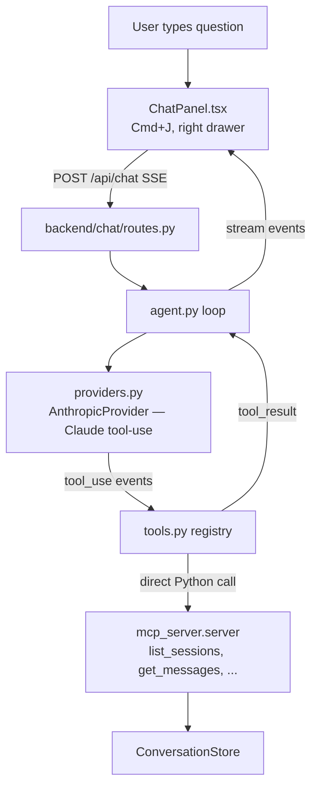

# In-App Agentic Chat Assistant

## Context

Users want to ask natural-language questions like "find all files edited in this session" without leaving the app to open Claude Code. The existing MCP server at `mcp_server/server.py` already exposes the exact primitives needed (`list_sessions`, `get_session_outline`, `get_messages`, `export_session`, `list_projects`) as plain Python callables under `@mcp.tool()` decoration — they can be imported and invoked directly, no stdio bridge required. Reference design: the Agentix chatbot at `/Users/rpeck/Source/agentix/agentix-fe-be/` (FastAPI + React + multi-model + agentic loop).

## High-Level Shape



## Design decisions

- **Anthropic-only in v1.** OpenAI + Gemini adapters triple surface area for a feature whose value lands at "it works." Ship Anthropic with a clean `Provider` interface so a second provider is a pure addition later.
- **SSE for streaming.** Matches Anthropic's native message-stream shape (`content_block_start`, `content_block_delta`, `message_delta`, tool_use events), minimizing translation. Use FastAPI's `StreamingResponse`.
- **Reuse MCP tool functions directly.** Import `list_sessions`, `list_projects`, `get_session_outline`, `get_messages`, `export_session` from `mcp_server.server`. They're plain Python functions under `@mcp.tool()` and return JSON-serializable dicts. No new search tool needed in v1 — `list_sessions(query=...)` already delegates to `backend.search.search_conversations`.
- **Context awareness via system prompt.** The request payload includes `current_session_id` from the URL; the system prompt tells Claude "the user is currently viewing session X; questions about 'this session' or 'here' refer to it." No special tool routing required.
- **API keys: env vars in v1** (`ANTHROPIC_API_KEY`). Settings-page UI deferred.
- **Panel pattern: copy `SearchPanel`.** Same slide-in, `data-allow-shortcuts` attribute on the input so global Cmd+K keeps working from inside the chat.

## Backend (new: `backend/chat/`)

```
backend/chat/
├── __init__.py
├── routes.py      # POST /api/chat (SSE), GET /api/chat/models
├── agent.py       # async run_agent(request) -> AsyncIterator[StreamEvent]
├── providers.py   # Provider protocol + AnthropicProvider impl
├── tools.py       # TOOLS registry wrapping mcp_server callables
└── schemas.py     # ChatRequest, ChatMessage, StreamEvent (pydantic)
```

Key specifics:

- **`tools.py`**: list of `ToolDef(name, fn, description, input_schema)`. Use `list_sessions` / `get_session_outline` / `get_messages` / `export_session` / `list_projects` imported from `mcp_server.server`. `input_schema` is an Anthropic-shaped JSON schema built by hand per tool (5 small schemas). The tool functions are synchronous → wrap the call site in `await asyncio.to_thread(...)`.
- **`providers.py`**: one `class AnthropicProvider` with `async def stream(messages, tools, system) -> AsyncIterator[StreamEvent]`. Internally uses the `anthropic` SDK's `messages.stream(...)` context manager. Yields normalized events: `{type: "text_delta", text}`, `{type: "tool_use", id, name, input}`, `{type: "end_turn"}`.
- **`agent.py`**: loops until `end_turn`. On `tool_use` event: look up in registry, `await asyncio.to_thread(fn, **input)`, append `{"role":"user","content":[{"type":"tool_result","tool_use_id":id,"content": json.dumps(result)}]}` to messages, loop.
- **`routes.py`**: `POST /api/chat` with `ChatRequest(message, history, model, current_session_id)` returns `StreamingResponse(event_generator(), media_type="text/event-stream")`. `GET /api/chat/models` returns `[{id: "claude-opus-4-7", label: "Claude Opus 4.7"}, {id: "claude-sonnet-4-6", label: "Claude Sonnet 4.6"}]`.
- **`backend/main.py`**: `from .routers import chat` then `app.include_router(chat.router, prefix="/api")`.
- **`pyproject.toml`**: add `anthropic>=0.40`.

## Frontend (new: `frontend/src/components/chat/`)

```
frontend/src/components/chat/
├── ChatPanel.tsx       # Drawer container, mirrors SearchPanel.tsx
├── ChatContext.tsx     # Messages, streaming state, toggle, model
├── MessageList.tsx     # User / assistant / tool-call / tool-result blocks
├── ToolCallBlock.tsx   # Collapsible, shows fn name + input + result
├── ModelPicker.tsx     # Dropdown wired to /api/chat/models
└── ChatInput.tsx       # Textarea + submit + stop button
```

- **Wiring**: `<ChatProvider>` inside `App.tsx` alongside `SearchPanelProvider` (`frontend/src/App.tsx:43`); `<ChatPanel />` mounted in `RootLayout.tsx` next to `<SearchPanel />` (`frontend/src/components/layout/RootLayout.tsx:12`).
- **Keybinding**: Cmd+J. Add to `useKeyboardShortcuts.ts` right after the Cmd+K block at line 130 — same `cmdOrCtrl` + `data-allow-shortcuts` pattern so it also works from inside the chat input.
- **Streaming**: `fetch` with `ReadableStream` reader, parse `event:` / `data:` SSE frames, append text deltas to the streaming assistant message.
- **Current-session awareness**: `ChatContext` reads `useParams()` UUID and includes it in `ChatRequest.current_session_id`.

## Verification

1. `curl -N -X POST http://localhost:8000/api/chat -H 'content-type: application/json' -d '{"message":"list my last 5 sessions","model":"claude-sonnet-4-6","history":[]}'` — SSE stream shows `tool_use` for `list_sessions` then `text_delta` for the answer, then `end_turn`.
2. In the UI, Cmd+J opens the chat drawer. Type "find all files edited in this session" while on `/conversations/<uuid>` — agent calls `get_session_outline` + `get_messages`, returns a file list.
3. Switch the model dropdown — confirm only the listed Anthropic models appear (v1 scope). (OpenAI / Gemini not shipped; provider interface exists.)
4. Stop button cancels an in-flight stream cleanly (abort the fetch).
5. Tool calls render as collapsible blocks in the chat; their JSON inputs/outputs are inspectable.
6. With `ANTHROPIC_API_KEY` unset, `/api/chat` returns 500 with a clear message (no silent hang).

## Explicitly out of scope (v1)

- OpenAI / Gemini providers (abstraction only)
- Embedding / RAG index
- Settings UI for API keys
- Per-user rate limiting (single-user local app)

## Sequencing

Ship after `cowork-multi-org.md`. The two changes are independent but the multi-org work is smaller and unblocks missing data; this one is larger scope.
