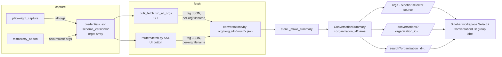

# Multi-Org Fetching (Cowork Support)

## Context

Claude.ai accounts with a personal org plus a "Cowork" workspace have more than one organization. The fetcher currently captures only the *first* org it sees and never queries the others, so Cowork conversations silently never reach the exporter.

Evidence:
- `fetcher/playwright_capture.py:91-92` takes `data[0].uuid` from `/api/organizations` and discards the rest.
- `fetcher/mitmproxy_addon.py:32,73` latches onto the first `org_id` matching a regex and stops.
- `fetcher/bulk_fetch.py:84` scopes every call to that single org_id.

Stored conversations carry no organization metadata, so even after a re-fetch there's no way to distinguish Personal vs Cowork at display time.

This document was reviewed by an adversarial LLM Council (Gemini-3-Pro + GPT-5.2). Council findings (P0-1 through P1-7) are folded into the relevant sections below; a summary mapping appears at the end.

## High-Level Shape



Both fetch paths must learn multi-org. The CLI (`bulk_fetch.py`) and the UI's "Fetch" button (`backend/routers/fetch.py` SSE endpoint) construct `ClaudeFetcher` independently — fixing only the CLI leaves the in-app fetch on the single-org bug.

## Phase 0 — Verify org topology + chat-visibility scoping (read-only probe)

Council P0-6: a "≥2 orgs vs =1 org" gate is too coarse. We must confirm what *actually scopes chat visibility*. An org may be listed but `/chat_conversations` denied, or Cowork may be partitioned by some header/cookie/account-context that the URL path doesn't capture.

Required artifacts before any code is written:

1. **Full `/api/organizations` response** — `uuid`, `name`, `capabilities` for every org.
2. **One `/chat_conversations` request per org context** — confirm the org `uuid` is the actual scoping dimension, with full URL + every request header + cookies recorded. Diff the two requests; the *only* differences should be the path-segment `org_id` and possibly per-org cookies.
3. **An empirical answer to: "When the user clicks the Cowork tab in Claude Desktop, what changes in outbound requests?"** Capture this via mitmproxy. If anything beyond the path segment changes (a workspace header, a context cookie, a different host), the multi-org loop must replicate that switch — not just the path.

```bash
SESSION=$(jq -r .session_key ~/.claude-exporter/credentials.json)
CF_BM=$(jq -r .cf_bm ~/.claude-exporter/credentials.json)
CF_CLEARANCE=$(jq -r .cf_clearance ~/.claude-exporter/credentials.json)

# Step 1: list orgs
curl -s -H "Cookie: sessionKey=${SESSION}; __cf_bm=${CF_BM}; cf_clearance=${CF_CLEARANCE}" \
  -H "User-Agent: Mozilla/5.0 (Macintosh; Intel Mac OS X 10_15_7) AppleWebKit/537.36" \
  https://claude.ai/api/organizations \
  | jq '[.[] | {uuid, name, capabilities}]'

# Step 2: probe each org's chat list (replace ORG_UUID per org). Record status code.
for ORG in $(curl -s ... /api/organizations | jq -r '.[].uuid'); do
  echo "=== $ORG ==="
  curl -i -s -H "Cookie: sessionKey=${SESSION}" \
    "https://claude.ai/api/organizations/${ORG}/chat_conversations?limit=1" | head -20
done
```

Decision gate:

| Probe outcome | Action |
|---|---|
| ≥ 2 orgs, all return 200 on `/chat_conversations` | Proceed with the plan as written. |
| ≥ 2 orgs, secondary returns 403/404 | Cowork uses some other scoping dimension. Capture Claude Desktop's actual Cowork-tab requests via mitmproxy and amend before coding. |
| Any org responds with a header/cookie change beyond `org_id` | Plan Phase 2 must include header/cookie passthrough; do not proceed without that captured. |
| = 1 org | Cowork is a project inside the personal org. Stop and re-plan around `project_uuid`. |

Fallback if Cloudflare blocks the curl probe (401/403): add `print(json.dumps(data, indent=2))` after `data = await response.json()` at `fetcher/playwright_capture.py:90`, re-run `uv run claude-explorer capture`, read the printed list, then revert.

## Design decisions

### Storage layout: per-org subdirectory

**Council P0-2 / P1-5.** Today both fetch paths write `<output_dir>/<uuid>.json` and dedup by filename stem. Two orgs returning the same conversation UUID (which happens when conversations are shared between orgs, and is statistically possible regardless) cause **silent data loss**: incremental mode skips the second org's copy, full-refresh mode silently overwrites the first. Confirmed by reading `fetcher/bulk_fetch.py:330-341`, `backend/routers/fetch.py:109-136`, and `backend/store.py:214-218,372-375`.

Fix: write per org. New layout:

```
~/.claude-explorer/conversations/
├── _index.json                  # global index (schema_version=2)
└── by-org/
    ├── <org_id_personal>/
    │   ├── <uuid_a>.json
    │   └── <uuid_b>.json
    └── <org_id_cowork>/
        └── <uuid_c>.json
```

This requires changes in three places:

1. `fetcher/bulk_fetch.py:save_conversation`: build `path = self.output_dir / "by-org" / self.current_org["uuid"] / f"{uuid}.json"` and `mkdir(parents=True, exist_ok=True)`.
2. `fetcher/local_claude_code.py:264-267`: parallel save path; same change. (Claude Code locally-imported sessions go under a synthetic `local` org id, e.g. `by-org/_claude_code/<uuid>.json`, so the loader treats them uniformly.)
3. `backend/store.py:_get_conversation_files` (line 214) + `routers/fetch.py:109-114`: glob becomes `data_dir.rglob("*.json")` (or explicitly `data_dir.glob("by-org/*/*.json")` to keep `_index.json` and any future top-level files out of the load set). The dedup set in `routers/fetch.py:113` becomes `set[tuple[str, str]]` keyed by `(org_id, uuid)`, populated by walking `by-org/<org_id>/`. Read `org_id` from the parent directory name.

**Migration of existing single-org data.** On the first multi-org run: walk `data_dir/*.json` (top-level), read each JSON's `organization_id` (None for legacy), and `os.rename` into `by-org/<org_id_or_PRIMARY>/`. `PRIMARY` resolves to the legacy `creds["org_id"]` (the only org we knew about pre-migration). Migration is one-shot and idempotent — guarded by a sentinel file `by-org/.migrated_v2`. **Migration is read-only of file contents** (only filesystem moves), so a partial failure leaves data recoverable: a separate `by-org/.migration_log.json` records every move.

### Credentials schema and the *real* "single normalization point"

**Council P0-1.** The original plan claimed `bulk_fetch.load_credentials()` was the single normalization point. It isn't — `backend/routers/fetch.py` reads `credentials.json` independently. Hand-wave fix.

Real fix: extract a shared module.

- New module: **`fetcher/credentials.py`** containing `load_credentials(path) -> CredentialsV2` and `save_credentials(creds, path)`. Imported by `bulk_fetch.py`, `routers/fetch.py`, `playwright_capture.py`, `mitmproxy_addon.py`, and tests. *No other module reads or writes `credentials.json` directly.* The plan must include a final-step grep audit to enforce this.
- New typed model `CredentialsV2`:

  ```python
  class CredentialsV2(TypedDict):
      schema_version: Literal[2]
      session_key: str
      cf_bm: str | None
      cf_clearance: str | None
      captured_at: str          # ISO8601
      orgs: list[OrgRef]        # always non-empty
      primary_org_id: str       # see P1-4 below
      org_id: str               # legacy mirror = primary_org_id, kept for one minor version
  ```

- `load_credentials()` accepts both schemas. If `schema_version` is missing (or 1), it synthesizes:
  ```python
  creds["schema_version"] = 2
  creds["orgs"] = [{"uuid": creds["org_id"], "name": None, "capabilities": []}]
  creds["primary_org_id"] = creds["org_id"]
  ```
  and **returns the upgraded dict in memory only** — no automatic disk rewrite. The next legitimate write (next capture, next save_credentials call) persists the v2 shape.
- `save_credentials()` writes atomically (see Atomic writes below) and always emits `schema_version: 2`.

### Primary org selection (P1-4)

`/api/organizations` doesn't document a stable order. Picking `orgs[0]` makes `primary_org_id` random across captures.

Resolution order:
1. If `creds["primary_org_id"]` already exists, keep it (sticky once chosen).
2. Else, prefer the org whose `capabilities` includes `"chat"` (or whatever flag the Phase 0 probe reveals; record the actual flag name in this section before coding).
3. Else, prefer the org with the **most conversations on disk** (a tiebreaker that survives mitm captures with no `/api/organizations` response).
4. Else, the first by UUID lexicographic order (deterministic fallback, never index-based).

The user can override at any time via `claude-explorer set-primary-org <uuid>` (new CLI subcommand).

### Atomic credentials writes (P0-5)

All `credentials.json` writes go through `fetcher/credentials.py::save_credentials()`:

```python
def save_credentials(creds: CredentialsV2, path: Path) -> None:
    _validate(creds)                       # raise if shape is wrong
    tmp = path.with_suffix(".json.tmp")
    bak = path.with_suffix(".json.bak")
    with open(tmp, "w") as f:
        json.dump(creds, f, indent=2)
        f.flush()
        os.fsync(f.fileno())
    if path.exists():
        os.replace(path, bak)              # last-known-good
    os.replace(tmp, path)                  # atomic on POSIX
```

`os.replace` is atomic on both POSIX and Windows, so the tmp+rename pattern alone is sufficient for crash safety. We deliberately **do not** add `fcntl.flock` (POSIX-only, would break Windows where `claude-explorer capture` is documented to run per CLAUDE.md). The two writers — `playwright_capture` and `mitmproxy_addon` — are not run concurrently in normal use (the user picks one capture flow), so the additional inter-process lock buys little. `_validate` rejects partial/malformed inputs before the tmp file is opened.

mitmproxy's "save on every new org" pattern goes through this same helper — increased write frequency does not increase corruption risk because every write is atomic.

### Per-org error handling (P0-3, P0-7)

Replace blanket `try/except: log + continue` with explicit per-org status:

| HTTP code on `/chat_conversations` | Behavior |
|---|---|
| 200 | `status: ok`, write conversations. |
| 401 (any org) | **Hard abort.** Surface "session expired — re-run `claude-explorer capture`" to the UI/CLI. Do not write a partial `_index.json`. |
| 403 / 404 (**primary** org) | Hard abort. Same surfacing. (User has lost access to their own primary org → something is wrong.) |
| 403 / 404 (**secondary** org) | Skip that org, mark `status: skipped`, persist `error_code` and `error_message` to `_index.json`. UI surfaces "Cowork: skipped (403)". |
| 429 | Retry with exponential backoff (3 attempts, base 30s, capped 5min). After exhausting retries: `status: failed`, persist error. **Never silently swallow.** Inter-org delay (existing `--delay`) applies *between* the retry chain too. |
| Other 5xx | Same retry + `status: failed` if exhausted. |
| Network/timeout | Same retry + `status: failed` if exhausted. |

**Crucially, a `failed` status does not overwrite previously-successful org data on disk.** Per-org subdirectories make this trivial: a failed Cowork run never touches `by-org/<personal_id>/`.

### `_index.json` schema (P1-3)

```json
{
  "schema_version": 2,
  "fetched_at": "2026-04-26T...Z",
  "orgs": [
    {
      "org_id": "...",
      "name": "Personal",
      "status": "ok",
      "fetched_count": 87,
      "skipped_count": 0,
      "error_code": null,
      "error_message": null,
      "conversations": [{"uuid": "...", ...}]
    },
    {
      "org_id": "...",
      "name": "Cowork",
      "status": "skipped",
      "fetched_count": 0,
      "skipped_count": 0,
      "error_code": "HTTP_403",
      "error_message": "Forbidden"
    }
  ]
}
```

`schema_version` lets external scripts and future commits detect the shape. We retain a top-level `org_id` mirror for one minor version (= primary org) for any external readers; remove in the version after.

### `'Claude Desktop'` legacy fallback (P1-1)

Council: bucketing untagged exports under `'Claude Desktop'` conflates **source** ("captured from the desktop app / web export") with **tenant** (Personal vs Cowork). After Phase 5's re-fetch, conversations migrate visibly between groups, breaking user trust.

Resolution:

- Storage: `organization_id` and `organization_name` stay `null` for un-retagged JSONs (do not synthesize `'Claude Desktop'` as a fake organization).
- UI: untagged Claude.ai conversations group under a distinct label `"Untagged (re-fetch to assign workspace)"`. Both source-icon and copy clearly tell the user a re-fetch is needed. The literal `'Claude Desktop'` string disappears from the group-key code path entirely.
- Source vs tenant remain orthogonal: `source` continues to drive the icon picker (P1-1 fallout into ConversationList.tsx — see Edits table).

### Sidebar workspace selector source (P1-2)

Council: deriving the selector's option list from `useConversations({}).data` is wrong on three axes — perf (5–10k row reduction every render), layout shift (set membership flips during a streaming SSE fetch), and missing-name false negatives.

Fix: new endpoint `GET /api/orgs` reads from `credentials.json` (always known *before* any conversation is fetched). Returns:

```json
[
  {"org_id": "...", "name": "Personal", "is_primary": true},
  {"org_id": "...", "name": "Cowork", "is_primary": false}
]
```

Sidebar consumes this. Selector visibility is gated on `length >= 2` of distinct `org_id`s (UUIDs, not names — so two orgs with identical names still show separately as `Cowork (uuid prefix)`). Layout reserves the slot to avoid shift; renders a placeholder when only one org exists.

### Capabilities field (P1-7)

We capture `capabilities` on the org. We will *use* it: if `capabilities` does not include the chat-list permission flag (exact name TBD by Phase 0 probe), skip that org's `/chat_conversations` request entirely instead of relying on a 403 → P0-3 path. Reduces noise in `_index.json` and avoids wasting one round-trip per non-chat org. If Phase 0 reveals capabilities are too vague to use this way, **drop the field** rather than store dead data.

### Cowork question (kept from prior plan)

Phase 0 + the chat-list probe collectively answer the personal-vs-project-vs-org question empirically. If the probe shows Cowork is a project inside the personal org, the entire plan reduces to project labeling and the multi-org loop is shelved.

## Edits

| File | Change |
|---|---|
| `fetcher/credentials.py` | **NEW.** Sole reader/writer of `credentials.json`. Exports `load_credentials() -> CredentialsV2`, `save_credentials(creds, path)`, `CredentialsV2` typed dict, and `OrgRef`. Handles v1→v2 in-memory upgrade. Does atomic write (tmp + `os.replace`) + `.bak` retention. Validates schema before persisting. **No `fcntl`** — `os.replace` is atomic on both POSIX and Windows. |
| `fetcher/playwright_capture.py` | In `get_org_id()` (line 83): return full list `[{uuid, name, capabilities}]` instead of `data[0].uuid`. Rename to `get_orgs()`. In `capture_credentials()` (line 174): build `creds = CredentialsV2(...)` with `orgs`, derive `primary_org_id` (see Primary org selection). **Delete the local `save_credentials` (line 197-204)** and update its call site in `main()` (line 237) to `from fetcher.credentials import save_credentials`. Update success printout to list all orgs *with redacted names by default* (P2-1; show full names under `--verbose`). |
| `fetcher/mitmproxy_addon.py` | Replace scalar `self.org_id` with `self.orgs: dict[str, dict]` keyed by UUID; accumulate all org UUIDs seen in `request()` (line 68). Remove the `self.captured` early-exit at line 73–76. Add a `response()` hook: when the request URL matches `/api/(v\d+/)?organizations(?:\?|$)` (regex on `flow.request.pretty_url`), and the response is JSON, decode using `flow.response.get_text()` (handles gzip/brotli automatically) inside a `try/except` that logs raw `Content-Length` + `Content-Encoding` + `Content-Type` on failure, then merge `[{uuid, name, capabilities}]` into `self.orgs`. Per-org provenance: store `seen_in_response: bool` so URL-only orgs are flagged "name unknown". **Delete `_save_credentials` (line 96-111)** and replace every persistence call (line 74) with `from fetcher.credentials import save_credentials; save_credentials(creds, self.credentials_path)`. |
| `fetcher/bulk_fetch.py` | `ClaudeFetcher.__init__` accepts `orgs: list[dict]` and `primary_org_id: str` (drop the scalar `org_id` param — `_api_url` now reads `self.current_org["uuid"]`). Add `self.current_org` set inside the loop. New method `run_all_orgs()` that iterates `self.orgs`, sets `self.current_org`, calls existing `fetch_conversation_list()`/`fetch_conversation()`, applying the per-org error policy. Inter-org pacing: enforce `time.sleep(self.delay)` between orgs, in addition to per-conversation delay. **Replace the existing 60s-sleep-and-recurse 429 handling at `fetch_conversation` (line 322-325)** with the documented exponential-backoff helper (3 attempts, 30s base, 5min cap) — applied *per org* so a 429 storm in Cowork doesn't burn the Personal-org request budget. `save_conversation()` (line 330): write to `self.output_dir / "by-org" / self.current_org["uuid"] / f"{uuid}.json"` (mkdir parents); inject `organization_id`/`organization_name` into the conversation dict before json.dump. `save_index()` (line 343): write the new schema (see `_index.json` schema). Build `existing_pairs: set[tuple[str, str]]` from `by-org/*/*.json` for incremental dedup. **Existing `run()` method (line 368)**: rewrite as a thin shim that constructs a single-org list `[{"uuid": self.primary_org_id, "name": None}]` and delegates to `run_all_orgs()`. No stale code path; `run()` stays callable from `__main__` for back-compat with anyone who imports `ClaudeFetcher` directly. |
| `fetcher/local_claude_code.py` | At line 264-267, write to `output_dir / "by-org" / "_claude_code" / f"{uuid}.json"`. The synthetic `_claude_code` "org" is filtered out of the `/api/orgs` selector (it's a source, not a tenant — P1-1 orthogonality). These JSONs are *not* loaded by `backend/store.py`'s desktop path (filtered at line 307 by `source == CLAUDE_CODE`); the directory exists only to keep imports from polluting tenant subdirs. |
| `fetcher/migrate_to_v2.py` | **NEW.** One-shot, idempotent. Walks `data_dir/*.json` (top-level only). Branches on `data.get("source")`: `CLAUDE_CODE` → moves into `by-org/_claude_code/<uuid>.json` *without* injecting `organization_id`/`organization_name` (these are not tenant-bound). Otherwise → moves into `by-org/<organization_id_or_primary>/<uuid>.json` *and* injects `organization_id`/`organization_name` (looked up from `creds.orgs`, or null if unknown) into the JSON before persisting, so `_make_summary` returns the right tenant on the next load. Uses the same atomic tmp-rename pattern as `save_credentials`. Logs every move + tag to `by-org/.migration_log.json`. Touches `by-org/.migrated_v2` sentinel only after every file has succeeded. Re-runnable safely (idempotent on already-tagged JSONs). Called automatically on first run of `bulk_fetch` or `routers/fetch.py` SSE if sentinel is absent. |
| `backend/routers/fetch.py` | `fetch_conversations_stream()` (line 62): import `load_credentials` from `fetcher.credentials` (no direct file read). Run `migrate_to_v2()` if sentinel absent. Build `ClaudeFetcher(orgs=creds.orgs, primary_org_id=creds.primary_org_id, ...)`, call `run_all_orgs` adapted to streaming. Emit `progress` events `{type: "org_start", org_id, name}` and `{type: "org_done", org_id, status, fetched_count, error_code}` around each org. Cumulative `current`/`total` counters span all orgs so the existing FetchDialog progress bar still reads right. Replace `existing_uuids = set()` (line 113) with `existing_pairs: set[tuple[str, str]]` keyed on `(org_id, uuid)`, populated from `by-org/<org_id>/*.json`. |
| `backend/routers/orgs.py` | **NEW.** `GET /api/orgs` returns `[{org_id, name, is_primary}]` from `load_credentials()`. Hides the `_claude_code` synthetic org. **Returns `200 []` (not 404) when no credentials exist** so the frontend `useOrgs` hook lands in success state with empty data; the sidebar's `length >= 2` gate then naturally hides the selector. (404 would surface as an `ApiError` toast via `frontend/src/lib/api.ts:21-26`, which is not "graceful".) |
| `backend/main.py` | Register the new `orgs` router under `/api`. |
| `fetcher/cli.py` | Register `claude-explorer set-primary-org <uuid>` Click subcommand alongside the existing `capture`/`fetch`/`serve` commands. Loads via `fetcher.credentials.load_credentials`, validates the supplied UUID is present in `creds["orgs"]` (else: print "Unknown org. Available: <list>" and exit 1), sets `creds["primary_org_id"] = uuid`, persists via `save_credentials`. Echo the resolved org name on success. |
| `backend/search.py` + `backend/routers/search.py` | Add `organization_id: str \| None` arg to `search_conversations()` (line 63) and the route. Filter inside the loop at line 79 with `if organization_id and conv.get("organization_id") != organization_id: continue`. Thread through `frontend/src/lib/api.ts:search` and `useSearch`. Without this, global Cmd+K search still mixes Personal + Cowork results regardless of the sidebar workspace filter. |
| `backend/models.py` | Add to `ConversationSummary` (line 46): `organization_id: str \| None = None`, `organization_name: str \| None = None`. |
| `backend/store.py` | Two changes: (a) in `_make_summary()` (line 228), read `organization_id`/`organization_name` from raw data and pass to `ConversationSummary`. (b) `_get_conversation_files()` (line 214) globs `by-org/*/*.json` (excludes top-level so `_index.json` doesn't leak in). |
| `backend/routers/conversations.py` | Add `organization_id: str \| None = Query(None)` to `list_conversations()` (line 19). Pass through to `store.list_conversations()`. In `store.list_conversations()` (line 319), add matching filter alongside `model` / `starred`. |
| `frontend/src/lib/types.ts` | Add `organization_id?: string \| null; organization_name?: string \| null` to `ConversationSummary` (line 15); add `organization_id?: string` to `ConversationFilters` (line 99). New `Org` type: `{ org_id: string; name: string \| null; is_primary: boolean }`. |
| `frontend/src/hooks/useOrgs.ts` | **NEW.** `useQuery(['orgs'], () => api.getOrgs())`. 5-min staleTime; revalidate after a successful fetch. |
| `frontend/src/contexts/SourceFilterContext.tsx` | Add `organizationId: string \| null` state + setter alongside the existing `sourceFilter`. Persist in localStorage. They compose. |
| `frontend/src/hooks/useConversations.ts` | Thread `organization_id` through the query key and request. Also extend `useSearch` (line 49) to accept and forward `organizationId`. |
| `frontend/src/contexts/SearchPanelContext.tsx` | Read `organizationId` from `SourceFilterContext` and pass to `useSearch` at line 90. Without this row, Cmd-K still mixes Personal + Cowork results regardless of the sidebar workspace selection — the backend filter and the `useSearch` arg both exist but nothing supplies the value at the call site. |
| `frontend/src/lib/api.ts` | In `getConversations` (line 29), add `if (filters?.organization_id) params.set('organization_id', filters.organization_id)` next to the other params at line 39. New `api.getOrgs()` calls `/api/orgs`. |
| `frontend/src/components/layout/Sidebar.tsx` | Add a second `<Select>` below the source filter (line 109 area). Source: `useOrgs().data` (NOT the conversation list). Render whenever there are ≥ 2 distinct `org_id`s; reserve the slot otherwise (placeholder div with same height) to prevent layout shift mid-stream. Display name = `org.name ?? \`Workspace (\${org.org_id.slice(0,8)})\``. On change, push `organization_id` into `SourceFilterContext`. |
| `frontend/src/components/conversation/ConversationList.tsx` | Two changes: (a) group key is `conv.organization_name ?? "Untagged (re-fetch to assign workspace)"`. The string `'Claude Desktop'` is removed from this code path. (b) Icon picker: switch to `const isClaudeAi = groupConvs.every(c => c.source === 'CLAUDE_AI')`, then `{isClaudeAi ? <MessageSquare /> : <FolderCode />}`. Source drives icon; tenant drives label. |
| `backend/tests/conftest.py` + `backend/tests/test_conversations.py` + `backend/tests/test_fetch.py` + `backend/tests/test_orgs.py` + `backend/tests/test_search.py` + `fetcher/tests/test_mitmproxy_addon.py` + `fetcher/tests/test_credentials.py` + `fetcher/tests/test_bulk_fetch_multi_org.py` | See Test plan. |

## Test plan (P1-6)

Tests are explicit, not implicit. Each Council finding gets a concrete test.

| Test | What it asserts |
|---|---|
| `test_credentials::test_v1_loads_as_v2_in_memory` | Loading a v1 file yields a `CredentialsV2` with synthesized `orgs` and `primary_org_id`; the on-disk file is not modified. |
| `test_credentials::test_atomic_write_survives_kill` | Simulate SIGKILL between `tmp` write and `os.replace`; assert original `credentials.json` and `.bak` survive intact. |
| `test_credentials::test_concurrent_writes_no_corruption` | Two writers race on `save_credentials`; final file is always valid JSON matching exactly one writer's intent (no half-merged blob). Atomicity is guaranteed by `os.replace`, not by an inter-process lock — the test should not assume serialization order. |
| `test_credentials::test_invalid_schema_rejected` | `save_credentials({})` raises before touching disk. |
| `test_mitmproxy_addon::test_response_hook_decodes_gzip` | `flow.response.get_text()` path with a gzip-encoded `/api/organizations` body. |
| `test_mitmproxy_addon::test_response_hook_handles_brotli` | Same with brotli. |
| `test_mitmproxy_addon::test_response_hook_matches_versioned_path` | `/api/v1/organizations` matches; `/api/organizations/abc` does not. |
| `test_mitmproxy_addon::test_response_hook_decode_failure_logs_and_continues` | A truncated body doesn't crash the addon. |
| `test_bulk_fetch_multi_org::test_filename_collision_isolated` | Two orgs both report UUID `X`; both files exist on disk under their own `by-org/<org_id>/` and contain their respective content. |
| `test_bulk_fetch_multi_org::test_dedup_pairs_not_uuids` | With `incremental=True` and Org A's `X.json` already on disk under `by-org/A/`, fetching Org B still pulls and saves `X.json` under `by-org/B/`. |
| `test_bulk_fetch_multi_org::test_secondary_403_records_status` | Mock secondary org returning 403; `_index.json` shows `status: "skipped"`, `error_code: "HTTP_403"`. Primary org's data unchanged. |
| `test_bulk_fetch_multi_org::test_primary_403_aborts` | Mock primary org returning 403; run aborts, no `_index.json` written, no partial state. |
| `test_bulk_fetch_multi_org::test_429_retries_then_fails` | Mock 3× 429 responses then 200; assert eventual success and proper backoff timing. After 3 failures, status is `"failed"`, prior org data untouched. |
| `test_bulk_fetch_multi_org::test_two_orgs_same_name_distinguished_by_id` | Both orgs named "Workspace"; sidebar selector still treats them as distinct (UUID-keyed). |
| `test_orgs::test_endpoint_returns_credentials_orgs` | `GET /api/orgs` reads from credentials, not conversations. |
| `test_orgs::test_endpoint_empty_when_no_credentials` | Fresh install (no `credentials.json`) yields `200 []` — *not* 404. Frontend selector remains hidden via the `length >= 2` gate without any error toast. |
| `test_orgs::test_synthetic_claude_code_org_filtered` | `_claude_code` does not appear in the response. |
| `test_conversations::test_organization_id_filter` | `?organization_id=<uuid>` returns only that org's rows. |
| `test_conversations::test_untagged_loads_with_null_org` | A pre-migration JSON without `organization_id` loads with `organization_id=None` — does not error. |
| `test_conversations::test_mixed_legacy_and_tagged_grouping` | A list containing both tagged and null-org rows groups them correctly: tagged under their workspace name, null under "Untagged". |
| `test_search::test_organization_id_filter` | Same as above for full-text search. |
| `test_migrate::test_idempotent` | Run migration twice; second run is a no-op (sentinel respected). |
| `test_migrate::test_partial_failure_logged` | Simulate a permission error mid-migration; assert `migration_log.json` records the partial state and sentinel is *not* touched. |
| `test_migrate::test_claude_code_routes_to_synthetic_org` | A top-level legacy JSON with `source: "CLAUDE_CODE"` migrates into `by-org/_claude_code/`, *not* into `by-org/<primary_org>/`. Source/tenant orthogonality (P1-1) is preserved across migration. |
| `test_migrate::test_legacy_files_get_org_id_injected` | A top-level legacy Claude.ai JSON without `organization_id` migrates into `by-org/<primary>/<uuid>.json` *and* the on-disk JSON now contains `organization_id` and `organization_name`. After migration, `_make_summary` returns the primary org's name, not "Untagged". |

## Verification

1. Phase 0 probe: `/api/organizations` returns ≥ 2 orgs, *and* a `/chat_conversations` request to each org returns 200 (or the expected scoped behavior is documented).
2. `uv run claude-explorer capture` writes `credentials.json` with `schema_version: 2`, an `orgs` array of length ≥ 2, and a deterministic `primary_org_id`. A simultaneous `kill -9` mid-write leaves either the old file intact or the new one — never a corrupt state.
3. `uv run claude-explorer fetch --full-refresh` produces `by-org/<personal>/...` and `by-org/<cowork>/...` directories. `_index.json` matches the documented v2 schema. Mid-run SIGINT leaves successful org subdirs intact and the partial org's subdir intact-but-incomplete (next incremental run resumes it).
4. `curl /api/conversations?organization_id=<cowork-uuid>` returns Cowork-only.
5. `curl /api/orgs` returns Personal + Cowork *without* `_claude_code`.
6. UI: open FetchDialog → progress emits `Fetching Personal…` then `Fetching Cowork…`; final `_index.json` reflects both orgs. Workspace `<Select>` appears (since orgs ≥ 2). With "Group by project" on, untagged JSONs land under "Untagged (re-fetch to assign workspace)" rather than the legacy `'Claude Desktop'`. Source-icon stays correct (blue MessageSquare for Claude.ai groups regardless of tenant label).
7. Force a secondary-org 403 (e.g. by editing the primary's `org_id` in credentials to be the only valid one): verify `_index.json` records `status: "skipped"`, the UI surfaces the skip in the FetchDialog summary, and primary-org data is unchanged.
8. Force a primary-org 401 (revoke session): verify the run hard-aborts with a clear "session expired" message in the UI/CLI; no `_index.json` is rewritten.
9. `uv run pytest backend/tests fetcher/tests` — full new test suite passes (see Test plan).
10. Backward-compat smoke: drop a v1 `credentials.json` + a flat-layout `data_dir` on a fresh checkout, run `claude-explorer fetch` once: migration runs, credentials get re-saved as v2 only on the next legitimate write, conversations relocate into `by-org/`, sentinel appears. Verify by re-running fetch — second run is a no-op for the migration step.

## Phase 5 — Re-fetch (post-implementation)

After Phases 1-4 land, run `uv run claude-explorer capture` then `uv run claude-explorer fetch --full-refresh`. Existing on-disk JSONs lacking `organization_id` are migrated into `by-org/<primary_org>/` first (one-shot, idempotent), then re-fetched in place — the `--full-refresh` re-tags them with the up-to-date `organization_name`. After this, "Untagged (re-fetch to assign workspace)" should be empty for users with valid credentials.

## Risks / open items

- **Cowork actually scopes by something other than `org_id`.** Phase 0's chat-list probe is the only safeguard. If discovered post-coding, the multi-org loop becomes a multi-context loop with the additional axis (header/cookie). Cost is moderate — `ClaudeFetcher.run_all_orgs` becomes `run_all_contexts` and the credentials schema gains a per-org context blob.
- **mitmproxy capture without `/api/organizations` traffic.** Org names stay null until the next playwright capture. Plan handles this gracefully (selector renders `Workspace (<uuid_prefix>)` for null-name orgs); Council P0-4's response-hook decode work is the mitigation.
- **Disk migration of large existing data dirs.** `os.rename` on the same filesystem is metadata-only and fast. If `data_dir` is on a different filesystem from the system temp, fall back to copy-then-delete with progress.
- **External tooling reading `_index.json` v1.** We retain the top-level `org_id` mirror (= primary) for one minor version. Document deprecation in the next release notes.

## Council critique resolutions (audit trail)

| Finding | Severity | Resolution location |
|---|---|---|
| P0-1 Single normalization point claim is false | Blocker | New `fetcher/credentials.py` module; explicit grep audit in Edits table |
| P0-2 Filename collision across orgs | Blocker | "Storage layout: per-org subdirectory" + Edits to `bulk_fetch.py`, `local_claude_code.py`, `store.py`, `routers/fetch.py` |
| P0-3 Per-org `try/except` masks failures | Blocker | "Per-org error handling" + per-org status persisted in `_index.json` |
| P0-4 mitmproxy hook misparses compressed bodies | Blocker | `mitmproxy_addon.py` row in Edits + dedicated tests |
| P0-5 Non-atomic credentials writes | Blocker | "Atomic credentials writes" section + `fetcher/credentials.py::save_credentials` |
| P0-6 Phase 0 binary gate too coarse | Blocker | "Phase 0" section requires chat-list probe per org + cookie/header diff |
| P0-7 Rate-limit storms across orgs | Blocker | "Per-org error handling" defines 429 backoff and inter-org pacing |
| P1-1 `'Claude Desktop'` fallback conflates source vs tenant | Should-fix | "`'Claude Desktop'` legacy fallback" section + ConversationList.tsx changes |
| P1-2 Sidebar derives orgs from conversation list | Should-fix | New `GET /api/orgs` endpoint + `useOrgs` hook + Sidebar change |
| P1-3 `_index.json` schema break has no version field | Should-fix | "`_index.json` schema" section adds `schema_version: 2` |
| P1-4 `orgs[0]["uuid"]` is non-deterministic | Should-fix | "Primary org selection" defines a deterministic resolution order |
| P1-5 Filename includes org_id (collides with P0-2) | Should-fix | Same fix as P0-2 |
| P1-6 Test coverage insufficient | Should-fix | "Test plan" section enumerates every required test |
| P1-7 `capabilities` captured but unused | Should-fix | "Capabilities field" section commits to using or dropping |
| P2-1 Workspace names may be sensitive | Nice-to-have | Names redacted in capture output unless `--verbose` (Edits row for `playwright_capture.py`) |
| P2-2 Sidebar layout shift mid-fetch | Nice-to-have | Sidebar reserves slot to prevent shift |
| P2-3 Document cross-org UUID assumption | Nice-to-have | Per-org subdir layout makes the assumption moot; documented anyway in "Storage layout" |
