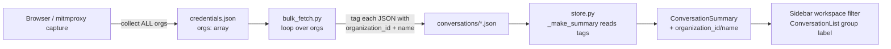

# Multi-Org Fetching (Cowork Support)

## Context

Claude.ai accounts with a personal org plus a "Cowork" workspace have more than one organization. The fetcher currently captures only the *first* org it sees and never queries the others, so Cowork conversations silently never reach the exporter.

Evidence:
- `fetcher/playwright_capture.py:91-92` takes `data[0].uuid` from `/api/organizations` and discards the rest.
- `fetcher/mitmproxy_addon.py:32,73` latches onto the first `org_id` matching a regex and stops.
- `fetcher/bulk_fetch.py:84` scopes every call to that single org_id.

Stored conversations carry no organization metadata, so even after a re-fetch there's no way to distinguish Personal vs Cowork at display time.

## High-Level Shape



## Phase 0 — Verify org topology (read-only probe, do this first)

The plan below assumes Cowork is a **distinct `org_id`** (matches Claude.ai's documented topology). If Cowork is instead a *project* inside the personal org, the fix shape changes (project filter rather than org loop). Confirm before writing code.

```bash
SESSION=$(jq -r .session_key ~/.claude-exporter/credentials.json)
CF_BM=$(jq -r .cf_bm ~/.claude-exporter/credentials.json)
CF_CLEARANCE=$(jq -r .cf_clearance ~/.claude-exporter/credentials.json)

curl -s -H "Cookie: sessionKey=${SESSION}; __cf_bm=${CF_BM}; cf_clearance=${CF_CLEARANCE}" \
  -H "User-Agent: Mozilla/5.0 (Macintosh; Intel Mac OS X 10_15_7) AppleWebKit/537.36" \
  https://claude.ai/api/organizations \
  | jq '[.[] | {uuid, name, capabilities}]'
```

Decision gate:

| `/api/organizations` length | Action |
|---|---|
| **≥ 2** (expected) | Proceed with Phases 1–4 below. Note the Cowork org's UUID + name for verification. |
| **= 1** | Cowork is *not* a separate org. Stop and re-plan: investigate per-conversation fields (e.g. `project_uuid`) and/or alternate list endpoints. |

Fallback if Cloudflare blocks the curl probe (401/403): add a one-line `print(json.dumps(data, indent=2))` after `data = await response.json()` at `fetcher/playwright_capture.py:90`, re-run `uv run claude-explorer capture`, read the printed list, then revert.

## Design decisions

- **Single directory, tagged files.** Keep one `~/.claude-exporter/conversations/` folder. Each JSON gets `organization_id` + `organization_name` fields stamped in before save. Rationale: `ConversationStore._get_conversation_files()` at `backend/store.py:214` already globs all `*.json`; splitting into per-org subdirs would require larger store changes for no real benefit.
- **Credentials schema.** Extend `credentials.json` with a new `orgs: [{uuid, name, capabilities}]` array. Keep `org_id` as the *primary* (first) for any code that hasn't been updated yet — read by `bulk_fetch.load_credentials()` and as a CLI-override default.
- **No `_index.json` backward-compat gymnastics.** `store.py` doesn't actually read `_index.json`; only `bulk_fetch.save_index()` writes it. Update the writer's schema (add `orgs` array with counts); nothing on the read side breaks.
- **Cowork question (personal vs. project vs. separate org) resolves itself during capture.** Log every org UUID/name seen; the user confirms whether Cowork is a distinct `org_id` or a project inside the personal org. Plan assumes distinct org (the documented Cowork setup); if it's a project, the same multi-org code path is still harmless and the scope shrinks to project labeling.

## Edits

| File | Change |
|---|---|
| `fetcher/playwright_capture.py` | In `get_org_id()` (line 83): return full list `[{uuid, name, capabilities}]` instead of `data[0].uuid`. Rename to `get_orgs()`. In `capture_credentials()` (line 174), build `credentials["orgs"] = [...]` and set `credentials["org_id"] = orgs[0]["uuid"]` for compatibility. Update success printout to list all orgs. |
| `fetcher/mitmproxy_addon.py` | Replace scalar `self.org_id` with `self.org_ids: set[str]`; accumulate all org UUIDs seen (line 68). Remove the `self.captured` early-exit at line 73–76; instead save on every new org. Optionally probe `/api/organizations` once via a response hook to get human names; otherwise names come later from Playwright or remain null. |
| `fetcher/bulk_fetch.py` | `ClaudeFetcher.__init__` accepts `orgs: list[dict]` (each `{uuid, name}`) in addition to/instead of the single `org_id`. Add `current_org` instance var used by `_api_url()`. New method `run_all_orgs()` (or refactor `run()`) iterates over `self.orgs`, sets `current_org`, calls existing `fetch_conversation_list()` / `fetch_conversation()`. In `save_conversation()` (line 330), before writing, inject `conversation["organization_id"] = self.current_org["uuid"]` and `conversation["organization_name"] = self.current_org.get("name", "")`. In `save_index()` (line 343), change top-level shape to `{fetched_at, orgs: [{org_id, name, total, conversations: [...]}]}`. |
| `backend/models.py` | Add to `ConversationSummary` (line 46): `organization_id: str \| None = None`, `organization_name: str \| None = None`. |
| `backend/store.py` | In `_make_summary()` (line 228): read `organization_id = data.get("organization_id")` and `organization_name = data.get("organization_name")`, pass to `ConversationSummary`. No `_index.json` changes needed — the store doesn't read it. |
| `backend/routers/conversations.py` | Add `organization_id: str \| None = Query(None)` to `list_conversations()` (line 19). Pass through to `store.list_conversations()`. In `store.list_conversations()` (line 319), add matching filter alongside `model` / `starred`. |
| `frontend/src/lib/types.ts` | Add `organization_id?: string \| null; organization_name?: string \| null` to `ConversationSummary` (line 15); add to `ConversationFilters` (line 96). |
| `frontend/src/contexts/SourceFilterContext.tsx` | Add `organizationId: string \| null` state + setter alongside the existing `sourceFilter`. Keep the existing source filter — they compose. |
| `frontend/src/hooks/useConversations.ts` | Thread `organization_id` through the query key and request. |
| `frontend/src/components/layout/Sidebar.tsx` | Add a second `<Select>` below the source filter (line 109 area), populated from the set of distinct `organization_name`s present in the loaded conversations. Default value `all`. Hidden entirely if only one org is seen (single-user, no Cowork). |
| `frontend/src/components/conversation/ConversationList.tsx` | In the group-by-project branch (line 114), replace hard-coded `'Claude Desktop'` group key with `conv.organization_name ?? 'Claude Desktop'` so Personal/Cowork become separate groups. |

## Verification

1. `uv run claude-explorer capture` with an account that has both personal + Cowork → `credentials.json` shows `orgs` array length ≥ 2.
2. `uv run claude-explorer fetch` → `_index.json` has an `orgs` array with separate counts; individual conversation JSONs contain `organization_id` + `organization_name`.
3. `curl 'http://localhost:8000/api/conversations?organization_id=<cowork-uuid>'` returns only Cowork conversations.
4. In the web UI, the new workspace `<Select>` appears (since two orgs exist) and filters correctly. With "Group by project" on, Claude Desktop conversations split into "Personal" / "Cowork" groups.
5. Run `uv run pytest backend/tests` — existing tests still pass (optional fields default to None).
6. Fixture: a single-org-only JSON (no `organization_id` field) still loads and appears under a "Untitled workspace" / no-filter fallback.

## Phase 5 — Re-fetch (post-implementation)

After Phases 1-4 land, run `uv run claude-explorer capture` then `uv run claude-explorer fetch --full-refresh`. Existing on-disk JSONs lack the new fields and will appear under the legacy `'Claude Desktop'` group until re-fetched; `--full-refresh` re-tags them all in one pass.

## Risks / open items

- **Cowork access to the chat list endpoint**: not all orgs may grant `/chat_conversations`. Wrap the per-org fetch in try/except (catch 401/403/404) and log + continue, so a permission gap on one org doesn't brick the whole fetch.
- **Renaming the legacy group label**: the literal `'Claude Desktop'` may be referenced as a group/sort key elsewhere — grep before changing. Safer path: keep `'Claude Desktop'` as the fallback when `organization_name` is null, and only split when names are known.
- **mitmproxy-only captures don't carry org names**: the proxy sees UUIDs but not human names. Acceptable — names are filled in on the next playwright capture; UI hides the workspace `<Select>` while only one distinct (non-null) name is known.
