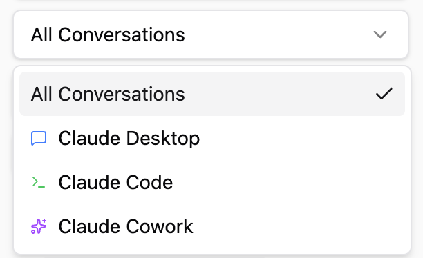
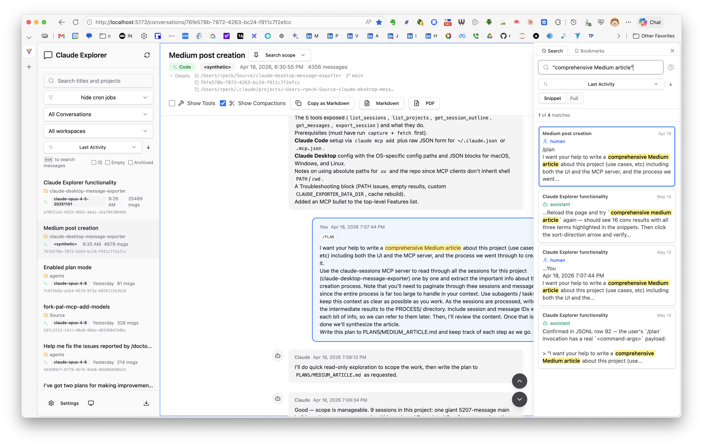
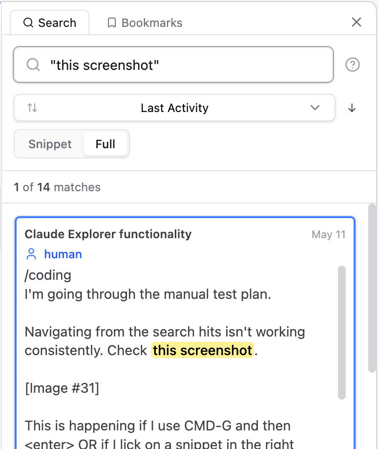
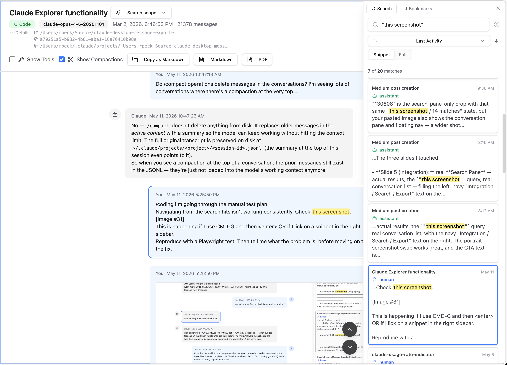
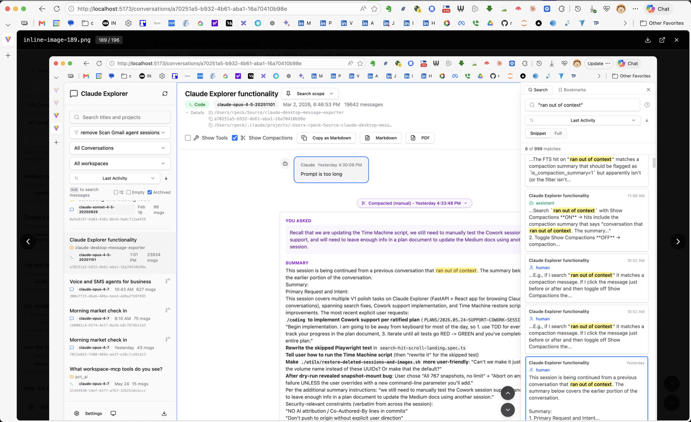
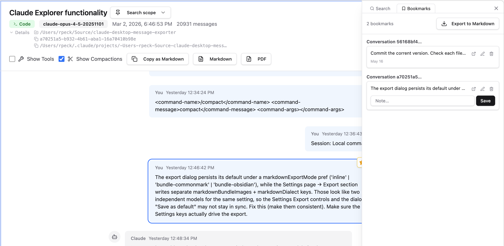
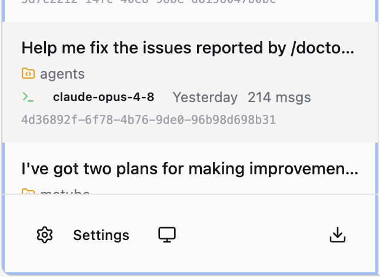
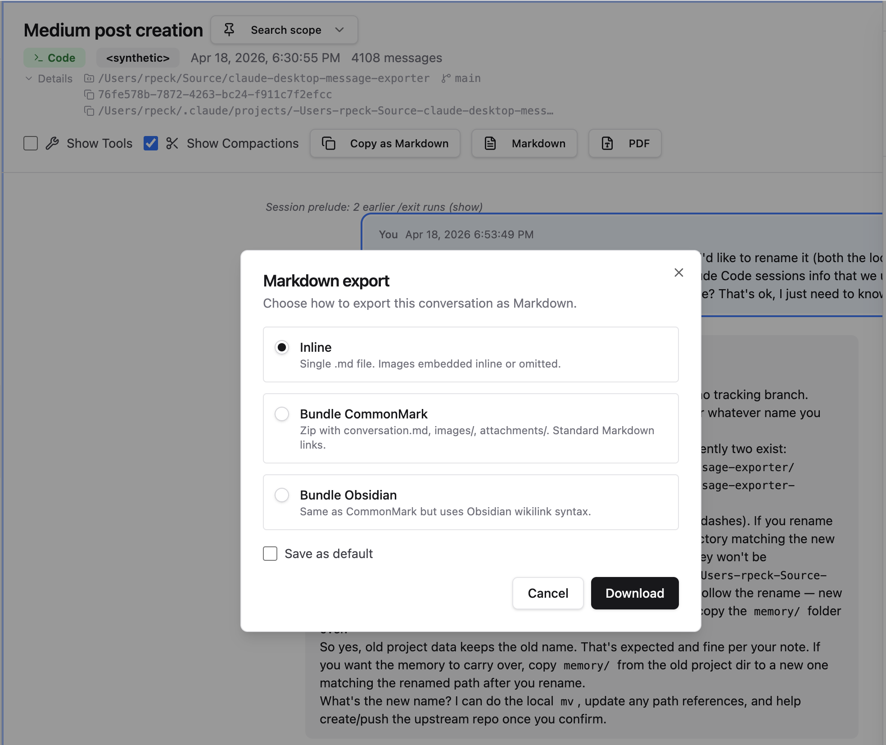
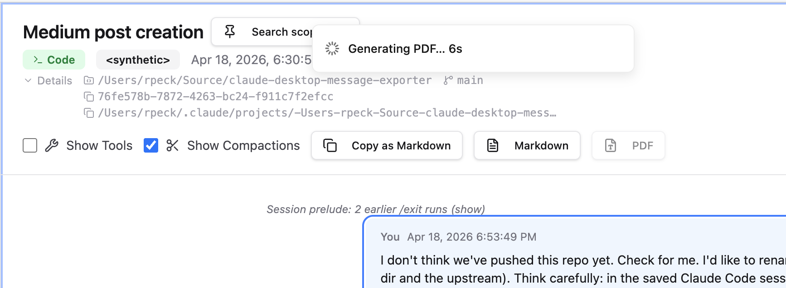

<!--
  Medium series: Unlocking Your Claude History
  Part 2 of 7: Draft (Council synthesis: Gemini 3 Pro + GPT-5.2-pro drafters, cross-critique, Opus synthesis)
  Sources: Part 1 (immutable), PROCESS/99_styleguide.md, README.md, phase_07/11/14/18/19 extractions
  Voice: Raymond Peck's "Best Practices for Modern REST APIs in Python" series
-->

# Part 2: Using the `claude-explorer` Web App (User Guide with Technical Deep Dive)

*This is the user guide for the `claude-explorer` web app plus a deep-dive into how the front end works under the hood (the search index, the image-cache architecture, settings persistence, dark mode, exports). If you only want the product tour without the implementation detail, see the [user-guide version](part_2_web_app_userdoc.md) or the [Quickstart](part_2_web_app_quickstart.md).*

***In this part of the series, we'll install `claude-explorer`, capture and fetch your Claude Desktop history, and then take a full product tour of the web UI: the unified Conversation List, full-text search, keyboard navigation, reading conversations, appearance and settings, and exports.***

> **Disclaimer**: This is an independent, community-built project. It is not affiliated with, endorsed by, sponsored by, or supported by Anthropic, PBC. "Claude" and "Claude Code" are trademarks of Anthropic, PBC. This project consumes Anthropic's products as a user would (via the same APIs and on-disk file formats the official clients use), but nothing here represents an Anthropic-sanctioned interface, and the formats this project depends on may change without notice. If they do, I'll update the project asap.


In the previous installation of this series, we covered the three moving parts that make this project work (capture → fetch → browse / export / query), plus the five reasons you'd actually want a unified local archive in the first place. If you missed that, make sure to go back and read [Part 1](https://medium.com/@raymondpeck/unlocking-your-claude-history-part-1-f19000c05655) first; Part 1 explains why we have to "capture" a `sessionKey` to download Claude Desktop conversations, and that Claude Code sessions already live on disk under `~/.claude/projects/`.

## Contents

- [Install and First Run](#install-and-first-run)
- [The Conversation List](#the-conversation-list)
- [Reading Messages](#reading-messages)
- [Searching and Navigating with the Keyboard](#searching-and-navigating-with-the-keyboard)
- [Inside the Conversation Pane](#inside-the-conversation-pane)
- [Appearance and Settings](#appearance-and-settings)
- [Exports (Markdown and PDF)](#exports-markdown-and-pdf)
- [Your History, On Your Disk](#your-history-on-your-disk)
- [Security](#security)
- [Performance](#performance)
- [Coming Up: Another Claude, Analyzing Your Sessions](#coming-up-another-claude-analyzing-your-sessions)
- [Wrapping Up!](#wrapping-up)

<a id="install-and-first-run"></a>

## Install and First Run

`claude-explorer` is a local tool you can get running in just a few minutes: install dependencies, start the server, open it in your browser, and let the UI handle credential capture and the first fetch on its own. We'll leave the MCP server for the next article in the series; it lets you use the same corpus of Claude conversations to have Claude analyze its own behavior, which has a bunch of different use cases.

We use `uvx` (from [Astral](https://docs.astral.sh/uv/getting-started/installation/), which is [joining OpenAI](https://openai.com/index/openai-to-acquire-astral/)) to do the heavy installation lifting; one command installs `claude-explorer` into an isolated, cached environment and runs it, so it feels closer to launching a native app than to a typical Python install. If you'd rather install from source, the [README.md](https://github.com/rpeck/claude-explorer#readme) and [CONTRIBUTING.md](https://github.com/rpeck/claude-explorer/blob/main/CONTRIBUTING.md) have the `git clone` + `uv sync` flow. 

Here's the "happy path" install and first run, end to end:

```bash
which uvx

# install uv/uvx if needed: https://docs.astral.sh/uv/getting-started/installation/

# One-time setup, in any order:

# install Chromium for in-process credential capture
# (skip if you only care about Claude Code sessions; they need no capture)
uvx --from claude-explorer playwright install chromium

# Strongly recommended: install the always-on image-cache watcher.
# One-time; runs as a launchd / systemd / Task Scheduler job. If you
# skip this, claude-explorer can only protect your screenshots while
# `serve` is running, and Claude Code rotates its image cache on its
# own schedule, so any image rotated during downtime is gone.
uvx claude-explorer install-watcher

# Optional: install the system libraries WeasyPrint needs for PDF export
# (skip if you'll only export to Markdown).
#   macOS:   run the brew command below
#   Linux:   use your distro's pango / cairo / libffi packages
#   Windows: install MSYS2 (https://www.msys2.org), then in its shell run
#            `pacman -S mingw-w64-x86_64-pango`. Or grab the standalone
#            WeasyPrint .exe from the GitHub releases page to skip the
#            system-library dance entirely.
brew install pango cairo libffi

# Then run the app (this one blocks; leave it running and open the URL in your browser):
uvx claude-explorer serve
```

That's it for the terminal. Open `http://localhost:8765` and your Claude Code sessions are visible immediately; those JSONL files already live under `~/.claude/projects/` and the back end reads them live at request time.

The default port is `8765`, picked specifically because nothing widely-deployed claims it. If you got an `[Errno 48] Address already in use` error from the `serve` command, something else is already on the port, almost always a previous `claude-explorer` run that didn't exit cleanly. Identify it and kill it:

```bash
# macOS / Linux
lsof -i :8765                            # see what's holding the port
kill $(lsof -ti :8765)                   # kill it (Ctrl-C-style; add -9 if it ignores you)
```

```powershell
# Windows (PowerShell)
Get-NetTCPConnection -LocalPort 8765 | Select-Object OwningProcess
Stop-Process -Id (Get-NetTCPConnection -LocalPort 8765).OwningProcess
```

If you'd rather just pick a different port instead, re-run with:

```bash
uvx claude-explorer serve --port 8766
```

For the full set of flags, run:

```bash
uvx claude-explorer serve --help
```

To pull in your Claude Desktop history, click the **Refresh** button in the top of the Conversation List and the UI runs the full pipeline in-process: capture credentials (Playwright), persist them to `~/.claude-explorer/credentials.json`, then incrementally fetch your conversations and stream progress back to a small status popup in the corner of the window. Subsequent Refresh clicks reuse the saved credentials and only re-capture when they expire.

### Tech Overview

Skip ahead if the stack doesn't interest you.
#### Back and front end stack
The back end uses FastAPI from Sebastián Ramírez for the REST API, served by uvicorn, with [FastMCP](https://github.com/PrefectHQ/fastmcp) layered on for the MCP server you'll meet in Part 3. I cover FastAPI in detail in [my best-practices column](https://medium.com/@raymondpeck/column-best-practices-in-modern-python-0cc40b50170e). PDF export goes through [WeasyPrint](https://weasyprint.org/). The optional `brew install` line earlier in the install block was for its system libs. The whole Python side runs inside a `uv`-managed virtual environment; `uv` is also how `uvx` ran the install command at the top of this section.

The front end is React 19 + TypeScript, built with Vite, styled with Tailwind CSS v4, and assembled out of shadcn/ui components, with TanStack Query for server-state caching. The whole thing builds to a static bundle that the FastAPI process serves directly; one server for both.

Packaging is hatchling, and the PyPI wheel ships with the pre-built React bundle inside it. That's the trick that lets `uvx claude-explorer serve` be a single line: nothing to clone, nothing to build, just run.

#### Credentials
Credential capture uses Playwright to open a Chromium window for the standard login flow. The fetcher itself uses httpx for the HTTP calls and curl_cffi for the TLS fingerprint Cloudflare expects from a real desktop browser.

#### FTS5 for fast search
Search is SQLite FTS5 for the fast path and a linear-scan fallback (orjson + an mtime-keyed FileCache + a ThreadPoolExecutor) for the case where FTS5 is not available in a given sqlite3 build. We'll get to the details when we get to search.

### Some details about auth and fetching

Skip ahead if the auth internals don't interest you.

Claude Desktop's history lives behind a session cookie called `sessionKey`. The default capture path opens a Chromium window via Playwright, lets you log into Claude the normal way (email, Google, your work SSO, whatever your account uses), and on success reads the `sessionKey` cookie plus the active org ID out of the browser context. Those two values get written to `~/.claude-explorer/credentials.json` with mode `0o600`, atomically. The capture step has no network egress beyond the browser tab you used to log in; the code path is `fetcher/playwright_capture.py::capture_credentials` if you want to audit it.

With credentials in hand, the fetch step uses the unofficial `chat_conversations` API at `GET /api/organizations/{org_id}/chat_conversations` to list IDs and `GET /api/organizations/{org_id}/chat_conversations/{uuid}` to pull each full conversation tree. The fetcher rate-limits itself to a 0.3s polite pause between requests. It is incremental by default (skips conversations already on disk); `--full-refresh` re-pulls everything, `--limit N` caps the run, `--verbose` shows progress. We store the JSON in `~/.claude-explorer/conversations/` and attachment bytes in a sibling `~/.claude-explorer/files/` keyed by conversation and file UUID.

`sessionKey` expires eventually. When that happens, the next Refresh click gets a `401` / `403` / `cf-mitigated` response, and the back end automatically launches the Playwright login flow again so you get a new cookie without dropping to the CLI. The same headless CLI commands (`claude-explorer capture`, `claude-explorer fetch`) are also available for the days when you'd rather drive the whole pipeline from a cron job or another script, e.g. for the MCP server.

<a id="the-conversation-list"></a>

## The Conversation List

The install's done and the first fetch is streaming in. Open the browser, and the Conversation List is the first thing your eye lands on; that's where the tour starts.

The Conversation List makes the unified corpus visible: one list containing all three Claude session sources side by side. Claude Desktop conversations (read from the fetched JSON files), Claude Code sessions (read live and cached from `~/.claude/projects/*.jsonl`), and Claude Cowork sessions (Desktop's "Cowork mode" local agent, whose append-only `audit.jsonl` logs live under `~/Library/Application Support/Claude/local-agent-mode-sessions/`). All three are indexed by the same full-text search and exported by the same Markdown / PDF pipeline. A few affordances make the list usable once you've got more than a couple dozen sessions. Special shout-out to Donald Norman for *The Design of Everyday Things*, which everyone should read! That was my intro to the word "affordance" a million years ago.

<div align="center">

</div>

### Source filter and project grouping

At the top, you can search by title or project.

Just below that, you'll see the named filter dropdown. More on that in a bit.

Next is a simple source filter dropdown: `All Conversations` | `Claude Desktop` | `Claude Code` | `Claude Cowork`. That sounds trivial, but it helps because your brain tends to remember context before content. Cowork sessions also pick up a "Show archived" toggle in the Conversation List (default-off) so the sessions you've archived in Desktop don't clutter the list until you ask for them.

<div align="center">

</div>

Claude Code sessions can also be grouped by project. The UI pulls the project name from the directory the session ran in, which is usually the git repo root (or at least somewhere inside it); it then renders a collapsible grouping so you can treat *"everything I did in repo `foo`"* as a first-class collection.

### Row metadata

Each row in the list carries just enough metadata to let you scan without clicking:

- The session title (or a derived title when the source format doesn't provide one).
- A source icon: a green terminal for Claude Code, a blue message glyph for Claude Desktop, a purple spark for Claude Cowork (hover for the name). The open conversation repeats it as a labeled badge in its header.
- A last-updated timestamp.
- A message count.

Those four fields give you the shape of the conversation: whether it was long or short, fresh or old, and where it came from. That's surprisingly close to how humans remember work; we rarely remember exact filenames, but we do remember that something happened "last month," that it was "a big session," and that it was "the CLI session, not the web chat."

You'll also see a starred group at the top. When you find something you know you'll come back to (a good project retrospective, a hard-won debugging thread, a clean solution you don't want to lose), you star it and it stops drifting away into the scrollback. Note that we also have message bookmarks, which we'll see later.

### The refresh button

There's a refresh button at the top of the Conversation List, and it does exactly what you want in a unified browser: one click triggers a Desktop fetch for new conversations *and* a re-scan of the Claude Code directory. You don't have to remember which source needs which kind of refresh; the UI just rebuilds the corpus and you keep reading. I asked for that because I'm lazy, and laziness is the mother of invention. Refresh is bound to **`⌘+R`**.

### The phantom-session filter

Claude Code sometimes spawns sessions with only local-command scaffolding and no real conversation; the Conversation List filters those out, while keeping any session where real conversation appears after the scaffolding. Noise and annoyance kill your trust in a tool.

### Named filters

Just below the title-search box, the Conversation List carries a small *named-filter* picker for saving and reusing title-pattern filters. Each filter has a name plus a behavior (*hide matches* or *show only matches*) plus one or more patterns. E.g., a single `cron jobs` filter can match every recurring job pattern you don't want cluttering up your view all the time, and toggling it on hides them all. The active selection is sticky across reloads, so tomorrow's view of the archive is whichever one you closed with today.


Filters can also be composed into groups that AND / OR other named filters together, which is handy when you want one filter that, e.g., hides cron jobs AND keeps client-A work without juggling two toggles. Exactly one filter is active at a time: select *Hide work-day chores* to narrow, select *All conversations* to broaden.

<a id="reading-messages"></a>

## Reading Messages

Before we get to global search and keyboard navigation that span the whole archive, let's look at how the viewer presents the conversation in front of you. Tool calls and slash commands both get deliberate treatment so the human-readable thread stays readable.

### Tool blocks and slash commands

The viewer hides `tool_use` and `tool_result` blocks by default, because tool output can dominate the screen and drown out the narrative flow of the conversation. When you want them, tick the **Show Tools** checkbox in the conversation toolbar; when you don't, you read the thread as a human conversation again. The toolbar uses semantic checkboxes; you can tell at a glance which view-filters are on without having to interpret an icon's "active" state.

The default is the right one for *reading* a session ("what happened, in plain English?"), and the toggle is there for *auditing* one ("what did the assistant actually run, and what did it get back?"). Reconstructing a debugging thread, for example, we usually want the tool calls visible. Image attachments are deliberately *not* gated by that toggle; they're primary content.


Slash commands get the same careful treatment. When you ran `/coding "Help me trace this bug"` or `/plan <long prose>`, the user's prompt renders as a normal message bubble with a small `/command` badge above the body so the provenance is obvious.

When you ran `/exit`, `/clear`, or any argless command, the bubble collapses to a muted *"Session: /exit"* marker that's visually de-emphasized; it's chrome, and it's excluded from search and exports for the same reason.

And when a session opens with one or more `/exit` markers before any real user message (it happens more than you'd expect on long-running sessions resumed from a different terminal), the leading markers fold into a single *"Session prelude: N earlier /exit runs (show)"* affordance at the top, collapsed by default. You can still expand it if you want to see what happened; you just don't have to look at it every time you open the conversation.

When the **Show Tools** checkbox is on there's a header button labeled **Expand** (it reads **Collapse** once everything's open) that forces every tool block in the conversation open or closed at once. This saves a lot of time when you're reviewing a session with dozens of tool calls; you can collapse everything to skim the high-level conversation, then expand everything when you want to audit what actually happened in detail. It's a button rather than a checkbox because it's an action, not a state.

### Show Compactions

A sibling checkbox, **Show Compactions**, controls whether `/compact` summary blocks render in the viewer. Claude Code emits a compaction whenever the running context is summarized to free room for new turns, and Cowork emits the same shape under a different on-disk marker; either way, the summary lives inside the conversation as a real message. The checkbox toggles its visibility while the conversation stays intact on disk; flipping the checkbox back on returns the summary card immediately.


The checkbox detects compactions across every source the corpus carries: Claude Code's native `isCompactSummary` flag for current-shape sessions, a text-prefix fallback for legacy CC sessions that pre-date that flag, and a parallel text-prefix detector for Cowork (which never carried `isCompactSummary` at all). The same checkbox also filters the title-leak case, where a session that opens on a compaction inherits a title auto-derived from that summary's first line (*"This session is being continued from a previous conversation that ran out of context…"*). One checkbox, every source.

<a id="searching-and-navigating-with-the-keyboard"></a>

## Searching and Navigating with the Keyboard

One principle drives this whole part of the app: keep your hands on the keyboard. Everything you do here, searching the global archive, stepping through matches, opening a conversation, reading a long session, has a key binding, so you almost never have to reach for the mouse. That goal is what makes the focus model below worth the trouble; once the keyboard owns the whole flow, the app has to be deliberate about which pane each keystroke talks to.

Claude Explorer is really a three-pane app: the Conversation List, the Conversation Pane, and a transient Search Pane that pops in from the right when you hit **`⌘+K`**. Searches stay fast (sub-second on archives in the thousands of conversations) because the back end maintains a **SQLite FTS5** inverted index over every message, including tool calls and tool results; we'll get to the benchmarks in the Performance section near the end.

One quick note on key labels: throughout this section I write shortcuts using the **`⌘`** glyph because I'm on macOS; on Windows and Linux, every place you see **`⌘`**, use **`Ctrl`** instead. The same swap applies to the **`Option`** bindings in the navigation list below: press **`Alt`** wherever I write **`Option`**. The code in `frontend/src/hooks/useKeyboardShortcuts.ts` accepts both modifiers (`metaKey || ctrlKey`), so the shortcuts work everywhere; only the labels are Mac-flavored.


### Overview

All of the search functions are bound to a small set of keyboard shortcuts. We'll get to the specifics under each binding's own section below.

The search itself covers every message in the archive, from both the user and the assistant, and that includes tool calls and tool results inside those messages (the `ripgrep` invocations, the test-runner output, the web-search blocks). Searches also compose with whatever scope the Conversation List is showing; the active filter, the source dropdown, and the conversation-level Tools toggle all narrow the result set together. This keyboard-driven flow relies on a strict focus model to keep the shortcuts predictable.

### The three-pane focus model

With three panes, keyboard shortcuts need an explicit focus rule. Without one you get half-working bindings, random scroll capture, and that familiar feeling *"why did the key I just pressed do something totally different than five seconds ago?"*.

Exactly one of the three panes holds focus at any moment, and the keys apply to that pane only. Click anywhere in a pane to focus it, or move between them with the keyboard: **`⌘+K`** opens and focuses the Search Pane, **`Enter`** drops into the Conversation Pane from whichever side pane you're in (the Conversation List or the Search Pane), and **`Esc`** returns you to wherever you came from. So when you press **`Enter`** on a search hit, focus lands on that message; press **`Esc`** and you're back in the Search Pane, ready to step to the next result with **`⌘+G`**.

### Demonstrated focus and the click-protected viewer

The importance of this wasn't clear to me until I started using the app in earnest, and getting this working correctly was a bit tricky, so I thought it was worth digging into a bit here.

A second focus rule applies inside the Conversation Pane, finer-grained than the pane-level one above. When you click a message bubble or scroll the conversation manually, you've **demonstrated focus** on whatever you're reading; from that moment on, background state changes must not yank the viewer off the message you've selected. Examples of this include a header checkbox flipping, a refresh that rebuilds the corpus, or an auto-selection of the first match after a fresh search. Only explicit navigation gestures move the viewer: **`⌘+G`** and **`⌘+Shift+G`**, **`Enter`** on a highlighted search hit, clicking a search result card, and clicking a bookmark. Everything else preserves where you are.

This rule sounds small until you've used a UI that didn't have it. The principle is "the app respects what I just did": a search refetch that completes in the background doesn't scroll you off the bubble you're reading, and toggling Show Tools mid-skim doesn't lose your place. 

#### Implementation: how focus works under the hood

The mechanism behind that guarantee fits in a paragraph, and every piece of it earns its keep against a different way the viewer would otherwise lose your place. It's worth understanding because the same shape (a piece of "where the user is right now" state plus a gated effect plus explicit re-arm signals) generalizes to every UI that has to coordinate background refetches with where the user is reading.

The implementation tracks one piece of state: the UUID of the message you last clicked or scrolled to. The viewer keeps it in a React ref that the rest of the component reads on every render, so a search refetch or a checkbox flip can't accidentally lose your place; refs survive re-renders without subscribing to them. The auto-promote effect that would otherwise scroll you to match 0 of a fresh search has four gates that all have to hold before it fires: 1. the search has to have finished (so it doesn't jump mid-keystroke), 2. there have to be results to promote, 3. the user can't have already navigated by **`⌘+G`** to a specific match (a refetch shouldn't yank you off the match you stepped to), and 4. the demonstrated-focus ref has to be null (the gate that catches the click-then-refetch race). 

Three things clear the ref and re-arm the auto-promote: 1. typing a new query, 2. stepping the active match with **`⌘+G`** or **`⌘+Shift+G`**, and 3. switching to another conversation. Clicking a result card or pressing **`Enter`** on a hit moves the viewer too, but each sets the active match index directly, which disarms the auto-promote on its own, so neither has to clear the ref. Part 6 walks through the debate I had with my LLM Council that produced this design.

### Emacs by default, Vim for heathens 😉

When navigating between message bubbles in the Conversation Pane, by default the app uses an Emacs-ish set of key bindings which you're probably used to from `bash` / `zsh` / etc:

- **`Ctrl+N`** / **`Ctrl+P`** move to **n**ext/**p**revious within the focused pane.
- **`Option+N`** / **`Option+P`** page (within the Conversation Pane).
- **`Option+<`** / **`Option+>`** jump to first / last message.
- **`Esc`** exits the current focus mode (or pops you back to the Conversation List).

The search and copy bindings (**`⌘+K`**, **`⌘+F`**, **`⌘+G`**, **`⌘+C`**) get their own section just below. One Emacs caveat: **`⌘+F`** (and **`Ctrl+F`**) is bound to find, so the **`Ctrl+F`** an Emacs user reaches for opens search rather than `forward-char`. As an Emacs user for decades, I think this is the correct way to go: moving to the next bubble or conversation is mentally closer to `forward-paragraph` than `forward-char`, so my fingers never reach for **`Ctrl+F`** to get there.

If Vim is more your speed, you can opt in on the settings page. In Vim mode, **`j`** / **`k`** move line by line, **`g`** / **`G`** jump to top and bottom (single-key rather than **`gg`**), and **`/`** starts search; the UI keeps the same explicit focus model, so Vim keys never leak into the wrong pane.

There are also a few bindings that are specific to the *"read a conversation"* experience. In the Conversation Pane, **`u`** and **`a`** jump to the next user message and the next assistant message; **`U`** and **`A`** reverse direction. I like these because they let you skim by speaker, which is often how you want to review a long thread. If you're hunting for *"what did I actually ask?"* you can jump by **`u`**; if you're hunting for *"where did the assistant propose that design?"* you can jump by **`a`**.

The UI also binds **`⌘+R`** to the refresh action (the same one the Conversation List button triggers) so you don't accidentally reload the single-page app and lose your place.

If you ever forget a binding, hit **`?`** to open the help overlay. It lists every binding for both modes.

<div align="center">

</div>

### Running a search (`⌘+K`, `⌘+G`, `⌘+Shift+G`, `⌘+C`, `⌘+F`)

**`⌘+K`** opens the Search Pane and runs the query; this shortcut has become the standard across modern apps for *"I want a fast, global search"*. The pane slides in from the right so we can see the conversations list and the search hits list at the same time. The pane actually carries two tabs (Search and Bookmarks); **`⌘+K`** always lands on Search, and clicking the Bookmarks tab swaps the list view to your saved-message list. We'll get to bookmarks below, under the Conversation Pane.

When you type a query and hit enter, the UI sends it to a full-text search endpoint; the back end runs the same query across both sources and returns a single list of hits. Each hit includes enough context to be useful in a skim: conversation title, source, timestamp, and a snippet around the matching text.

<div align="center">

</div>


Once results are in, the Search Pane header carries a small inline "N of M matches" counter so you can see your position at a glance. When the result set hits the per-request cap (currently 1,000 messages, per the truncation-disclosure subsection a few paragraphs below), the counter appends a `+` to the total, so `1 of 1000+ matches` reads as "you're on hit 1; the true total is at least 1,000, and probably more." That `+` tells you at a glance that more matches exist; the footer beneath the results carries the full disclosure ("Showing first 1,000 of 12,400 message matches. Refine your query to see the rest"). **`⌘+G`** jumps to the next match and **`⌘+Shift+G`** jumps to the previous one. **`⌘+G`** works across the whole result set, jumping between conversations as naturally as between matches in a single thread; if match #7 is in one conversation and match #8 is in another, **`⌘+G`** takes you there anyway and **`⌘+Shift+G`** brings you back.

These keys count as explicit navigation, alongside **`Enter`** on a highlighted hit and clicking a result card; they all move the viewer to the target message. Clicking a bubble or scrolling the conversation manually does not count as navigation, and a re-fetch fired by an unrelated header-checkbox flip does not count either. The earlier *Demonstrated focus and the click-protected viewer* section spells out the full rule.

If you prefer the mouse, clicking a hit in the results list loads the corresponding conversation and scrolls you precisely to the matching message. If you've ever tried to implement scroll-to-match over a virtualized list, you know why I'm calling it out; this is one of those places where a tiny bit of structure buys you a lot of polish.

#### Snippet or full message

By default each hit shows a **snippet**: the ±150-character window around the match, with every matched token highlighted, so you can skim a long result list fast. When you want the surrounding context without leaving the Search Pane, the **Snippet / Full** toggle at the top of the results flips every card to its complete message body, rendered inline in a scrollable card. The choice is a preference, so it survives a panel close and a server restart. Full view paints fewer cards at a time than Snippet view, because a single full message can run tens of thousands of characters; if a broad query hides the hit you want behind the cap, narrow the query and it comes back.

<div align="center">

</div>

#### What gets searched

Search also includes tool calls, tool results, and `/compact` summaries. This matters more than it sounds once you use Claude Code heavily. Engineers tend to remember the *effect* of a tool invocation ("the `ripgrep` output showed the string in three files," "the test runner printed that traceback", "the web search returned the name Andrej Karpathy") even when they have forgotten the exact assistant text around it. The same logic covers Claude Desktop sessions where the assistant ran a tool block (web search, web fetch, code execution, Gmail read...) inside the conversation; that content is searchable too.

What's searchable tracks what's visible: the **Show Tools** and **Show Compactions** checkboxes filter the search, not just the viewer. With Show Tools off, a match that lives only inside a tool block drops out of the results; with Show Compactions off, a match inside a `/compact` summary drops out along with its summary card. Search never returns a hit you couldn't see in the viewer. *How scopes compose* (below) walks through how those two toggles combine with the Conversation List's source and filter scopes.

#### Focusing on a message

Press **`Enter`** on a highlighted hit to focus that message bubble in the Conversation Pane; the Search Pane stays open so you can keep stepping through matches with **`⌘+G`**. Press **`Esc`** to close the panel and stay on whatever message you ended up on, ready to scroll and read with **`Ctrl+N`** / **`Ctrl+P`** (or **`j`** / **`k`** in Vim mode).

With a match in focus, **`⌘+C`** copies the message cell to your clipboard. Focus is explicit, so copy is explicit, and you can search, move, copy, and repeat without switching modes. The clipboard gets the message text plus the speaker and timestamp; if you've focused a tool block, you get the tool input or output verbatim.

If you want to adjust the query instead of navigating matches, **`⌘+F`** jumps focus into the find input. Together with **`⌘+K`** / **`⌘+G`** / **`⌘+C`**, that gives you a one-handed flow: run **`⌘+K`**, step to a hit with **`⌘+G`**, do **`⌘+F`** to tweak the query, and **`⌘+C`** to copy the focused cell. It's the kind of thing you only notice after you've done it a dozen times, which is exactly the point; the best UI features are the ones you stop noticing because they match how you already work.

#### Query syntax: terms vs phrases

Day-to-day, you'll write queries two ways, and the difference comes down to quotes. Each answers a different question:

- **Multi-word, unquoted**, e.g. `this screenshot`. All words must appear in the same matched message, in any order, possibly with other words between them. This is the right tool when you remember a couple of distinctive words from a conversation but have forgotten the exact phrasing; an FTS5 index does the heavy lifting of finding messages where both tokens co-occur. 


- **Quoted phrase**, e.g. `"this screenshot"`. The words must appear in that exact sequence. This is the right tool when you remember a specific turn of phrase verbatim. Wrap the whole query in double quotes; the back end translates that to an FTS5 phrase clause, and the snippet only highlights matches of the full phrase.



Either way, the snippet highlights every matched token (or phrase), so you can tell at a glance which words triggered the hit.

#### How scopes compose

Every query you run, whether you type it in the Conversation List or the Search Pane, runs through a scope you set ahead of time. A handful of controls decide which conversations stay in play and which parts of each one count as visible:

- **In the left Conversation List:**
  - the **source dropdown** (`All Conversations` | `Claude Desktop` | `Claude Code` | `Claude Cowork`)
  - the **workspace dropdown**, when your account spans more than one Claude workspace (it scopes you to a single workspace)
  - the **active filter**, any one of your saved filters from the *Manage filters* window
- **In the conversation header:**
  - the **Show Tools** checkbox
  - the **Show Compactions** checkbox


Together they set the scope, and both search surfaces run inside it: the Conversation List's title-search filters the visible list by title, and the Search Pane's full-text search matches text within whatever conversations remain. Each control you add narrows the result set further, and the search re-runs itself the moment any scope changes, so previously hidden matches reappear without you re-typing the query.

Show Tools and Show Compactions earn their place on that list for one reason: search never returns a hit you couldn't see in the viewer. Turn Show Tools off and a match that lives only inside a tool block drops from the results; turn Show Compactions off and a match inside a `/compact` summary drops too, along with its summary card.

The mental model is "the Conversation List and header are one combined filter; search asks questions through it." The MCP side speaks the same vocabulary: `list_sessions` accepts `source` and `project` arguments that mirror the dropdowns, so an MCP-aware client (another Claude session) scopes its queries the same way. 

A per-conversation *pin* scope lives in the header too; the next section covers it, and it composes the same way.

#### Scoping search to a conversation or project (Pin)

Search defaults to global, which is the behavior most people expect; you opened the app to find something across the whole archive. There's also a complementary scope that matters whenever you've drilled into a specific session: *"search this conversation only"* (or *"this project only,"* for Claude Code sessions grouped under a `cwd`). In Claude Explorer, that's a **pin**.


There's a small `Search scope` button next to the conversation title with a dropdown carrying two entries: `Pin this conversation` and (when applicable) `Pin this project`. Click one and you're scoped; the Search Pane sprouts a small rounded scope tag that says `In: <Conversation Title>` (or the project name), and the Conversation List dims any rows that fall outside the scope so you can see at a glance what's currently in play.

This design owes a lot to the scope tags in macOS Finder, GitHub's repo and org search, and Slack's channel/DM filter; the pattern works because it makes the active scope visible at the point of decision, instead of hiding it behind a toggle the user might forget they set. The dim, rather than a hard filter, was a deliberate call: the Conversation List already does real filtering through the `All / Claude Desktop / Claude Code / Claude Cowork` source dropdown, and stacking two different *"not applicable"* semantics (*hidden* and *grayed*) would make the Conversation List harder to read. Dim says *"still here, just not in scope right now"*.

The pin is *sticky*. It survives panel close, conversation switching, and a full page reload, because the scope is encoded in the URL as `?pin=conv:<uuid>` or `?pin=project:<path>` rather than in component state. That makes it shareable too; paste a URL with a pin param and the recipient ends up scoped the same way.

The pin clears on exactly two events: the user clicks the explicit *unpin* control (either the scope tag's `×` or the `Unpin and search all →` button that appears in the empty state of a scoped search), or the user types in the **Conversation List's title-search box**. That second rule is worth a sentence: the Conversation List's title-search is global by construction (it filters the visible Conversation List across the entire archive), so running one is the user signaling *"I want to broaden,"* and the pin clears to match.

**`⌘+G`** honors the scope: when you're pinned to a conversation, **`⌘+G`** wraps within that conversation's matches; pinned to a project, it wraps within all sessions in that project. **`⌘+G`** is *"find again,"* and find-again should never yank focus out of the input.

### Conversation List navigation polish

One last bit of polish in the Conversation List that ties this all together: when you press **`Ctrl+P`** or **`Ctrl+N`** to step through sessions, the UI does not eagerly load each conversation as you scroll. It blanks the Conversation Pane and renders a hint ("Hit **`Enter`** to select this conversation.") instead. Loading a heavy session is an explicit action; you scan the list with your fingers on the keyboard, and you only commit to opening one when you actually want to read it. That single decision is the difference between *"keyboard nav is fast"* and *"keyboard nav makes the whole app feel slow because every step opens a new conversation."*

<a id="inside-the-conversation-pane"></a>

## Inside the Conversation Pane

With search and keyboard navigation covered, the rest of the work happens inside the Conversation Pane: timestamps, image attachments, the lightbox, the local image cache, and branch navigation.

When you select a conversation in the Conversation List (and hit **`Enter`**, because loading is explicit), the Conversation Pane renders the full session as a sequence of message bubbles. The goal here is straightforward: preserve the structure of the original exchange, but make it easy to skim, search, and export. The scroll-to-match behavior from search lands here too: each message bubble carries a stable identifier, so clicking a search hit jumps the pane directly to that message, which keeps the *"search then read"* loop tight.


The first thing you'll probably notice is that it will show you the entire conversation, from the beginning. Anyone who has used Claude Code for more than a few days has gotten frustrated that `compact` operations make the summarized part of the disappear, seemingly forever. Turns out it's still on disk. Now, with Claude Explorer, you can get back to it again!

### Timestamps and content blocks

Each message shows a local timestamp, on both sides of the conversation. That matters more than you'd think, because time is part of the story; *"this was a ten-minute back-and-forth"* feels different than *"this took three hours and spanned lunch."*

Messages can contain multiple content blocks. In practice, you'll see three:

- `text` blocks for normal conversation.
- `tool_use` blocks when the assistant invokes a tool.
- `tool_result` blocks for the tool's output.

### Image attachments and the lightbox

Images arrive two different ways, and the viewer renders each to match its source. **Claude Desktop** ships attachments on the message itself, next to the content blocks rather than inside them; the viewer lays them out as thumbnails, with a single attachment at its natural aspect ratio (capped to a readable height) and two or more in a tidy two-column grid of square tiles, plus a `+N` overflow tile when a message carries more than five.

**Claude Code** inlines its images instead, as `[Image: source: …]` markers (or base64 content blocks) inside the message body, so the viewer renders each one in reading order between the surrounding text, full-width at its natural aspect ratio and capped to a readable height, rather than cropping it into the attachment grid.


Click any thumbnail and a full-screen lightbox opens; arrow keys move between images, **`Esc`** closes, **`d`** downloads, and **`o`** opens the original in a new tab.



The thumbnail and the lightbox both load through the same local backend proxy that handles your other Claude Desktop fetches, so images keep working even when you're offline from claude.ai itself. `/api/cc-image` and `/api/attachments` guard against path-traversal in different ways. `/api/cc-image` takes a raw filesystem path (Claude Code's image-cache sits outside the data dir), so it resolves the path and returns a `403` if the result lands outside the image-cache root, alongside an image-extension allow-list. `/api/attachments` never takes a raw path: it addresses files by `<org>/<file-uuid>/<variant>` segments in a fixed template, and its disk-cache fallback rejects glob metacharacters in the file UUID so a crafted `**` can't walk the tree. No clever URL crafting reads a file outside where each route is meant to look.

### Image caching (Desktop and Claude Code)

Images live in two places depending on which Claude they came from. Claude Desktop attachments (images, PDFs, anything else attached to a message) come from the `claude.ai` API with the conversation fetch. Claude Code stores its image-cache files at `~/.claude/image-cache/<sess>/<N>.png` and **deletes them on its own rotation schedule**, so a screenshot you pasted last month may already be gone by the time you go looking for it. Claude Explorer keeps its own permanent local copy of both; the `install-watcher` you ran during install is what makes that protection always-on, even while the dev server isn't running.

#### Under the hood (for the curious)

Skip ahead if the caching architecture doesn't interest you.

I made the cache opportunistic because losing an image is irreversible. Claude Code rotates its own cache (`~/.claude/image-cache/`) on a schedule I can't control, so by the time the explorer notices a file is gone, the bytes are gone too.

To guarantee that protection, the back end mirrors images along three independent paths. First, an eager scan grabs images when you read a conversation. Second, a lazy capture triggers when you view an image via `/api/cc-image`. Third, a continuous background watcher grabs images the moment they appear on disk, using the `watchdog` library on top of FSEvents on macOS, inotify on Linux, and ReadDirectoryChangesW on Windows; a 10-minute backstop poll catches the rare event the OS drops or coalesces.

The `install-watcher` command extends the continuous path beyond the `claude-explorer serve` lifetime. It registers the same event-driven watcher to run continuously at login, with restart-on-crash, using launchd on macOS, a systemd user unit on Linux, and Task Scheduler on Windows. The CLI dispatches by `sys.platform` so a single command works everywhere. On Linux, one extra step (`sudo loginctl enable-linger $USER`) keeps the watcher alive across logout; without that, your protection pauses every time you close the GUI session. Verify the job is running with the status command for your platform:

```bash
launchctl list | grep claude-explorer
# or systemctl --user status claude-explorer-cc-watcher.service
# or schtasks /Query /TN ClaudeExplorerCCWatcher
```

A user who hasn't run `install-watcher` is in a silent failure mode: they don't have the protection that's preventing image loss, and the UI says nothing about it until they go looking for a missing screenshot. To close that gap, the back end exposes a `/api/health/watcher` endpoint that probes the supervised-job state on whichever platform you're on (launchd on macOS, systemd on Linux, schtasks on Windows), and the React app reads the result at boot. If the watcher isn't installed, the app surfaces a persistent amber `WatcherMissingBanner` at the top of the layout that mirrors the existing `ConfigCorruptionBanner` styling; it shows regardless of whether any image-loss events have happened yet, so the warning lands before the loss does. The startup logger writes four WARNING lines describing the consequence and the one-line fix when the watcher is missing, or a single INFO line when it's installed, so a `launchctl`/`journalctl` tail carries the same advice the UI does. The `claude-explorer serve` command also echoes the four-line warning to stderr above uvicorn's "Starting server" banner, so users who launch from a terminal can't miss it.

Captured images land on disk permanently. Claude Desktop attachments save to `~/.claude-explorer/files/<conv-uuid>/<file-uuid>/{thumbnail|preview|original|document}` as part of the fetch; Claude Code images mirror into `~/.claude-explorer/cc-images/<conv-uuid>/<sess>--<N>.<sha8>.<ext>`. The mirror is content-addressed (sha8 in the filename) and append-only, so duplicates dedup and a captured image stays captured.

There is also a one-shot escape hatch for forcing a re-walk; you shouldn't normally need it since the background watcher covers normal use.

```bash
claude-explorer warm-cc-cache
```

### View branches

There's a *"View branches"* button on the conversation header. Claude can create branches when you edit an earlier message and regenerate from there; when branches exist, the UI renders a tree visualization so you can see the structure, and you can click any leaf to switch the Conversation Pane to that branch's path (the URL gains a `?leaf=<uuid>` so the choice is shareable and back-button friendly).


### Bookmarks (message-level)

Stars in the Conversation List save a whole conversation; bookmarks save a single message inside one. Hover over any message bubble and a star icon appears in the action overlay alongside the copy icon; clicking it adds that message to your bookmark list and turns the star amber. Clicking it again removes the bookmark. Argless-command markers (`/exit`, `/clear`) deliberately do not get the bookmark affordance, since *"save a meaningful message"* is the whole mental model.

The bookmark list lives in the **Bookmarks** tab of the Search Pane (the same pane that holds the search results; click the tab header to switch between them, and the choice persists across sessions). The list groups bookmarks by conversation, and each row shows a ~140-character snippet of the saved message, an optional note you can edit inline, and the timestamp. Click any row to navigate to that exact message in the Conversation Pane; that click counts as explicit navigation under the demonstrated-focus rule, same as a search-result card click, so the viewer moves to the bookmarked bubble. An edit icon opens the note field, and a trash icon deletes the bookmark.



A small **Export to Markdown** button at the top of the panel writes the whole bookmark set to a single `bookmarks-YYYY-MM-DD.md` file. Each entry includes the snippet and any note, grouped under its conversation, so the export reads cleanly outside the app. The back end persists everything atomically to `~/.claude-explorer/bookmarks.json`, so a `claude-explorer serve` restart never loses a bookmark.

With the core reading experience covered, the remaining features are the ones that make the app comfortable to live in: appearance controls, a small settings page, the responsive layout, and exports.

<a id="appearance-and-settings"></a>

## Appearance and Settings

Most of us spend enough time in tools like this that comfort earns its keep; if a UI fights your eyes, your hands, or your screen size, you stop using it. Claude Explorer keeps these parts simple and predictable.

### Dark mode (Light, Dark, System)

Theme is a three-valued state: `'light' | 'dark' | 'system'`, and `'system'` is the default. (Skip ahead if the theming internals don't interest you.) When you pick `system`, the UI follows your OS preference via `matchMedia('(prefers-color-scheme: dark)')`, including changes mid-session; if you flip your system from light to dark while the app is open, the UI flips with it. The app applies the effective theme by toggling a `.dark` class on the document element, which keeps the CSS story straightforward and avoids the *"half the app is themed, half isn't"* problem.

<div align="center">

</div>

The toggle lives in the footer of the Conversation List, and it cycles Light → Dark → System. I like cyclical toggles for three-state theme because it's fast, it's discoverable, and it doesn't require a settings panel trip every time you're on a laptop in a bright cafe, but it's available in the Settings panel, too.

### Settings

The settings page is deliberately small. It has five sections: *Appearance* (theme), *Keyboard Navigation* (Emacs vs Vim), *Export* (default Markdown export mode), *Data* (data directory and conversation count), and *About*. It's the place you go to make a deliberate choice; the main UI remains the Conversation List and the Conversation Pane.

<div align="center">

</div>


Settings persist server-side rather than in browser localStorage. (Skip ahead if the persistence internals don't interest you.) When you change a setting, the front end `PATCH`es `/api/preferences`, and the back end writes the merged blob to `~/.claude-explorer/preferences.json` It uses atomic tmp-and-rename, `0600` permissions, a top-level merge per key so toggling one setting leaves the others intact, and a cleanup path that unlinks the `.tmp` if the write ever fails so the data dir stays clean after a botched write.

The practical consequence is that your settings follow you across browsers and Incognito windows on the same machine; pick `Dark` mode and Vim navigation in Chrome, then open the same `http://localhost:8765` in Safari, and you get the same configuration without re-clicking anything. The front end also writes every change into a localStorage mirror synchronously and reads that mirror first, so a setting you just changed survives a reload even if the back end was briefly down when its `PATCH` fired; the server copy catches up on the next successful write.

Almost done. We can browse, search, navigate, and read comfortably; the last practical feature is the one that turns *"a viewer"* into *"an archive you can actually use elsewhere."*

<a id="exports-markdown-and-pdf"></a>

## Exports (Markdown and PDF)

If the goal is to make your Claude history *yours*, then *"I can read it in the browser"* is only half the story. You also want to move it into other tools: paste a thread into a pull request, save a session as a note, archive a conversation as a PDF, or hand a Markdown export to a teammate as part of a retro.

The quickest path out is the clipboard; for a saved file, Claude Explorer has two export formats per conversation: Markdown and PDF.

### Copy as Markdown

Copy affordances show up where you'd expect. Each content block shows a *"two overlaid pages"* copy icon on hover, and the conversation header includes a *"Copy as Markdown"* action that copies the entire thread as Markdown to your clipboard. This becomes a workflow the first time you realize you can paste a whole session into notes, a pull request description, or a retrospective document without wrestling with formatting. The copy paths respect both header checkboxes (Show Tools and Show Compactions) the same way the viewer does; one truth, three surfaces (viewer, copy, export).

### Markdown export

Clicking *Markdown* in the conversation header opens a small dialog with three radios: **Inline** (a single `.md` file that references each image by URL), **Bundle CommonMark** (a `.zip` with `conversation.md` plus `images/` and `attachments/` folders, using standard `[name](path)` links), and **Bundle Obsidian** (the same zip layout but with `[[wikilink]]` syntax in `conversation.md` so it drops cleanly into an Obsidian vault). A *"Save as default"* checkbox saves the choice so the dialog pre-selects your last pick the next time you open it. Inline is great for pasting a thread into a pull request or a notes app; bundles are the right pick when you want a portable archive that survives without the local server running.



Bundles include every attachment in the conversation, of every kind. Image attachments (both Claude Desktop and Claude Code) land in `images/`; PDFs, text files, and anything else Claude Desktop accepted as a document land in `attachments/`. The Markdown links inside `conversation.md` are rewritten to point at the bundled paths, so the export remains internally consistent whether you're reading it in CommonMark, Obsidian, or unzipping it for a teammate.

The export honors the same `showToolCalls` toggle as the viewer. One truth, three surfaces (viewer, copy, export); if you've decided tool calls should be visible for this session, that decision applies consistently whether you're reading in the UI, copying to your clipboard, or exporting to a file. The same goes for **Show Compactions**: the dialog used to carry its own per-export `Include /compact content` checkbox, which I've since removed in favor of inheriting the live viewer preference. One header checkbox now drives viewer visibility, Copy-as-Markdown, and both Markdown export modes (as well as PDF export, below).

Bundles that contain a `/compact` boundary also pick up a rich-rendering fix that shipped alongside the unified checkbox. The export used to emit a stub trigger row (the literal `/compact` invocation) and drop the summary body; the current path emits the full summary the user sees in the viewer, with the heading and embedded content intact. The exported bundle now captures what the user was reading.

Backend export also strips two `TOOL_PLACEHOLDER` strings Claude Desktop bakes into the conversation: the common *"This block is not supported on your current device yet."* and the rarer *"Viewing artifacts created via the Analysis Tool web feature preview isn't yet supported on mobile."* Sometimes the Anthropic API hands a conversation back flattened, with an empty `content[]` array and only a pre-rendered `text` field. The flattening drops any block the originating Desktop client couldn't render at write time, replacing it with one of those placeholder strings. The usual cause is a tool call (web search, MCP server, artifact, the analysis REPL, file ops). Claude Explorer can suppress the noise so the bundle reads cleanly, but the original block is not on disk anywhere; nothing can put it back.

### PDF export (WeasyPrint)

WeasyPrint handles PDF export. It needs a few system libraries (`pango`, `cairo`, `libffi`); if you ran the optional `brew install` line up in the install section, you're set. PDF export then works the way you'd expect: you click export, you get a PDF representation of the conversation. Just like the Markdown export, the PDF inherits both header checkboxes; whether tool calls appear and whether `/compact` summaries render in full both follow the same Show Tools and Show Compactions preferences the viewer uses.



Skip ahead if the PDF generation internals don't interest you.

Image attachments come through with their bytes embedded, which is unusual; HTML-to-PDF pipelines without an HTTP context typically produce broken-image placeholders. This works because the back end hands WeasyPrint a `url_fetcher` callback that resolves `/api/cc-image` and `/api/<org>/files/...` URLs from disk, including the permanent attachment cache, so a screenshot you pasted into a Claude Code session three months ago still embeds in the PDF even after Claude Code rotated the original.

If you're thinking *"why bother with PDF when Markdown exists,"* the answer is simple: PDF is a stable artifact. Markdown is great for editing and reuse, but it will render differently depending on where you view it; PDF is the thing you can stick in an archive folder, attach to a ticket, or keep as *"this is exactly what we saw at the time."*

At this point, we've covered the UI tour: install and first run, the unified Conversation List, search, match navigation, keyboard focus and shortcuts, reading sessions, appearance and settings, and exports. All that's left is the feeling you get when you realize what you're actually looking at.

<a id="your-history-on-your-disk"></a>

## Your History, On Your Disk

Claude Desktop keeps your conversations server-side, so you need to be online and signed in to read them; Claude Code keeps sessions on your machine, but by default it deletes session transcripts older than 30 days from `~/.claude/projects/` at startup (and rotates its image cache off disk on its own schedule).

### Setting the retention period (`check-cleanup-period.py`)

The session-transcript retention is controlled by the `cleanupPeriodDays` setting in `~/.claude/settings.json`; the default is 30, and a large value like 36500 effectively preserves transcripts indefinitely:

```json
{
  "cleanupPeriodDays": 36500
}
```

I learned about that setting the hard way: Claude Code deleted a batch of sessions out from under me one morning, and I had to restore them from Time Machine with the recovery script below. Add the setting before you start trusting your local archive.

If you'd rather not hand-edit JSON, the repo ships `scripts/check-cleanup-period.py` to do it for you:

```bash
# Report the current setting
python3 scripts/check-cleanup-period.py

# Raise it to ~100 years, effectively disabling auto-cleanup
python3 scripts/check-cleanup-period.py --set 36500
```

It rewrites `settings.json` atomically and preserves every other key, and it refuses `0`, which Claude Code treats as "turn persistence off entirely" rather than "keep forever." The script lives in the repo, so grab it from GitHub first if you installed with `uvx` and never cloned the project.

### Recovering from Time Machine (`restore-deleted-sessions-and-images.sh`)

If you're on a Mac and you've already been bitten, `utils/restore-deleted-sessions-and-images.sh` in the repo will pull missing session JSONLs and image-cache PNGs back out of a Time Machine disk. If you installed with `uvx` and never cloned the project, grab that one script from the GitHub repo first. The script has graduated from "rough utility" to "expected to Just Work": the one-liner `sudo ./utils/restore-deleted-sessions-and-images.sh` is now enough on a typical setup, with no UUID-digging or snapshot-by-snapshot babysitting. It walks Time Machine snapshots newest-first, restores anything that's gone from `~/.claude/projects/`, `~/.claude/image-cache/`, and (newly) `~/Library/Application Support/Claude/local-agent-mode-sessions/` so Cowork's `audit.jsonl` trees come along for the ride. It refuses to overwrite files that still exist on disk, and supports `--dry-run` so you can see the plan before anything moves.

A handful of recent polish changes earn the "Just Work" claim. The script auto-detects the `--tm-disk` flag via `tmutil latestbackup`; it asks Time Machine which snapshot directory is newest and uses it, so you only need to pass `--tm-disk` explicitly when you want to point at an alternate volume. Snapshot mounting is APFS-aware and strict by default: the script calls `mount_apfs` directly rather than relying on `tmutil mount` (which had reproducible quirks on a real Time Machine disk during testing), mounts only the snapshot containing the file you asked for rather than every snapshot upfront, and filters APFS orphan stubs that the disk sometimes leaves behind. A `--continue-on-mount-failure` flag covers the case where one snapshot mount fails partway through (a network volume hiccup, a deleted snapshot) and you want the rest of the walk to keep going rather than abort. And the script aborts immediately if you forgot `sudo`, instead of doing ~30 seconds of setup work before failing; a small detail you only appreciate the second time you've made that mistake.

<a id="security"></a>

## Security

`claude-explorer` reads your `~/.claude/` files and captures a Claude.ai session key, so a word on trust. The capture runs in a local Chromium window, the session key stays on your disk and goes only to claude.ai over HTTPS, and the app ships no telemetry, analytics, or auto-update channel. Beyond that baseline, two things back it up: a one-time supply-chain audit, and the scans that gate every push.

### Mini Shai-Hulud Malware Scan

I wrote this article shortly after the May 2026 Mini Shai-Hulud npm worm hit parts of the TanStack JavaScript ecosystem, so one note: I audited our four pinned `@tanstack/*` packages (`react-query`, `query-core`, `react-virtual`, `virtual-core`) against [GHSA-g7cv-rxg3-hmpx](https://github.com/advisories/GHSA-g7cv-rxg3-hmpx). None of them appear in the advisory, and a defense-in-depth scan of `node_modules` and the shipped front-end bundle for the worm's known indicators of compromise came back clean. The full 15-check audit log (lockfile, on-disk IoCs, CI workflows, git author history, project- and user-level persistence vectors, shipped artifact) lives in [SECURITY.md](https://github.com/rpeck/claude-explorer/blob/main/SECURITY.md).

Three automated layers run alongside that one-time audit.

### security-guidance and /security-review

Anthropic's `security-guidance` plugin intercepts every Write/Edit operation and refuses curated bad patterns (`eval`, `pickle`, `dangerouslySetInnerHTML`, `child_process.exec`, GitHub Actions injection) in real time, before the diff exists. The built-in `/security-review` slash command runs an LLM diff-review across the current branch and catches the things regex can't; on the 2026-05-27 pre-publish sweep it caught a stored HTML injection in the PDF exporter (Part 6 walks the catch in detail).

### React Doctor

[`millionco/react-doctor`](https://github.com/millionco/react-doctor) is an Oxlint-based React rule set that the pre-push checklist runs in diff mode, so a regression in one of the frontend's perf invariants (inline `<Provider value={{...}}>` literals, `fetch` inside `useEffect`, and friends) fails the push before it ships. The full 10-grep pre-push checklist (secrets, AI attribution, personal paths, real session keys in fixtures) plus those two automated scans lives in `CLAUDE.md`.

### strict code-quality review

One more layer runs on demand rather than on every push: an LLM-driven *strict code-quality review*, an opinionated maintainability-and-reuse rubric that flags duplicated logic and modules past their size budget. Part 6 walks what it caught, including the regressions a first round of fixes introduced and a second pass then surfaced. The *tl;dr* is that my `strict code-quality` Claude Code skill an improved version of Cursor's "thermonuclear" code review skill.

<a id="performance"></a>

## Performance

Skip ahead if the internal architecture doesn't interest you. The rest of this section walks the same path you do: getting the Conversation List on screen (a persistent summary cache, frontend virtualization, and a slimmer wire payload), opening a conversation (a detail cache), and searching (the FTS5 index and the watchers that keep it fresh). Together they took a 4–5 s "loading…" experience down to one that feels instant.

### Measuring before optimizing

Before any of the numbers, a word on how I approach performance work in general. My first pass at anything is the clearest version I can write, using whatever algorithms and data structures are the natural fit; when one option is obviously cheaper than an equally clear alternative, of course I use it. That's not optimization, that's just *not being stoopid*. 

Premature optimization is a common mistake, and countless times I've seen it produce code that's both slower and harder to debug and maintain. The rule is: don't make optimizations unless you profile, and measure a baseline first to compare against. That seems obvious, but it's easy to fool yourself into skipping this.

I learned this while building [Quantify](https://public.dhe.ibm.com/software/rational/docs/v2002/dev_tools/installing_and_gettingstarted/4-quantify.html) at [Pure Software](https://en.wikipedia.org/wiki/Pure_Software), the first profiler to instrument object code (including third-party libraries you never compiled) for *instruction-accurate* timing on production binaries, with no recompilation. I saw first-hand how even expert intuition goes wrong. We were demonstrating the tool for the kernel performance group at Oracle. They didn't believe the first set of results, because the bottlenecks the tool surfaced weren't the ones their experience told them to expect. They re-ran it. They ran their own measurements alongside. The tool was right; they were wrong. These were the people responsible for the database kernel's performance, and they still were incorrect about where their bottlenecks were.

That experience has stuck with me for thirty years. Whenever I look at a slow-feeling system, I measure before I start theorizing. The numbers in this section come from the `make bench` harness; each before/after pair was measured on the same machine in the same warm/cold state, so a reader can see exactly what moved.

As the old saying goes: measure twice, cut once.

### Reading the headline numbers

This whole push started from one issue: on an archive of a thousand-plus conversations, the app felt slow, and search felt slowest of all, since asking a question meant waiting whole seconds for the hits to come back. So I went after the paths you touch most, with search at the top of the list, and measured each one before and after. I re-measured the headline **backend-latency** rows on 2026-05-29 against my current corpus (~1,200 conversations, mostly Claude Code; warm OS cache; M3 Max MBP, local SSD), running the pre-optimization baseline (commit `2bf4fa8`: linear-scan search, full-walk Conversation List) against current. Both columns drove the same `benchmarks/run_all.py` script against the same corpus on the same machine; only the code path changed.

| Backend latency, re-measured 2026-05-29 (warm) | Before (`2bf4fa8`) | After (current) | Speedup |
|---|---|---|---|
| Conversation List (`/api/conversations`) | ~5,790 ms | **~195 ms** | ~30× |
| Search, broad (`q=python`) | ~2,060 ms | **~355 ms** | ~5.8× |
| Search, narrow (`q=foobar`) | ~2,540 ms | **~35 ms** | ~73× |
| Conversation detail (2.75 MB CC session) | ~44 ms | **~14 ms** | ~3.1× |

One row there rewards a second look. In the *before* column the narrow query (`foobar`) ran *slower* than the broad one (`python`), ~2,540 ms against ~2,060 ms, even though it returned a sliver of the data (208 KB of hits versus 14 MB). The linear scan explains it: it walked every message across all ~1,200 conversations on every query, so both paid the same ~2.5 s full-corpus floor no matter how many results came back. The rare word came out behind because it gives the scanner nothing to latch onto early; the scan reads further into each message to confirm the word is absent, whereas a common word like `python` matches quickly and lets the scan move on. The inverted index flips the economics entirely: FTS5 seeks straight to the handful of rows that contain the term, so the narrow query is exactly where it gains the most. That's why `foobar` posts the table's biggest speedup (~73×) while broad `python` posts the smallest (~5.8×); the broad query still has 14 MB of matches to gather and serialize whichever path runs.

The remaining wins are **point-in-time figures from the original optimization work**, measured on the smaller corpus of the time (~334 conversations, ~1.0 GB index); this was before I restored expired sessions with my Time Machine restoration script. I have not re-measured them with the API benchmark, and some of their fixtures (a 288 MB session, a 4,000-bubble conversation, a cold filesystem cache that needs a privileged `purge` to reproduce) have since aged out of my corpus. The inline numbers in the deep-dive subsections below are from that same session. They stand as the historical record of how each fix was found and what it moved.

| Frontend & watcher, original optimization work (point-in-time) | Before          | After          | Speedup       |
| ------------------------------------------------------------- | --------------- | -------------- | ------------- |
| Conversation List DOM rows rendered (334-conv corpus)                   | 334             | **13**         | ~26× fewer    |
| Warm conversation switch, 4,000-bubble session (render)       | ~10,300 ms      | **~514 ms**    | ~20×          |
| Conversation List wire payload                                          | 650,640 B       | **459,555 B**  | ~1.4× smaller |
| Search-ready after server restart                             | ~15 s           | **<1 s**       | >15×          |
| Startup time-to-image-protection                              | ~15 s           | **~1 s**       | ~15×          |
| In-flight search freshness (CC session updated mid-run)       | up to 600 s     | **~2–3 s**     | ~200–300×     |
| Conversation detail, 288 MB CC JSONL (cold-cache bug surface) | 1,474 ms        | **~230 ms**    | ~6.4×         |
| Markdown export, same 288 MB conversation                     | 1,460 ms        | **~230 ms**    | ~6.3×         |
| Conversation List, cold SQLite cache / first install                    | 6,000–11,168 ms | **134–135 ms** | ~44–83×       |
| Search cold (`q=python`, first call after restart)            | ≈20,850 ms      | **≈780 ms**    | ~27×          |

### Getting the list on screen

The first thing the app owes you is the Conversation List, fast, and then a list that stays smooth while you scroll it. Most of these wins happen before you've read a single word.

#### The list endpoint: from 4.5 s to 87 ms

`/api/conversations` took around **4.5 s** to return a ~650 KB Conversation List payload, dominated by walking every Claude Code session JSONL on disk (~1,000 files, ~2.5 GB on my laptop) to recompute message counts, the latest custom title, and a few other metadata fields. It worked, but it felt slow, and the connection-status dialog had time to flash a "Last error" badge before the response came back. Three small changes fixed it.

**I stopped re-parsing files that hadn't changed.** The waste was recomputing the same summaries on every request even when nothing on disk had moved. I added a small persistent summary cache in the same SQLite database the search index already uses; each request reads the cached rows, checks them against every file's modification time and size, and re-scans only the handful that drifted. The misses that remain fan out across eight worker processes via `ProcessPoolExecutor`, which beats threads here because the per-line JSON parsing is GIL-bound. Yay, Python... Tell me again was a genius Guido is. 🤬

**I made the cache invalidate itself.** A persistent cache only helps while you trust it, so I version it from the summary-producing code itself: when that logic changes, the next startup notices the mismatch and wipes the table. I also cache the *empty* results, because roughly 10% of a corpus are phantom sessions with no real user message; without remembering "this file had nothing," the warm path kept reopening about 85 of them per request and handing back ~300 ms.

**I trimmed the rest once the hot path was fast.** With the multi-second disk walk gone, the small costs started to matter, so I switched the response to `ORJSONResponse` (about 30 ms on a payload this size) and folded the cache's upkeep into the watcher pass that already walks the corpus for search drift, paying for one scan instead of two.

**The new numbers** (`hyperfine`, 10 runs, warm caches):

| Query | Before | After | Speedup |
|---|---|---|---|
| `/api/conversations` warm (FS + SQLite both hot) | ≈ **4.5 s** | ≈ **87 ms** | ~52× |
| `/api/conversations` cold SQLite, warm FS | n/a | ≈ **137 ms** | — |
| `/api/conversations` first-install, 1,000 files, cold FS | ≈ **4.5 s** | ≈ **123 ms** | ~37× |

The warm path is the one users actually feel: every refresh, every workspace switch, every **`⌘+R`**. That sped up ~52×, the connection-status dialog stopped firing on first paint, and the Conversation List now paints essentially instantly.

#### Speeding up the cold restart

The first request after a server restart used to take 5–6 s. The startup hook fired two heavy jobs at the same moment the app tried to serve that first page: rebuilding the FTS5 index from scratch and scanning every session for image markers, both fighting the request for CPU and disk. The first fix staggers them. An eager-fill task warms the conversation-summary cache first, so that opening request hits warm rows, and the two heavy jobs start a short beat after the server signals ready, giving the request a clear runway.

The second fix made the index build incremental. The old path loaded every message of every conversation into memory before it checked whether anything had changed, so even a restart with zero new content paid ~10 s of contended reads. Now it enumerates the files, compares each against what the index already recorded, and re-reads only the ones that changed; a warm restart with nothing new takes about 100 ms instead of 10 s. Search-ready time after restart drops from roughly 15 s to about 1 s, so a **`⌘+K`** in the first few seconds of launching the app already hits the index. Reading an updated Claude Code session warms that session's images as a side effect, so the old image-warm scan folded into this same pass and stopped being a second walk of the corpus.

#### Virtualizing the Conversation List

Once the network call dropped to ~87 ms, rendering about 1,000 rows on the main thread became the bottleneck you could feel. I wrapped the list in `@tanstack/react-virtual`, so only the rows in the viewport mount while the scroll bar still reflects the full height. On a 334-conversation corpus that drops the rendered rows from 334 to 13 and shrinks the sidebar's DOM from about 5,300 nodes to 330, a 94% reduction that takes the per-row layout work with it. First-Contentful-Paint moved from 76 ms to 64 ms at this size, a modest gain now that widens as the archive grows.

One wrinkle: the rows vary in height (Claude Code rows carry an extra project-path line), which made the library's built-in scroll-to-row unreliable under React 19. So a deep link or a keyboard jump sets an estimated scroll position first and lets the target row finish centering itself once it mounts. The grouped-by-project view stays unvirtualized, since collapsing a group is its own natural pagination.

#### Trimming and splitting the wire payload

With virtualization handling the render side, I audited the wire format. Four fields on the list payload looked unused, but three of them feed other consumers (the MCP server's session tools, and the Conversation Pane's branch label), so only one came off outright; I left an inline comment on each survivor naming who depends on it, so the next audit skips the grep. That first trim was small, from 650,640 to 629,829 bytes.

The real win came from noticing those three fields have consumers everywhere *except* the list itself. So the list endpoint now serves a skinny model, `ConversationListItem`, while the detail endpoint, search, and the MCP tools keep the full shape; the server still loads the full record so its `?search=` filter keeps matching, then projects each row down before sending. That dropped the payload from 629,829 to 459,555 bytes, 27% on top of the first trim, with warm latency steady around 85 ms.

### Opening a conversation

You've found a session and pressed **`Enter`**; now the cost shifts from painting the list to loading the one conversation you picked.

#### Caching conversation detail

Opening the biggest Claude Code session took about a second and a half every single click, even when the cache should have been warm and the data hadn't changed. The "Export to PDF" button on the same conversation paid the same 1.5 s every time you hit it.

The cause turned out to be a cache that one code path quietly skipped. Desktop conversations already loaded through a file cache; Claude Code sessions went straight to disk and re-parsed the whole JSONL on every request, because a prior refactor wired the cache into the Desktop branch and missed the CC one. On the largest session on disk (288 MB, about 16,000 messages) that meant 1,474 ms on every load, warm or not, since nothing was ever cached. Every export endpoint loaded the same way, so each click of "Export to PDF" on that conversation paid the same 1.5 s too.

The fix routes the CC branch through the same cache the Desktop branch already used; a one-line change. Warm loads of that heaviest session dropped from 1,474 ms to about 230 ms, and the same win carried through to every export. The cache keys each conversation on its path and last-modified time, so an edited session invalidates itself with no help from the watcher; the first load still pays full price, but every reopen while you read becomes a lookup. It lives in the back-end process, shared across every browser tab and every MCP client on the same server, and it is bounded by an LRU cap so a long browsing session can't grow memory without limit.

### Searching the archive

The **SQLite FTS5 inverted index** persisted on disk and refreshed at backend startup is what keeps things fast, even on archives in the thousands of conversations; the same watcher that protects the CC image cache keeps it warm as new conversations land. The linear-scan path (`orjson` parsing plus an mtime-keyed `FileCache` plus parallel reads via a `ThreadPoolExecutor`) is still in the codebase as a safety-net fallback that triggers if FTS5 isn't available (e.g., with some Linux distros' stock sqlite3 builds) or if the index hasn't finished its first walk yet. So search never goes "down": the FTS5 path is fast, and the fallback is correct.

The two search rows in the headline table above already tell the speed story; the fallback is the part they don't show. When the FTS5 path runs, the Search Pane returns hits in under a second. When it can't, the linear scan still answers correctly, just a few times slower on the same query, so search never goes dark, it only slows down. That's the whole point of keeping both: the fast path is fast, the slow path is a safety net, and **`⌘+K`** stays inside the *"feels interactive"* zone either way, including the first **`⌘+K`** after a fresh server start.

#### The 16 s cold-search bug

Even after the FTS5 index was working, the first `/api/search?q=python` after every server restart took 16–21 s on a 1,000-conversation corpus. The index returned its matches in under 100 ms, so the delay lived downstream, in the step that builds the preview snippets. To produce the ±150-character highlighted window each result shows, the back end loaded every matched conversation's body text back off disk; on a cold filesystem cache that walk read about 1 GB of JSON just to render a few lines of context per hit. The index had made the lookup fast while the snippet stage kept re-reading the whole corpus.

The fix turns on a detail I'd missed: the text a snippet needs already lives inside the index. So instead of re-reading files, I let FTS5's built-in [`snippet()`](https://sqlite.org/fts5.html#the_snippet_function) function carve the window straight out of the indexed text, where the highlight offsets already line up with what the search matched. The swap improved relevance as a bonus: FTS5 ranks the candidate windows with BM25, so a query like `python script` centers the snippet where both words cluster together rather than on the first stray `python` in an unrelated paragraph.

That one change collapses the snippet pass into a single SQL call. I cap it with `LIMIT 1000`, so even a broad search like `python` returns its top 1,000 ranked snippets in about 400 ms, which takes that first cold **`⌘+K`** from 16–21 s down to under a second. I tried a cleverer two-pass version first, fetching cheap row IDs and then snippeting only a subset, but asking FTS5 to satisfy both conditions at once made it scan twice; letting a single `MATCH` return the top results directly was the winner.

The same change tightened the rendering path too. The back end ships each snippet as a small list of marked and unmarked text fragments, and the front end renders each one as either plain text or a highlighted `<mark>`. That keeps raw HTML out of the render path entirely, so a snippet never needs `dangerouslySetInnerHTML` or an HTML sanitizer to display safely. The old file-reading path stays in the codebase as a fallback for the rare "expand to the whole message" request, where `snippet()` can't return the full body.

#### Search only what you can see

After the FTS5 optimizations, search hits sometimes lit up text the user couldn't see. You clicked a Conversation List result, the Conversation Pane scrolled to the owning message, and the highlighted word was nowhere on screen: the match lived inside a hidden tool block or compaction.

The new fast path had quietly introduced the bug, and I didn't catch it until I saw a highlight point at nothing. With Show Tools off the viewer hides tool blocks, but the index stored every message in full, tool calls included; so `snippet()` could place its highlight on a token that only existed inside a hidden block. The linear-scan fallback never had the problem, because it re-filters each message down to the visible text before it chooses where to highlight, but the moment FTS5 took over snippet duty, that filtering step was gone.

The fix gives the index two views of each message. One column keeps the full text, tool blocks and all; a second `body_text` column keeps the text-only view that matches what the viewer shows with Show Tools off. Search reads whichever column matches the current Tools state, so the highlight always lands on text you can actually see. That costs about 30% more index on disk, a fair trade for highlights that never point at nothing, and it adds no query latency. 

The **Show Compactions** checkbox has the same job, but it gets a simpler fix. A `/compact` summary is its own whole message rather than a block tucked inside a visible one, so search doesn't need a second view of the text; when Show Compactions is off, it just skips those rows. The two checkboxes end up matching the two shapes of hidden content: a tool block hides part of a message, so search swaps the column it reads; a compaction summary is a message of its own, so search drops the row.

#### Disclosing truncation on every response

Broad queries had a hidden ceiling. Ask for something that matched 12,000 messages and the panel showed 1,000, with no indication the rest existed; you could refine the query in good faith, get the same "1,000 results" count back, and assume you were thoroughly covered.

The fix makes the cap visible. Every response now reports how many messages actually matched alongside how many it returned, and a cheap second `COUNT` query supplies that total without paying to build snippets for all of them. When the two numbers differ, the Search Pane shows a muted footer beneath the results: *"Showing first 1,000 of 12,400 message matches. Refine your query to see the rest."* The MCP server raises its own cap to 5,000, so an LLM session querying your history can sweep broader before it has to narrow down.

The extra accounting stays cheap. On my current corpus a search for `python` still lands near 900 ms and reports 1,000 of roughly 22,000 matches; a search for `foobar` finishes around 400 ms and returns every match with nothing truncated. The change matters for honesty more than speed: the app no longer implies that 1,000 results means all of them.

#### Keeping search fresh while running

A Claude Code session edited mid-run could take up to ten minutes to appear in search results. The user typed `/something` in another terminal, the JSONL on disk grew, and **`⌘+K`** against the live archive kept missing the new content until the watcher's next backstop sweep happened.

The same drift refactor that fixed cold-start also closed this in-flight gap. Search freshness used to ride only on that 600 s backstop poll; now a `watchdog` observer watches the Claude Code projects directory for changes and queues a debounced re-index (2 s by default). Claude Code appends to a session file as you type, firing 5 to 20 change events in quick succession, and the debounce collapses each burst into a single re-index per session. Search-fresh time during runtime drops from up to 600 s to about 2–3 s after the edit lands.

In practice that's a big deal, of you're viewing an active session. You can count on seeing new messages without having to be constantly refreshing with **`⌘+R`**.

### Running the benchmarks yourself

Every number in this section came out of a `make bench` target the repo ships, so you can reproduce them on your own corpus. It drives the whole canonical suite against a running backend (Conversation List, warm and cold search, conversation-detail across a range of session sizes, and Markdown export) and prints a single table you can paste straight into a PR; `make bench-json` emits the same numbers as structured JSON. The harness picks its fixture conversations from your live corpus at a spread of size percentiles, so the same command gives meaningful coverage whatever your archive looks like, and it prints the conversations it chose so a run reproduces. For one-off measurements I still reach for [`hyperfine`](https://github.com/sharkdp/hyperfine) (`brew install hyperfine`, or your platform's package manager). I keep `make bench` as the "did this PR regress anything" check rather than a CI gate, since a per-machine baseline is its own project; it lives in the PR checklist so I run it before posting.

The hunt didn't stop here. A second wave of wins (virtualizing the message bubbles inside a conversation for faster switching, bypassing gzip on the big conversation-detail responses, more startup warmups, and a self-healing migration that recovered Cowork sessions an earlier schema change had orphaned), plus the search-typing-lag postmortem they all came out of, lives in Part 7 of this series.

<a id="coming-up-another-claude-analyzing-your-sessions"></a>

## Coming Up: Another Claude, Analyzing Your Sessions

Up to now we've been talking about how *we* browse: the Conversation List, full-text search, keyboard navigation, and exports. Part 3 flips the point of view; another Claude queries the same on-disk archive via an MCP server, so your history becomes something a fresh session can interrogate without you copy-pasting anything.

That MCP server exposes five tools (`list_sessions`, `list_projects`, `get_session_outline`, `get_messages`, `export_session`), and the outline-first pattern is the trick that keeps it practical; a new Claude Code run can start broad, then zoom in, even when the underlying session is thousands of messages long.

That opens up workflows you can't easily get any other way: ask a fresh Claude to summarize a sprawling session down to its decisions, or to read back through a week of debugging sessions, pull out the mistakes that kept recurring, and turn them into sharper rules for your `CLAUDE.md` and your coding prompts so you stop hitting them. And yes, I used this MCP server to mine this project's own history to write this very series. Which prior conversation would you most want a fresh Claude session to read for you?

<a id="wrapping-up"></a>

## Wrapping Up!

Ok, that's enough for today! We covered a lot of ground: installing with `uvx` (one line, no clone, no environment management), capturing a `sessionKey` via Playwright, fetching Claude Desktop conversations into `~/.claude-explorer/conversations/`, and then using the web app to browse a unified Conversation List, run full-text search with **`⌘+K`**, navigate matches with **`⌘+G`**, drive the whole UI from the keyboard with an explicit focus model, read sessions with tool-call toggles and timestamps, switch themes (with settings that follow you across browsers), and export conversations to Markdown (Inline, Bundle CommonMark, Bundle Obsidian) or PDF, with image attachments preserved across Claude Code's silent rotation thanks to a permanent local cache.

Part 3 dives into the MCP server we just teased: install paths for Claude Code and Claude Desktop on macOS, Windows, and Linux, the outline-first querying model in more detail, and the workflows that come with it (the self-referential retrospective, the `CLAUDE.md` tuning loop). It's the part of the project that makes me happiest. 🤓

One last note before the sign-off, since I led with it at the top: this is an independent, community-built project, not affiliated with or endorsed by Anthropic. "Claude" and "Claude Code" are Anthropic trademarks; this tool just consumes their public APIs and on-disk formats the way any other client would, and those formats may change without notice. If they do, the project will catch up; the archive on your disk is yours either way.

Before you go, comment with the one session you wish you could hand to a fresh Claude Code run and say, "summarize this and pull out the decisions." Like last time, please comment below with any questions, corrections, etc. If you liked this, please clap and follow me here and on LinkedIn.

See you next time!
