<!--
  Medium series: Unlocking Your Claude History
  Part 2 of 7: User-doc lite version
  Source: PLANS/articles/part_2_web_app.md (~7,700 words)
  Voice: PROCESS/99_styleguide.md (Raymond Peck's "Best Practices for Modern REST APIs in Python" series)
  Council: Gemini 3 Pro + Gemini 2.5 Pro (GPT-5.2-pro fallback after 429) drafters → cross-critique → synthesis
-->

# Part 2: Using the `claude-explorer` Web App (User Guide)

*This is the user guide for the `claude-explorer` web app: install, Conversation List, keyboard shortcuts, exports, the whole nine yards. If you also want a technical deep-dive into how the front end works under the hood (the search index, the image-cache architecture, settings persistence), see the [longer version](part_2_web_app.md), which is a superset of this article and adds the internals. There's also a [Quickstart](part_2_web_app_quickstart.md) if you just want to get going quickly. 🤓*

***In this part of the series, we'll install `claude-explorer`, capture and fetch your Claude Desktop history, and then take a full product tour of the web UI: the unified Conversation List, full-text search, keyboard navigation, reading conversations, appearance and settings, and exports.***

> **Disclaimer**: This is an independent, community-built project. It is not affiliated with, endorsed by, sponsored by, or supported by Anthropic, PBC. "Claude" and "Claude Code" are trademarks of Anthropic, PBC. This project consumes Anthropic's products as a user would (via the same APIs and on-disk file formats the official clients use), but nothing here represents an Anthropic-sanctioned interface, and the formats this project depends on may change without notice. If they do, I'll update the project asap.

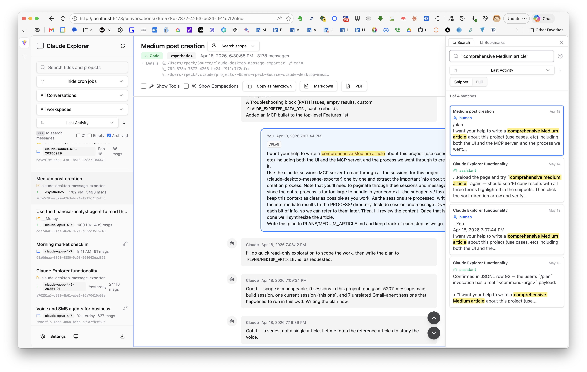

In the previous installation of this series, we covered the three moving parts that make this project work (capture → fetch → browse / export / query), plus the five reasons you'd actually want a unified local archive in the first place. If you missed that, make sure to go back and read [Part 1](https://medium.com/@raymondpeck/unlocking-your-claude-history-part-1-f19000c05655) first.

## Contents

- [Install and First Run](#install-and-first-run)
- [The Conversation List](#the-conversation-list)
- [Reading Messages](#reading-messages)
- [Searching and Navigating with the Keyboard](#searching-and-navigating-with-the-keyboard)
- [Inside the Conversation Pane](#inside-the-conversation-pane)
- [Appearance and Settings](#appearance-and-settings)
- [Exports (Markdown and PDF)](#exports-markdown-and-pdf)
- [Your History, On Your Disk](#your-history-on-your-disk)
- [Security](#security)
- [Coming Up: Another Claude, Analyzing Your Sessions](#coming-up-another-claude-analyzing-your-sessions)
- [Wrapping Up!](#wrapping-up)

<a id="install-and-first-run"></a>

## Install and First Run

`claude-explorer` is a local tool you can get running in just a few minutes: install dependencies, start the server, open it in your browser, and let the UI handle credential capture and the first fetch on its own. We'll leave the MCP server for the next article in the series; it lets you use the same corpus of Claude conversations to have Claude analyze its own behavior, which has a bunch of different uses.

We use `uvx` (from [Astral](https://docs.astral.sh/uv/getting-started/installation/), which is [joining OpenAI](https://openai.com/index/openai-to-acquire-astral/)) to do the heavy installation lifting; one command installs `claude-explorer` into an isolated, cached environment and runs it. If you'd rather install from source, the [README](https://github.com/rpeck/claude-explorer#readme) has the `git clone` + `uv sync` flow.

Here's the "happy path" install and first run, end to end:

```bash
which uvx

# install uv/uvx if needed: https://docs.astral.sh/uv/getting-started/installation/

# One-time setup, in any order:

# install Chromium for in-process credential capture
# (skip if you only care about Claude Code sessions; they need no capture)
uvx --from claude-explorer playwright install chromium

# Strongly recommended: install the always-on image-cache watcher.
# One-time; runs as a launchd / systemd / Task Scheduler job. If you
# skip this, claude-explorer can only protect your screenshots while
# `serve` is running, and Claude Code rotates its image cache on its
# own schedule, so any image rotated during downtime is gone.
uvx claude-explorer install-watcher

# Optional: install the system libraries WeasyPrint needs for PDF export
# (skip if you'll only export to Markdown).
#   macOS:   run the brew command below
#   Linux:   use your distro's pango / cairo / libffi packages
#   Windows: install MSYS2 (https://www.msys2.org), then in its shell run
#            `pacman -S mingw-w64-x86_64-pango`. Or grab the standalone
#            WeasyPrint .exe from the GitHub releases page to skip the
#            system-library dance entirely.
brew install pango cairo libffi

# Then run the app (this one blocks; leave it running and open the URL in your browser):
uvx claude-explorer serve
```

That's it for the terminal. Open `http://localhost:8765` and your Claude Code sessions show up immediately, with no fetch step, because the app reads your local Claude Code history straight from your own machine.

The default port is `8765`, picked because nothing widely-deployed claims it. If you got an `[Errno 48] Address already in use` error, something else is already on the port (almost always a previous `claude-explorer` run that didn't exit cleanly). Identify it and kill it:

```bash
# macOS / Linux
lsof -i :8765                            # see what's holding the port
kill $(lsof -ti :8765)                   # kill it (Ctrl-C-style; add -9 if it ignores you)
```

```powershell
# Windows (PowerShell)
Get-NetTCPConnection -LocalPort 8765 | Select-Object OwningProcess
Stop-Process -Id (Get-NetTCPConnection -LocalPort 8765).OwningProcess
```

If you'd rather just pick a different port instead, re-run with:

```bash
uvx claude-explorer serve --port 8766
```

For the full set of flags, run:

```bash
uvx claude-explorer serve --help
```

To pull in your Claude Desktop history, click the **Refresh** button in the top of the Conversation List or press **`⌘+R`** and the UI runs the full pipeline for you: capture credentials in a small browser window, persist them locally, then incrementally fetch your conversations and stream progress back to a small status popup in the corner of the window. Subsequent Refresh clicks reuse the saved credentials and only re-capture when they expire.

<a id="the-conversation-list"></a>

## The Conversation List

The install's done and the first fetch is streaming in. Open the browser, and the Conversation List is the first thing your eye lands on; that's where the tour starts.

The Conversation List makes the unified corpus visible: one list containing all three Claude session sources: Claude Desktop conversations, Claude Code sessions, and Claude Cowork sessions. All three are searchable the same way and export through the same Markdown / PDF pipeline. A few affordances make the list usable once you've got more than a couple dozen sessions. Special shout-out to Donald Norman for *The Design of Everyday Things*, which everyone should read! That was my intro a million years ago to the word "affordance". Anyone who works with UX/UI should read it.

<div align="center">
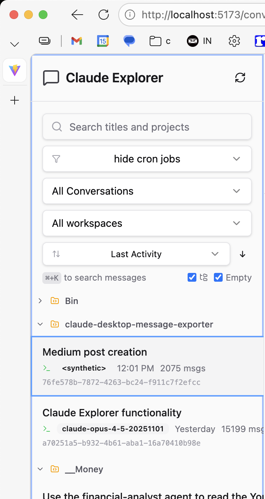
</div>

### Source filter and project grouping

At the top, you can search by title or project.

Just below that, you'll see the named filter dropdown. More on that in a bit.

Next is a simple source filter dropdown: `All Conversations` | `Claude Desktop` | `Claude Code` | `Claude Cowork`. That sounds trivial, but it helps because your brain tends to remember context before content. Cowork sessions also pick up a "Show archived" toggle in the Conversation List (default-off) so the sessions you've archived in Desktop don't clutter the list until you ask for them.

Claude Code sessions can also be grouped by project. The UI pulls the project name from the directory the session ran in, which is usually the git repo root, then renders a collapsible grouping so you can treat *"everything I did in repo `foo`"* as a first-class collection.

### Row metadata

Each row in the list carries just enough metadata to let you scan without clicking: the session title, a source icon (Claude Desktop, Claude Code, or Claude Cowork), a last-updated timestamp, and a message count. Those four fields give you the shape of the conversation: whether it was long or short, fresh or old, and where it came from. That's surprisingly close to how humans remember work; we rarely remember exact filenames, but we do remember that something happened "last month" and that it was "a big one."

You'll also see a starred group at the top. When you find something you know you'll come back to (a good project retrospective, a hard-won debugging thread, a clean solution you don't want to lose), you star it in Claude Desktop and it stops drifting away into the scrollback. Note that we also have message bookmarks, which we'll see later.

### The refresh button

There's a refresh button at the top of the Conversation List that does exactly what you want in a unified browser: one click triggers a Desktop fetch for new conversations *and* a re-scan of the Claude Code directory, so you don't have to remember which source needs which kind of refresh. Refresh is bound to **`⌘+R`**.

### The phantom-session filter

Claude Code sometimes spawns sessions with only local-command scaffolding and no real conversation; the Conversation List quietly filters those out so you never see them. It still keeps a session if real conversation starts after the scaffolding. The filter runs automatically and has no toggle.

### Named filters

Just below the title-search box, the Conversation List carries a small *named-filter* picker for saving and reusing title-pattern filters. Each filter has a name plus a behavior (*hide matches* or *show only matches*) plus one or more patterns. A single `cron jobs` filter, for example, can carry every chore pattern you want gone; toggling it on hides them all.

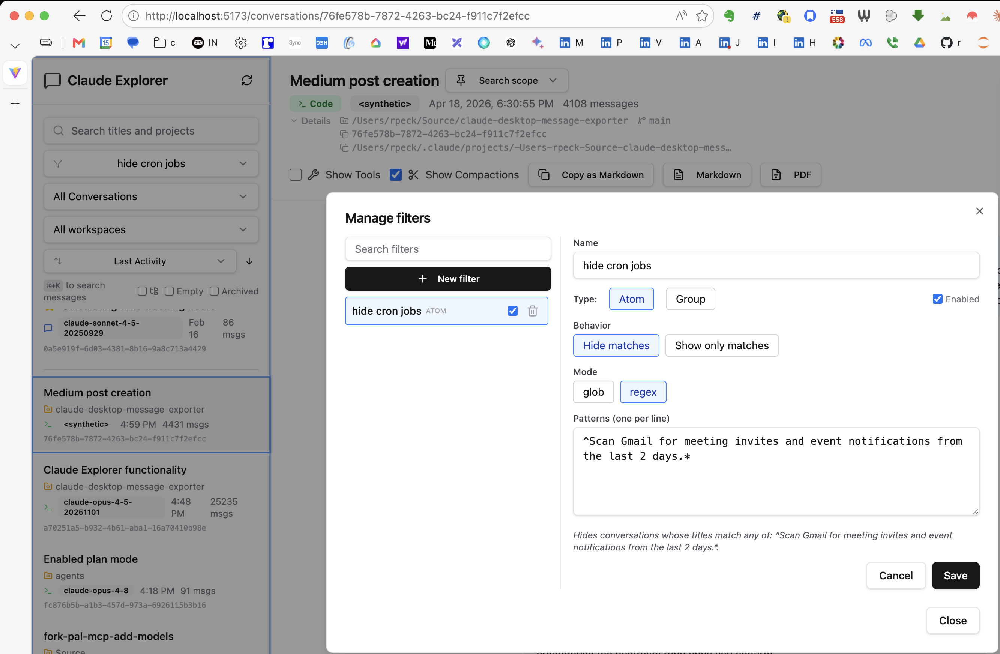

You can also compose filters into groups that AND or OR other named filters together, handy when you want one filter that, e.g., hides cron jobs AND keeps client-A work without juggling two toggles.

Only one filter applies at a time: pick *Hide work-day chores* to narrow, pick *All conversations* to broaden. Your selection persists across reloads, so tomorrow's view of the archive is whichever one you closed with today.

<a id="reading-messages"></a>

## Reading Messages

Before we get to global search and keyboard navigation, let's look at how the viewer presents the conversation.

### Tool blocks and slash commands

The viewer hides tool-use and tool-result blocks by default, because tool output can dominate the screen and drown out the conversation. When you want them, click the **Show Tools** checkbox in the conversation toolbar. The default is the right one for *reading* a session ("what happened, in plain English?"); the checkbox is there for *auditing* one ("what did the assistant actually run, and what did it get back?").

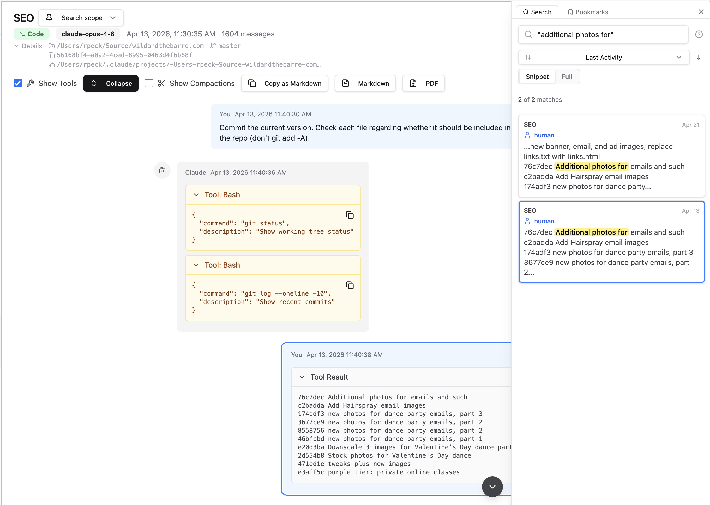

Slash commands get the same careful treatment. When you ran `/coding "Help me trace this bug"`, the user's prompt renders as a normal message bubble with a small `/coding` badge above the body. When you ran `/exit`, `/clear`, or any argless command, the bubble collapses to a muted *"Session: /exit"* marker that's visually de-emphasized; it's excluded from search and Copy-as-Markdown for the same reason.

When a session opens with one or more `/exit` markers before any real user message (it happens more than you'd expect on long-running sessions resumed from a different terminal), the leading markers fold into a single *"Session prelude: N earlier /exit runs (show)"* control at the top, collapsed by default.

When the **Show Tools** checkbox is on there's a header button labeled **Expand** (it reads **Collapse** once everything's open) that forces every tool block in the conversation open or closed at once. This saves a lot of time when you're reviewing a session with dozens of tool calls. It's a button rather than a checkbox because it's an action, not a state.

### Show Compactions

A sibling **Show Compactions** checkbox hides or shows `/compact` summary blocks the same way. Claude Code writes a compaction record whenever it summarizes the running conversation to free up room for new turns; the checkbox just hides or shows those summary cards, so your conversation stays exactly as it was and ticking the box back on brings the card right back. If you've invoked `/compact` manually with a prompt, Claude Explorer shows you that prompt.

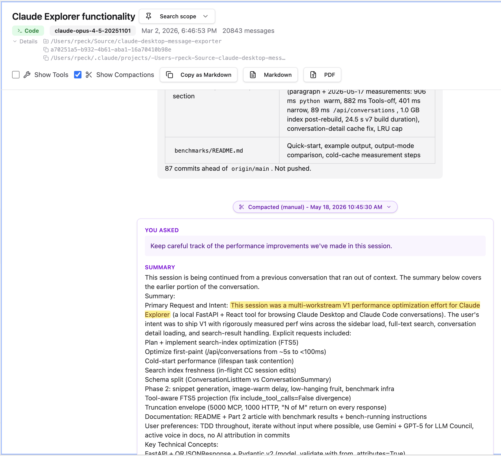

<a id="searching-and-navigating-with-the-keyboard"></a>

## Searching and Navigating with the Keyboard

One principle drives this whole part of the app: keep your hands on the keyboard. Everything you do here, searching the global archive, stepping through matches, opening a conversation, reading a long session, has a key binding, so you almost never have to reach for the mouse.

Claude Explorer is really a three-pane app: the Conversation List, the Conversation Pane, and a Search Pane that pops in when you hit **`⌘+K`**. Searches stay fast, sub-second even on archives in the thousands of conversations.

One quick note on key labels: I write shortcuts with the **`⌘`** glyph because I'm on macOS; on Windows and Linux, use **`Ctrl`** instead. The same swap applies to the **`Option`** bindings below: press **`Alt`** wherever I write **`Option`**.

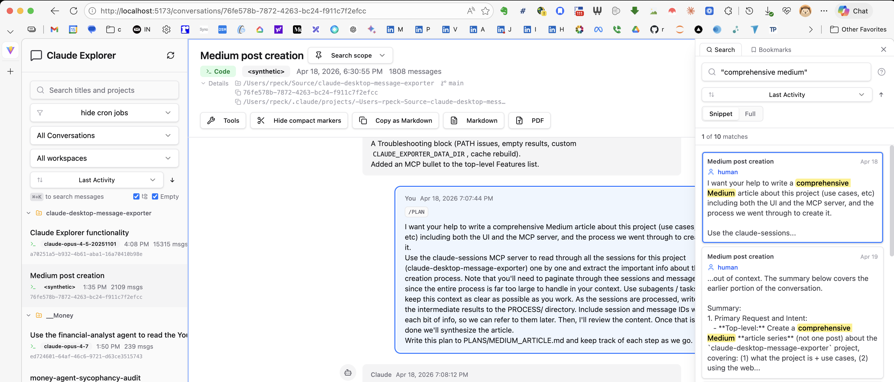

### Overview and the focus model

All of the search functions are bound to a small set of keyboard shortcuts, each covered in its own section below. Search covers every message in the archive, including tool calls and tool results, and composes with whatever scope the Conversation List is showing.

With three panes, keyboard shortcuts need an explicit focus rule. Exactly one pane holds focus at any moment, and the keys apply to that pane only. Click anywhere in a pane to focus it, or move between them with the keyboard: **`⌘+K`** opens and focuses the Search Pane, **`Enter`** drops into the Conversation Pane from whichever side pane you're in (the Conversation List or the Search Pane), and **`Esc`** returns you to wherever you came from.

A second, finer rule applies inside the Conversation Pane, and it's the kind of thing you only notice when it's missing. Modern apps love to scroll themselves around in the background: a refetch lands, a checkbox flip rebuilds the list, a polling timer fires, and suddenly you've lost the bubble you were reading. Click a bubble (or scroll to it by hand) and the viewer anchors there: it keeps that message in view even when the set of displayed messages changes underneath it. Flip on Show Tools and a dozen tool blocks appear above your bubble, but you stay parked on it rather than getting bumped down the page. Search-result card clicks, bookmark clicks, **`Enter`** on a highlighted hit, and **`⌘+G`** / **`⌘+Shift+G`** are the gestures that deliberately move you somewhere new; everything else leaves you where you are.

### Emacs by default, Vim for heathens 😉

By default, the app uses an Emacs-ish set of bindings (the ones you're probably used to from `bash` / `zsh`):

- **`Ctrl+N`** / **`Ctrl+P`** move within the focused pane.
- **`Option+N`** / **`Option+P`** page (within the Conversation Pane).
- **`Option+<`** / **`Option+>`** jump to first / last message.
- **`Esc`** exits the current focus mode (or pops you back to the Conversation List).

The search and copy bindings (**`⌘+K`**, **`⌘+F`**, **`⌘+G`**, **`⌘+C`**) get their own section just below. One Emacs caveat: **`⌘+F`** (and **`Ctrl+F`**) is bound to find, so the **`Ctrl+F`** an Emacs user reaches for opens search rather than `forward-char`. As an Emacs user for decades, I think this is the correct way to go: moving to the next bubble or conversation is mentally closer to `forward-paragraph` than `forward-char`, so my fingers never reach for **`Ctrl+F`** to get there.

If Vim is more your speed, you can opt in on the settings page. In Vim mode, **`j`** / **`k`** move line by line, **`g`** / **`G`** jump to top and bottom (single-key rather than **`gg`**), and **`/`** starts search; the UI keeps the same explicit focus model, so Vim keys never leak into the wrong pane.

A few bindings are specific to reading a conversation. In the Conversation Pane, **`u`** and **`a`** jump to the next user message and the next assistant message; **`U`** and **`A`** reverse direction. I like these because they let you skim by speaker. The UI also binds **`⌘+R`** to the refresh action so you don't accidentally reload the single-page app and lose your place. If you ever forget a binding, hit **`?`** to open the help page; it lists every binding for both modes, and shows which mode you're in.

<div align="center">
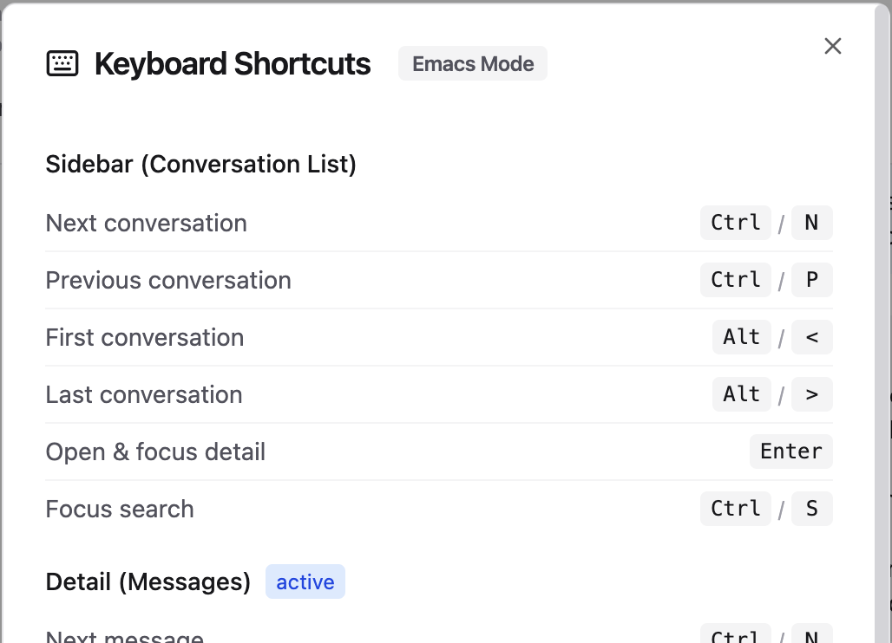
</div>

One last bit of polish in the Conversation List: when you press **`Ctrl+P`** or **`Ctrl+N`** to step through sessions, the UI does not eagerly load each conversation. It blanks the Conversation Pane and renders a hint to hit **`Enter`** to load. Loading a heavy session is an explicit action, so you scan the list with your fingers on the keyboard and only commit to opening one when you actually want to read it.

### Running a search (`⌘+K`, `⌘+G`, `⌘+Shift+G`, `⌘+C`, `⌘+F`)

**`⌘+K`** opens the Search Pane and runs the query; the shortcut has become the standard across modern apps for *"I want a fast, global search"*. The pane slides in from the right so we can see the conversations list and the search hits list at the same time. The pane carries two tabs (Search and Bookmarks); **`⌘+K`** always lands on Search, and clicking the Bookmarks tab swaps the list view to your saved-message list (more on bookmarks in the Conversation Pane section). Each search hit includes enough context to be useful in a skim: conversation title, source, timestamp, and a snippet around the matching text.

<div align="center">
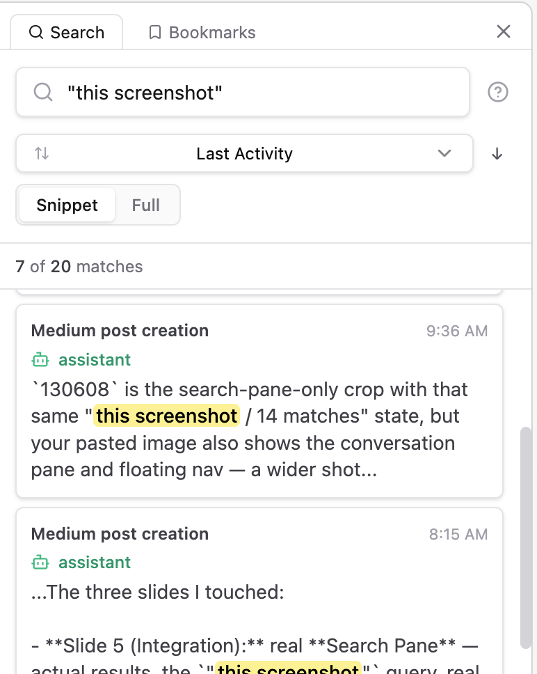
</div>

Once results are in, the panel header carries a small inline "N of M matches" counter so you can see your position at a glance. If the count reads like `1 of 1000+`, you've hit the per-query cap; refine the query to narrow the results and see the rest. **`⌘+G`** jumps to the next match and **`⌘+Shift+G`** jumps to the previous one. **`⌘+G`** works across the whole result set, jumping between conversations as naturally as between matches in a single thread, so you can treat a result set like a playlist. If you prefer the mouse, clicking a hit loads the corresponding conversation and scrolls you precisely to the matching message.

#### Snippet or full message

By default each hit shows a snippet: a short window around the match with the matched words highlighted, so you can skim a long list fast. A **Snippet / Full** toggle at the top of the results flips every hit to its complete message body, shown inline in a scrollable card, and the choice sticks across sessions.

#### What gets searched

Search also covers tool calls, tool results, and `/compact` summaries, which matters once you use Claude heavily; we tend to remember the *effect* of a tool invocation ("the `ripgrep` output showed the string in three files", "the web search returned the name Andrej Karpathy") even when we've forgotten the exact assistant text around it. The **Show Tools** and **Show Compactions** checkboxes filter the search, not just the viewer, so search never returns a hit you couldn't see: flip either off and matches inside the now-hidden blocks drop out of the results too.

#### Focusing on a message

Press **`Enter`** on a highlighted hit to focus that message bubble in the Conversation Pane; the Search Pane stays open so you can keep stepping through matches with **`⌘+G`**. Press **`Esc`** to close the panel and stay on whatever message you ended up on, ready to scroll and read with **`Ctrl+N`** / **`Ctrl+P`** (or **`j`** / **`k`** in Vim mode).

With a match focused, **`⌘+C`** copies the focused message to your clipboard, including the speaker and timestamp; if you've focused a tool block, you get the tool input or output verbatim. If you want to adjust the query instead of navigating matches, **`⌘+F`** jumps focus into the find input. The full one-handed flow: **`⌘+K`**, step to a hit with **`⌘+G`**, **`⌘+F`** to tweak the query, **`⌘+C`** to copy the focused cell.

#### Query syntax: terms vs phrases

Day-to-day, you'll write queries two ways, and the difference comes down to quotes. Each answers a different question:

- **Multi-word, unquoted**, e.g. `comprehensive medium`. All words must appear in the same matched message, in any order, possibly with other words between them. This is the right tool when you remember a couple of distinctive words but have forgotten the exact phrasing.

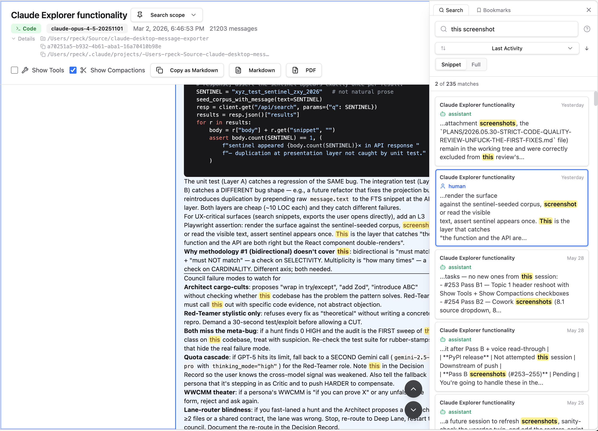

- **Quoted phrase**, e.g. `"comprehensive medium"`. Wrap the whole query in double quotes and the words must appear in that exact sequence. This is the right tool when you remember a specific turn of phrase verbatim.

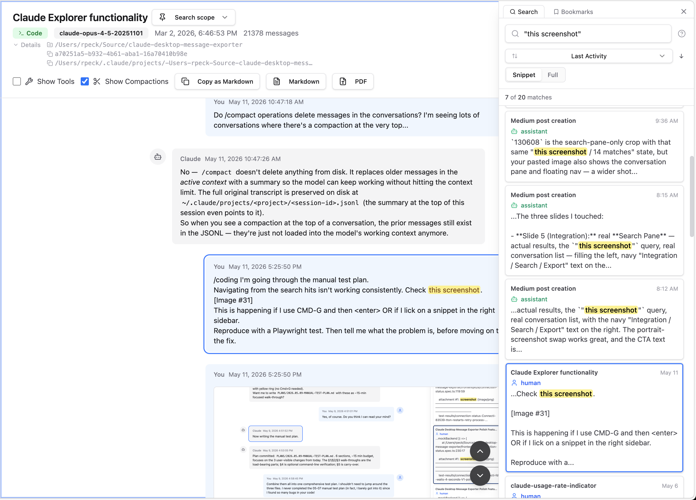

Either way, the snippet highlights every matched token (or phrase), so you can tell at a glance which words triggered the hit.

#### Scope composition

Every search runs through a scope you set ahead of time. A few controls decide which conversations stay in play and which parts of each one count as visible:

- **In the left Conversation List:** the **source dropdown** (`All Conversations` | `Claude Desktop` | `Claude Code` | `Claude Cowork`), the **workspace dropdown** (it appears only when your account spans more than one Claude workspace), and the **active filter** (any of your saved named filters).
- **In the conversation header:** the **Show Tools** and **Show Compactions** checkboxes.

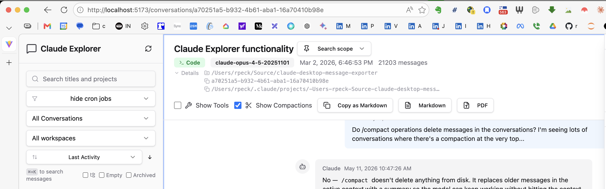

Together they set the scope, and both search surfaces run inside it: the Conversation List's title-search filters the list by title, and the Search Pane's full-text search matches text within whatever conversations remain. Each control you add narrows the results further, and the search re-runs itself whenever the scope changes, so previously hidden matches reappear without you re-typing the query.

Show Tools and Show Compactions earn their place on that list because search never returns a hit you couldn't see in the viewer: turn Show Tools off and matches inside a hidden tool block drop from the results; turn Show Compactions off and matches inside a hidden `/compact` summary drop the same way. The mental model is "the Conversation List and header are one combined filter; search asks questions through it."

Imagine hunting for a string you know is in a Claude Code session, but you've got hundreds of Desktop chats drowning it out. Set the source to `Claude Code`, flip on a saved filter for the repo you were in, and now **`⌘+K`** only searches what's left. Every control you add narrows the field a little more, and the results refresh the moment you change one.

#### Scoping search to a conversation or project (Pin)

Search defaults to global, but there's a complementary scope for when you've drilled into a specific session: *"search this conversation only"* or *"this project only"*. We call that a **pin**. There's a small `Search scope` button next to the conversation title with two entries: `Pin this conversation` and (when applicable) `Pin this project`. Click one and the Search Pane sprouts a small rounded scope tag (`In: <Conversation Title>`), and the Conversation List dims any rows that fall outside the scope. The pin is sticky and survives a full page reload because it's encoded in the URL, which makes it shareable too. It clears when you click the explicit unpin control or type in the Conversation List's title-search box. **`⌘+G`** honors the scope and wraps within it.

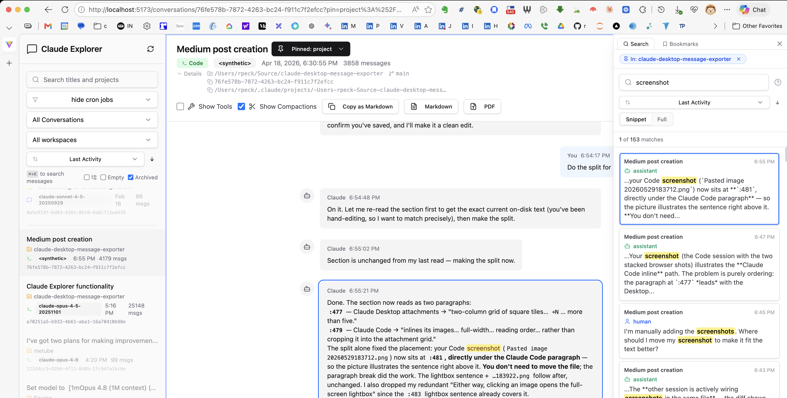

<a id="inside-the-conversation-pane"></a>

## Inside the Conversation Pane

Now that we can find a conversation and step through it from the keyboard, the next stop is the Conversation Pane itself: how it renders messages, what the affordances are, and what gets carried through to copy and export. The scroll-to-match behavior from search lands here too: click a search hit and the pane jumps straight to that message.

When you select a conversation in the Conversation List (and hit **`Enter`**, because loading is explicit), the Conversation Pane renders the full session as a sequence of message bubbles.

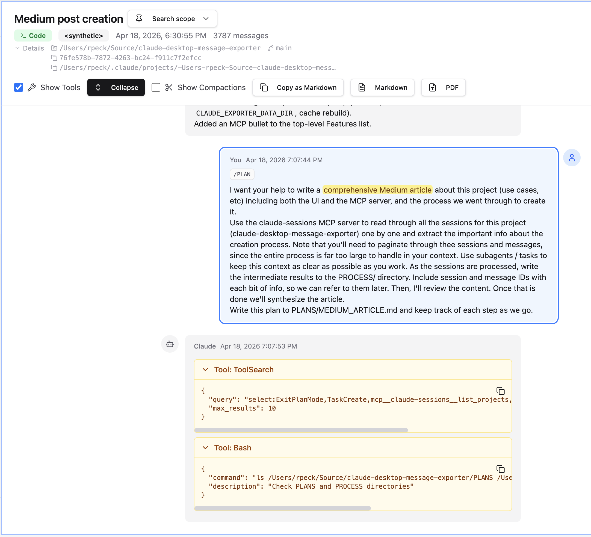

### Timestamps and content blocks

Each message shows a local timestamp on both sides of the conversation. That matters more than you'd think, because time is part of the story; *"this was a ten-minute back-and-forth"* feels different than *"this took three hours and spanned lunch."* Messages can contain multiple content blocks; in practice, you'll see three: text blocks for normal conversation, tool-use blocks when the assistant invokes a tool, and tool-result blocks for the tool's output.

### Image attachments and the lightbox

Images show up two ways, and the viewer matches each one. Claude Desktop attachments render as thumbnails: a single image at its natural aspect ratio, and two or more in a tidy two-column grid of square tiles, with a `+N` tile when a message carries more than five. Claude Code images are inline instead, so the viewer shows each one full-width at its natural shape, stacked in reading order with the surrounding text. Either way, click an image to open it full-screen.

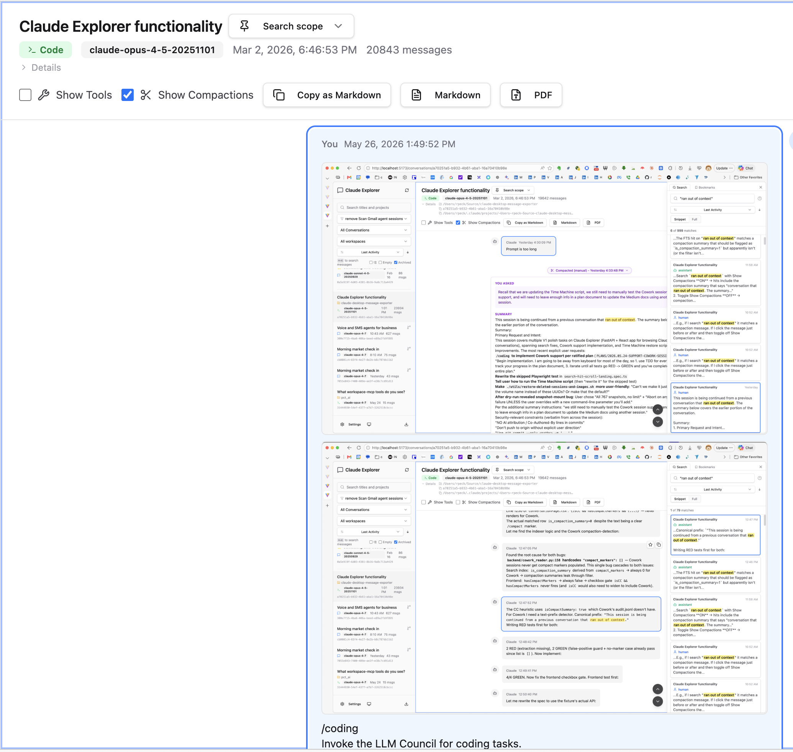

Click any thumbnail and a full-screen lightbox opens; arrow keys move between images, **`Esc`** closes, **`d`** downloads, and **`o`** opens the original in a new tab. Both the thumbnail and the lightbox load from your own machine rather than the network, so the images always render, even offline and even once claude.ai no longer has them (more on how that local copy works next).

### Image caching (Desktop and Claude Code)

Images live in two places depending on which Claude they came from. Claude Desktop attachments come from the `claude.ai` API with the conversation fetch. Claude Code stores its image-cache files locally and **deletes them on its own rotation schedule**, so a screenshot you pasted last month may already be gone by the time you go looking for it. Claude Explorer keeps its own permanent local copy of both; the `install-watcher` you ran during install is what makes that protection always-on, even while the app isn't running. If you skipped that step, the app raises a persistent amber banner at the top of the UI reminding you to run it, because only the supervised watcher stands between you and a lost screenshot.

### View branches

There's a *"View branches"* button on the conversation header. If you've ever edited an earlier message and regenerated from there, you've split that conversation into branches, and the version you're reading is only one path through it. Click *"View branches"* and a tree slides in showing every path; click any leaf to switch the Conversation Pane to that branch, so the work you did on a road you didn't end up taking is still one click away.

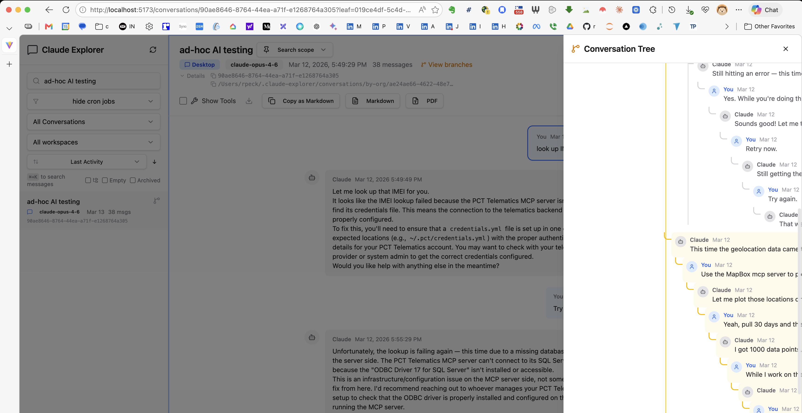

### Bookmarks (message-level)

Stars in the Conversation List save a whole conversation; bookmarks save a single message inside one. Hover over any message bubble and a star icon appears in the action overlay alongside the copy icon; clicking it adds that message to your bookmark list and turns the star amber. Clicking it again removes the bookmark. Command markers with zero arguments (`/exit`, `/clear`) deliberately do not get the bookmark affordance, since *"save a meaningful message"* is the whole point of Claude Explorer.

The bookmark list lives in the **Bookmarks** tab of the Search Pane (the same pane that holds the search results; click the tab header to switch between them, and the choice persists across sessions). The list groups bookmarks by conversation, and each row shows a snippet of the saved message, an optional note you can edit inline, and the timestamp. Click any row to navigate to that exact message in the Conversation Pane; an edit icon opens the note field, and a trash icon deletes the bookmark.

A small **Export to Markdown** button at the top of the panel writes the whole bookmark set to a single `.md` file. Each entry includes the snippet and any note, grouped under its conversation, so you can paste the export into notes or share it without needing the app running.

<a id="appearance-and-settings"></a>

## Appearance and Settings

### Dark mode (Light, Dark, System)

The theme has three settings: Light, Dark, and System. The default is System, which follows your operating system's light or dark mode setting, including changes mid-session. The toggle lives in the footer of the Conversation List, and it cycles Light → Dark → System.

### Settings

The settings page is deliberately small. It has five sections: *Appearance* (theme), *Keyboard Navigation* (Emacs vs Vim), *Export* (default Markdown export mode), *Data* (data directory and conversation count), and *About*. Your settings follow you across browsers and Incognito windows on the same machine; pick `Dark` mode and Vim navigation in Chrome, then open the same address in Edge or Safari, and you get the same configuration without re-clicking anything.

<div align="center">
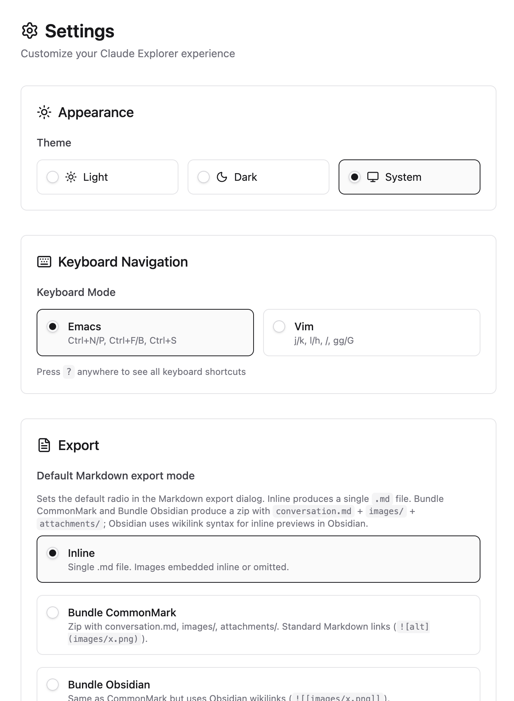
</div>

<a id="exports-markdown-and-pdf"></a>

## Exports (Markdown and PDF)

If the goal is to make your Claude history *yours*, then *"I can read it in the browser"* is only half the story. You also want to move it into other tools: paste a thread into a pull request, save a session as a note, or hand a Markdown export to a teammate as part of a retro. The quickest path out is Markdown to the clipboard; to save to a file, Claude Explorer has two export formats per conversation: Markdown and PDF.

### Copy as Markdown

Each content block shows a *"two overlaid pages"* copy icon on hover, and the conversation header includes a *"Copy as Markdown"* action that copies the entire thread to your clipboard. This becomes a workflow the first time you realize you can paste a whole session into notes, a pull request description, or a retrospective without wrestling with formatting. The copy paths respect both header checkboxes (Show Tools and Show Compactions) the same way the viewer does; one truth, three surfaces (viewer, copy, export).

### Markdown export

Clicking *Markdown* in the conversation header opens a small dialog with three "radio stations": **Inline** (a single `.md` file that references each image by URL), **Bundle CommonMark** (a `.zip` with `conversation.md` plus `images/` and `attachments/` folders, using standard `[name](path)` links), and **Bundle Obsidian** (the same zip layout but with `[[wikilink]]` syntax in `conversation.md` so it drops cleanly into an Obsidian vault). A *"Save as default"* checkbox pre-selects your last pick the next time you open it. Inline is great for pasting a thread into a pull request or a notes app; bundles are the right pick when you want a portable archive that survives without the local server running.

Bundles include every attachment in the conversation. Image attachments land in `images/`; PDFs, text files, and anything else Claude Desktop accepted land in `attachments/`. The Markdown links inside `conversation.md` are rewritten to point at the bundled paths, so the export remains internally consistent. The export honors both header checkboxes (Show Tools and Show Compactions) the same way the viewer does.

### PDF export

PDF export needs a few system libraries (`pango`, `cairo`, `libffi`); if you ran the optional `brew install` line up in the install section, you're set. You click export, you get a PDF of the conversation, and the PDF inherits the same two header checkboxes (Show Tools and Show Compactions) the Markdown export does. PDF is the thing you can stick in an archive folder, attach to a ticket, or keep as *"this is exactly what we saw at the time."*

<a id="your-history-on-your-disk"></a>

## Your History, On Your Disk

Claude Desktop keeps your conversations server-side, so you need to be online and signed in to read them; Claude Code keeps sessions on your machine, but by default it deletes session transcripts older than 30 days from `~/.claude/projects/` at startup (and rotates its image cache off disk on its own schedule).

### Setting the retention period (`check-cleanup-period.py`)

The session-transcript retention is controlled by the `cleanupPeriodDays` setting in `~/.claude/settings.json`; the default is 30, and a large value like 36500 effectively preserves transcripts indefinitely:

```json
{
  "cleanupPeriodDays": 36500
}
```

I learned about that setting the hard way: Claude Code deleted a batch of sessions out from under me one morning, and I had to restore them from Time Machine with the recovery script below. Add the setting before you start trusting your local archive.

If you'd rather not hand-edit JSON, the repo ships a script that does it for you:

```bash
# Report the current setting
python3 scripts/check-cleanup-period.py

# Raise it to ~100 years, effectively disabling auto-cleanup
python3 scripts/check-cleanup-period.py --set 36500
```

It refuses `0` (which Claude Code treats as "turn persistence off entirely"), and it lives in the repo, so grab it from GitHub if you installed with `uvx`.

### Recovering from Time Machine: `restore-deleted-sessions-and-images.sh` \[MacOS\]

If you're on a Mac and you've already been bitten, `utils/restore-deleted-sessions-and-images.sh` in the repo will pull missing session JSONLs and image-cache PNGs back out of a Time Machine disk. If you installed with `uvx` and never cloned the project, grab that one script from the GitHub repo first. The one-liner `sudo ./utils/restore-deleted-sessions-and-images.sh` is enough on a typical setup; the script does the rest. What it covers:

- Restores from all three locations: Claude Code sessions, the image cache, and the Cowork local-agent-mode-sessions tree.
- Auto-detects the Time Machine disk via `tmutil latestbackup`, so you don't need to pass `--tm-disk` by hand.
- Mounts only the Time Machine snapshots it actually needs, on demand.
- Aborts immediately if you forgot `sudo`, rather than wasting 30 seconds before failing.
- Supports `--dry-run` (preview the plan before anything moves) and `--continue-on-mount-failure` (don't abort the whole walk if one snapshot can't be mounted).
- Refuses to overwrite files that still exist on disk.

<a id="security"></a>

## Security

A few notes on the trust question, since this app reads files from `~/.claude/`, captures a Claude.ai session key via Playwright, and stores everything on your own disk. That's a lot of sensitive info that we need to protect.

The credential capture runs entirely in a Chromium window on your machine, and the session key stays on your own disk. The fetcher sends it only to claude.ai over HTTPS to pull your history, never to any third-party telemetry or analytics endpoint, and the app has no auto-update channel.

The code itself goes through automated security and code-quality review before every change ships, including a full supply-chain audit of its dependencies. If you want the details, the audit log lives in [`SECURITY.md`](https://github.com/rpeck/claude-explorer/blob/main/SECURITY.md) in the repo.

<a id="coming-up-another-claude-analyzing-your-sessions"></a>

## Coming Up: Another Claude, Analyzing Your Sessions

Up to now we've been talking about how *we* browse: the Conversation List, full-text search, keyboard navigation, and exports. Part 3 flips the point of view; another Claude queries the same on-disk archive via an MCP server, so your history becomes something a fresh session can interrogate and analyze without you copy-pasting anything.

That MCP server exposes a small set of tools, and the outline-first pattern makes it practical; a new Claude Code run can start broad, then zoom in, even when the underlying session is thousands of messages long.

That opens up workflows you can't easily get any other way: ask a fresh Claude to summarize a sprawling session down to its decisions, or to read back through a week of debugging sessions, pull out the mistakes that kept recurring, and turn them into sharper rules for your `CLAUDE.md` and your coding prompts so you stop hitting them. And yes, I used this MCP server to mine this project's own history to write this very series. Which prior conversation would you most want a fresh Claude session to read for you?

<a id="wrapping-up"></a>

## Wrapping Up!

Ok, that's enough for today! We covered a lot of ground: installing with `uvx`, capturing a `sessionKey` in a small browser window, fetching Claude Desktop conversations locally, and then using the web app to browse a unified Conversation List, run full-text search with **`⌘+K`**, navigate matches with **`⌘+G`**, read sessions with tool-call toggles and timestamps, switch themes, and export conversations to Markdown or PDF, with image attachments preserved across Claude Code's silent rotation thanks to a permanent local cache.

Part 3 dives into the MCP server we just teased: install paths for Claude Code and Claude Desktop on macOS, Windows, and Linux, the outline-first querying model in more detail, and the workflows that come with it (the self-referential retrospective, the `CLAUDE.md` tuning loop). It's the part of the project that makes me happy. 🤓

One last note before the sign-off, since I led with it at the top: this is an independent, community-built project, not affiliated with or endorsed by Anthropic. "Claude" and "Claude Code" are Anthropic trademarks; this tool just consumes their public APIs and on-disk formats the way any other client would, and those formats may change without notice. If they do, the project will catch up; the archive on your disk is yours either way.

Before you go, comment with the one session you wish you could hand to a fresh Claude Code run and say, "summarize this and pull out the decisions." Like last time, please comment below with any questions, corrections, etc. If you liked this, please clap and follow me here and on LinkedIn.

See you next time!
